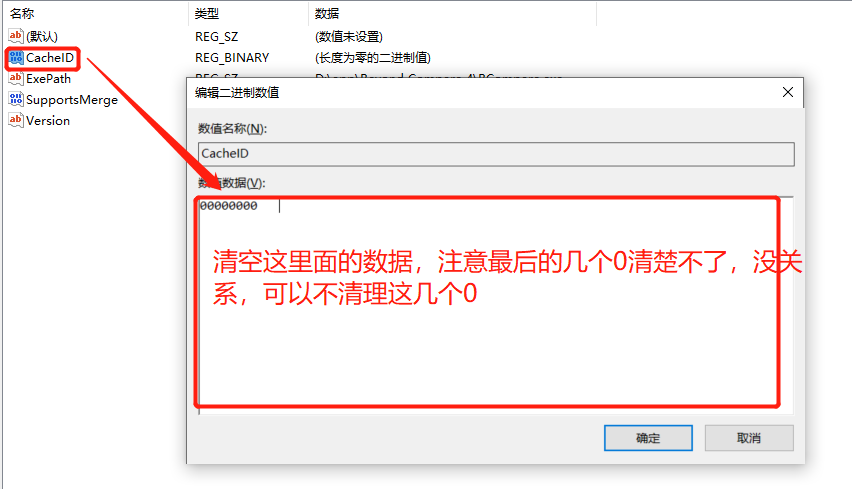

### 延长 BeyondCompare4 的试用期

BeyondCompare4 的免费的试用期只有 30 天，而且没有免费版的，那么怎么可以延长试用期呢？

修改注册表的值，就可以了；

HKEY_CURRENT_USER\Software\Scooter Software\Beyond Compare 4\CacheID，双击该文件，打开文件后直接清空里面的数据就可以了，然后重启 BeyondCompare，就又拥有了 30 天的免费试用。

然后记得每隔将近 30 天的时候，清理一下注册表就可以了。

这种方式，有点麻烦，且总是得记得要定期清理，也可以通过创建定时任务的方式去自动的清理，因为不是很关心这个，就没有梳理，我再找个时间梳理下，把整理好的文档留存下来。
