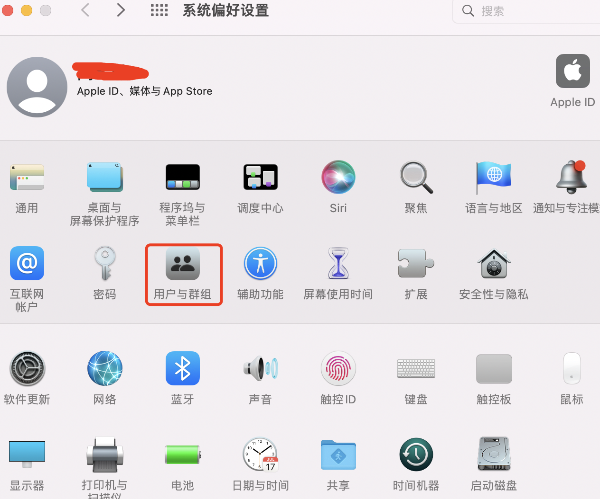
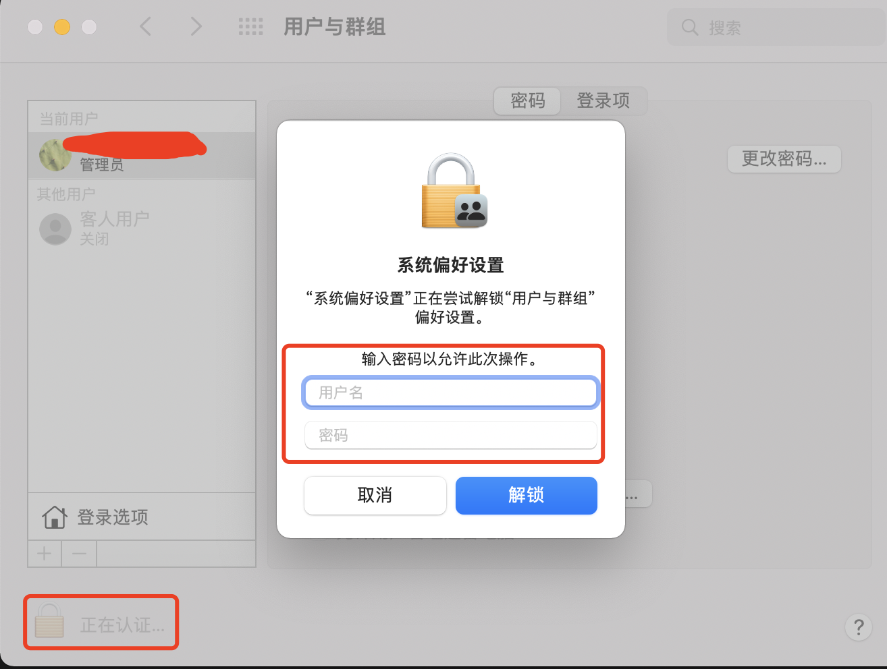
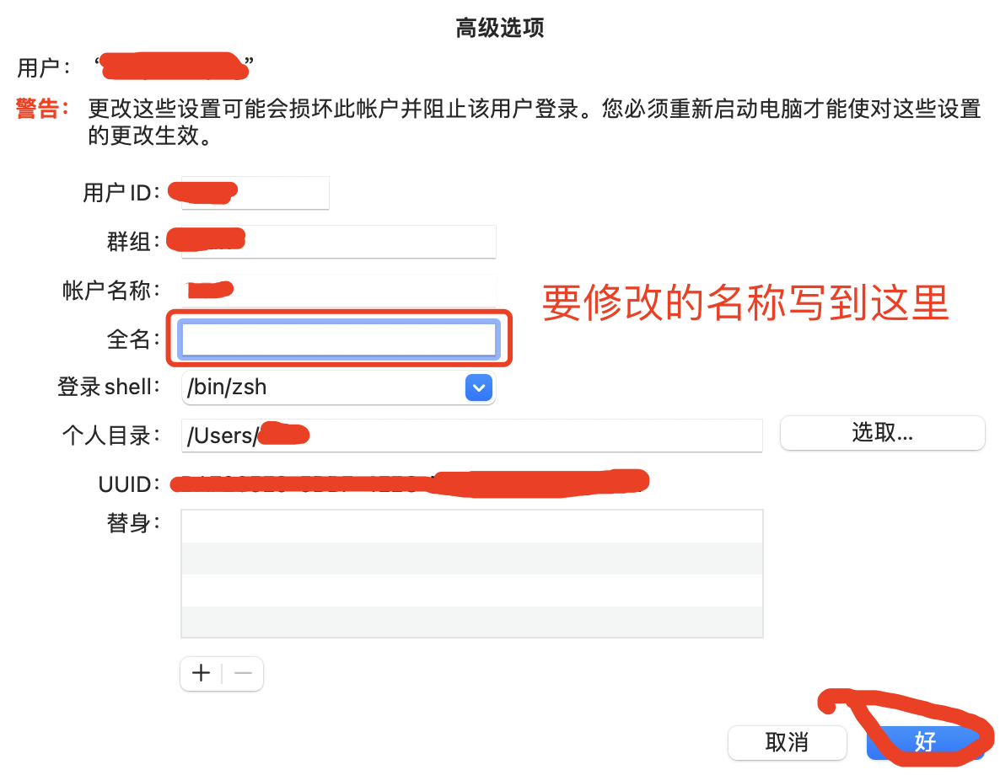
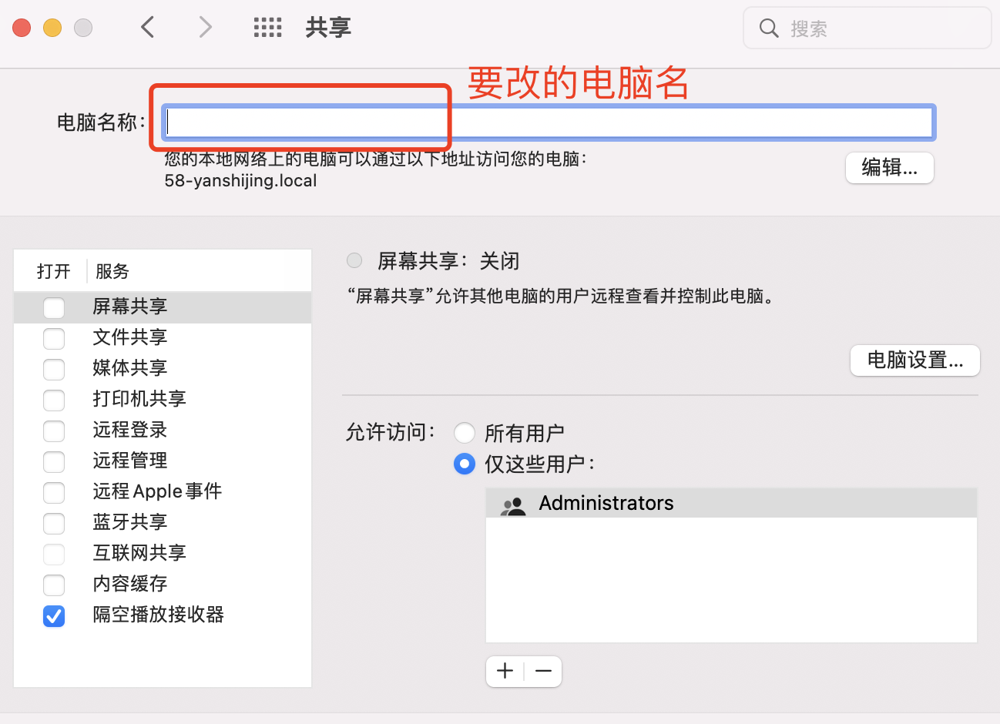
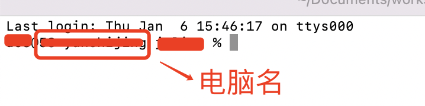

### Mac怎么修改用户名称和电脑名称

首先需要明确电脑名称和用户名称是两个完全不同的名称。

电脑名称是这台电脑的名字，用户名称是登录这台电脑的用户的名称。就好比我们去北京找个城市了，北京是这个城市的名字，张三和王五都去了北京，那么张三和王五就是用户的名字。

#### 1. 修改用户名

设置 -> 用户与群组

之后进入“用户与群组”页面，有的时候可能会由于安全方面的原因，不能直接修改用户名，这个时候需要先点击左下角的锁，点了锁以后会弹出弹层让输入登录电脑的用户名和密码，正常输入就可以了

输入了用户名和密码之后，就可以右键点击要修改的用户名了

然后在高级选项弹窗里修改用户名就可以了

#### 2. 修改电脑名

设置 -> 共享，然后在电脑名称输入新的电脑名称就可以了

修改了电脑名称后，最直观的体现，就是在终端使用时最前面的提示

