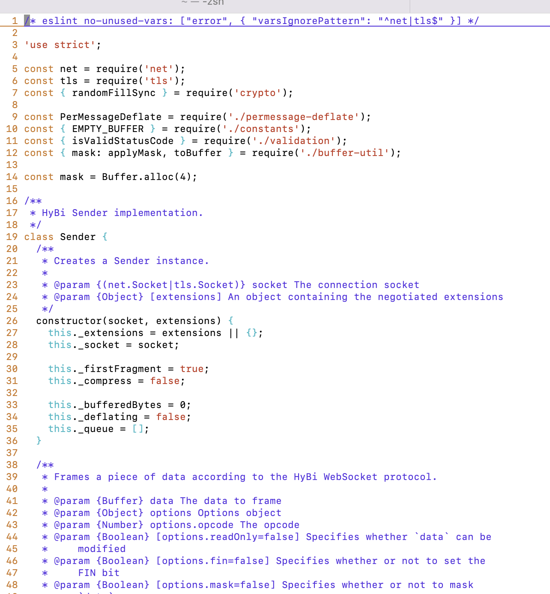

### Mac设置VIM编辑器有彩色效果

在使用mac做开发的时候，经常会使用到终端，但是无论是bash还是zsh，vim编辑器都是黑白的，当文件的代码量大的时候，文件内容的辨识度就会变的很低，不方便查看，如果把文件内容添加一些色彩，其可读性就会高很多。

如果要求不高的话，可以按照下面的配置方式去配置：

1. 复制vim的系统配置文件到当前用户目录下，作为当前登录用户的配置文件

```bash
cp /usr/share/vim/vimrc ~/.vimrc
```

2. 复制下面的配置代码到～/.vimrc底部

```bash
colorscheme default     " 设置颜色主题

syntax on               " 语法高亮

filetype on             " 检测文件的类型

set number              " 显示行号
set cursorline          " 用浅色高亮当前行
"autocmd InsertLeave * se nocul
"autocmd InsertEnter * se cul

set ruler               " 在编辑过程中，在右下角显示光标位置的状态行
set laststatus=2        " 显示状态栏 (默认值为 1, 无法显示状态栏)
set statusline=\ %<%F[%1*%M%*%n%R%H]%=\ %y\ %0(%{&fileformat}\ %{&encoding}\ %c:%l/%L%)\
                        " 设置在状态行显示的信息

set tabstop=4           " Tab键的宽度
set softtabstop=4
set shiftwidth=4        " 统一缩进为4

set autoindent          " vim使用自动对齐，也就是把当前行的对齐格式应用到下一行(自动缩进)
set cindent             " (cindent是特别针对 C语言语法自动缩进)
set smartindent         " 依据上面的对齐格式，智能的选择对齐方式，对于类似C语言编写上有用

set scrolloff=3         " 光标移动到buffer的顶部和底部时保持3行距离

set incsearch           " 输入搜索内容时就显示搜索结果
set hlsearch            " 搜索时高亮显示被找到的文本

set foldmethod=indent   " 设置缩进折叠
set foldlevel=99        " 设置折叠层数
nnoremap <space> @=((foldclosed(line('.')) < 0) ? 'zc' : 'zo')<CR>
                        " 用空格键来开关折叠

" 自动跳转到上次退出的位置
if has("autocmd")
    au BufReadPost * if line("'\"") > 1 && line("'\"") <= line("$") | exe "normal! g'\"" | endif
endif
```

然后使用vi或者vim指令的时候，编辑器就自动添加上了颜色，可读性瞬间提高很多。



如果修改了配置文件后没有生效的时候，可以执行下source .vimrc重新加载下配置文件试试。