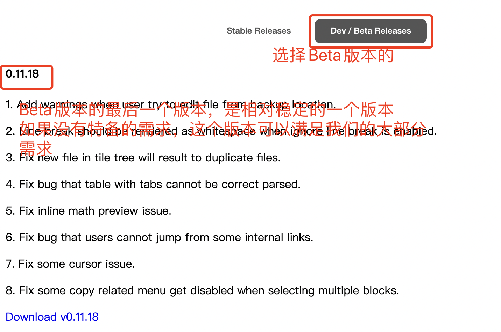

### Typora从1.0.0版本开始收费了

系统给弹出了一个提示更新，然后就直接更新了，更新后发现新版本开始收费了。

收费的版本，肯定会更加的稳定和更加全方位的服务，但是之前的免费版本对于我来说，已经足够使用，那么怎么办呢，把现在的收费版本卸载掉，安装之前的免费版本的吧。

Typora从1.0.0版本开始收费，之前的版本，都是免费的，我们可以从它的官网上去下载旧版本的就可以了。

在Typora官网，进去默认进去下载页面显示的是收费的稳定版的，如果想找到免费版的，点击“Dev/Beta Releases”

附上下载链接：https://typora.io/releases/all

官方的链接，现在还可以下载，以后有可能会因为推广收费的稳定版而下掉免费的历史版本。