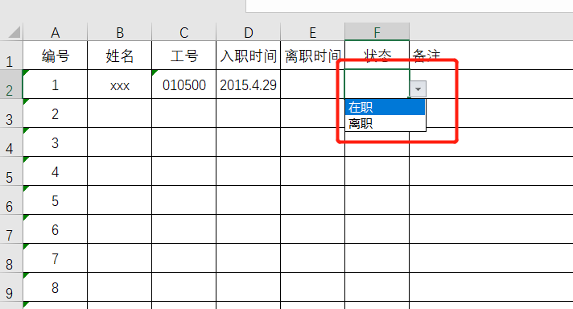

### excel设置下拉选项

经常使用excel的同学，应该会有设置单元格设置下拉选项的需求，如下图的状态：

这种场景，经常会遇到，那么这个下拉筛选项在excel中是怎么实现的呢？现在我们就以office 家庭和学生版为例在说明下excel怎么实现单元格下拉选项。

我的版本：

### 方法和步骤

#### 实现单个单元格的下拉选项

1. 打开一个excel表格，选中一个单元格，然后在菜单栏中选中“数据”项，如图：

2. 选中“数据”菜单项下的“数据验证”子菜单(其他版本的office可能叫“数据有效性验证”)，并再次选择次子级菜单“数据验证”

 ")

3. 在弹出的“数据验证”弹层中，切换到“设置”页签（弹层刚弹出时默认就是设置页签），在允许的验证条件下选中“序列”字段，在来源筛选项中输入我们期望出现的筛选项，如男、女。注意筛选项之间用英文逗号分隔，否则筛选项仅会作为一个筛选项出现；

做到这一步，就已经大功告成了，我们可以看下效果：

