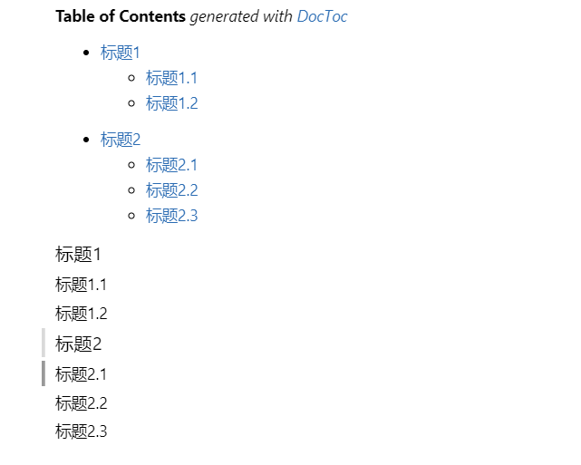

### 使用doctoc声明markdown目录

doctoc是一个npm包，使用前先要安装。

```bash
npm install doctoc -g
```

**使用**

doctoc是命令行工具，使用时切换到当前markdown文件的目录，执行doctoc 文件名.md即可。

如我的test.md，我先切换到test.md所在的目录下，然后执行 doctoc test.md

```bash
doctoc test.md
```

然后test.md中自动生成文件目录，只要文件中有#(1-6个)的都会被自动生成目录。生成目录之后，如果文件中又有新增的#，那么新的目录也会自动添加到目录部分。



doctoc不好的一点就是需要依赖npm包，不过只需要最初安装一次，全局安装，对日常的使用的影响不大。