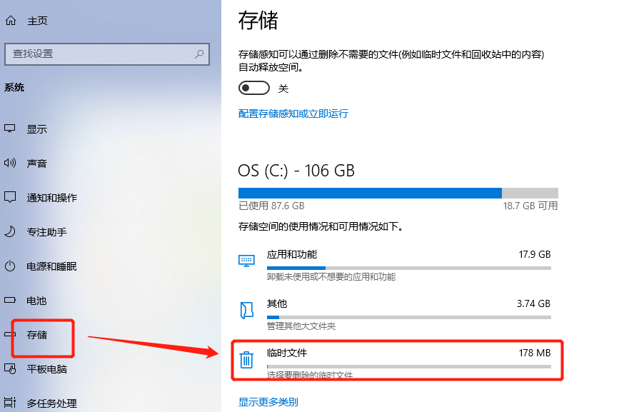
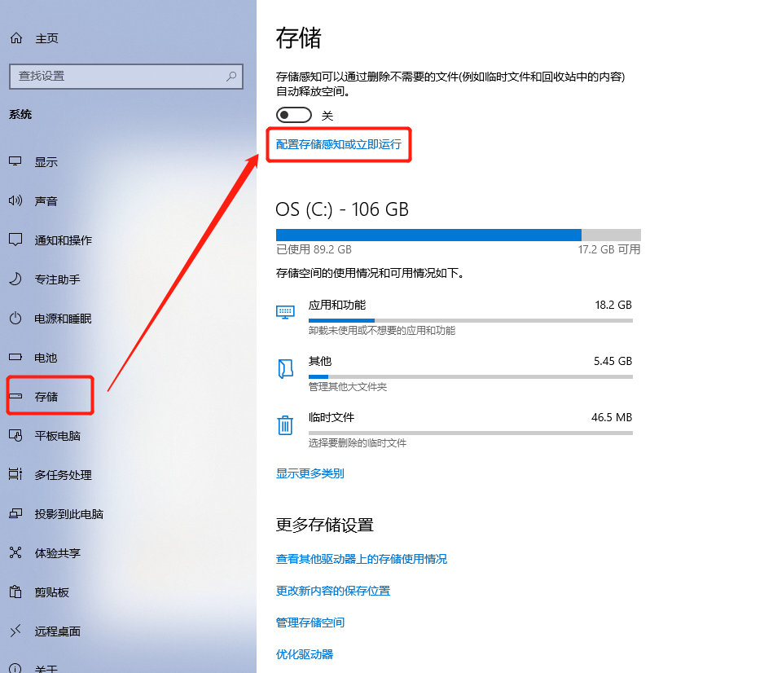
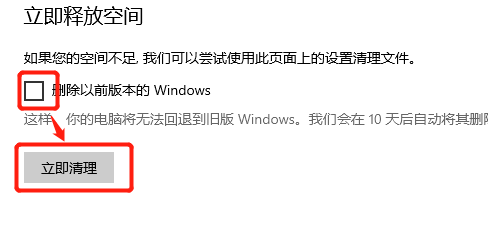

### windows10 C盘空间不足

上周由于不小心的一个操作，把windows系统启动的引导文件给删除掉了，于是就恢复了下系统，系统刚恢复的时候，C盘还有60多个G的空间，使用了几天后，还剩下50多个G，这个时候还没有太注意。

昨天早上，有一些推过来的系统更细，我就更新了，更新后，C盘就只剩下了18个G了，不知道30多个G的空间都怎么被占用了。

#### 可以尝试以下的方法，释放C盘的空间

1. 关闭windows休眠功能

   这个可以根据个人的使用习惯来做，我觉着这个用起来还挺友好的，就没有关闭它。

   如果大家有需要，可以百度一下，解决方案都是现成的。

2. 清理临时文件

   这是windows系统给提供的原生的、内置的工具，也挺好用

   依次执行：

   设置-系统-存储，然后点击右侧的“临时文件”  我的刚被我清理过了，现在临时文件占用的空间已经不是很大了。

   

   点击“临时文件”进去之后，选择要清理的文件删除就可以了，这种方式是系统提供的，安全可靠。

3. 关闭windows“保留的存储”

   保留的存储，是2019年5月份之后的windows10系统，都会自带一个“保留的存储”，这是windows10内置的一项功能，目的是保障系统在更新时可以正常运行。如果系统盘空间不大，可以关闭这个功能。

   修改注册表，运行regedit，以管理员身份运行。

   依次：计算机\HKEY_LOCAL_MACHINE\SOFTWARE\Microsoft\Windows\CurrentVersion\ReserveManager，然后右侧找到ShippedWithReserves将其值改为0.修改完成后重启电脑生效。

   > 保留的存储，不会在功能禁用后马上释放，而是会在下次系统更新后自动消失。

4. 移动“虚拟内存”到其他的盘符

   有些朋友可能直接关闭了虚拟内存，建议还是不要关闭，它虽然占用了一定的空间，但是这个空间还是有限的。

   我不太建议修改这个目录，也就没有总结转移虚拟内存的方式。

5. 清理windows.old文件夹

   这个文件夹，不要通过直接从右侧点击删除，点击删除也删除不了。

   正确的删除方式：

   设置-系统-存储，然后点击右侧的“配置存储感知或立即运行”

   

   进去后页面拉到底部，勾选“删除以前版本的widnows”，然后“立即清理”。

   

这种删除方式，也不是立即生效，看提示是10天后才会删除。