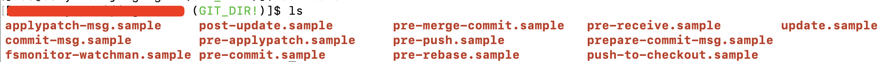

### git hooks 简介

Git Hooks是git版本控制系统的一个功能,它允许用户在执行某个git指令的时候自动执行一些自定义脚本.这些git指令,可以是提交(commit)、推送(push)、合并(merge)等等,只要是合法的git事件就都可以.

> 关于git的使用,可参考:[https://git-scm.com/docs](https://git-scm.com/docs)

通过使用Git Hooks,我们可以在执行某行某个git指令、或者执行某个指令之前、之后的时候可以执行一些指定的自定义操作,比如格式化代码、自动化测试、代码部署等.

Git Hooks是执行在.git/hooks目录下的可执行文件,这些文件的名称分别对应着不同的git事件.当git执行相关的指令时,相应名称的钩子函数(脚本)就会被执行..git是一个隐藏文件夹,在linux或者mac中,可以通过ls -a来显示该目录.

