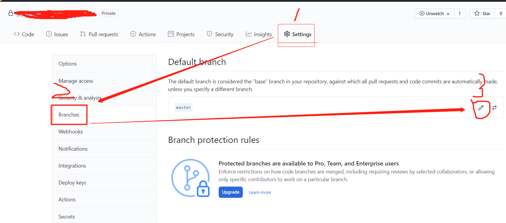
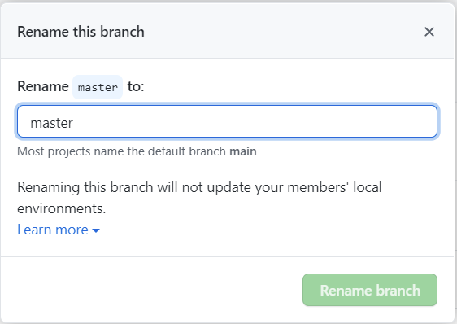
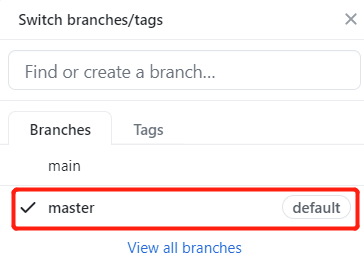
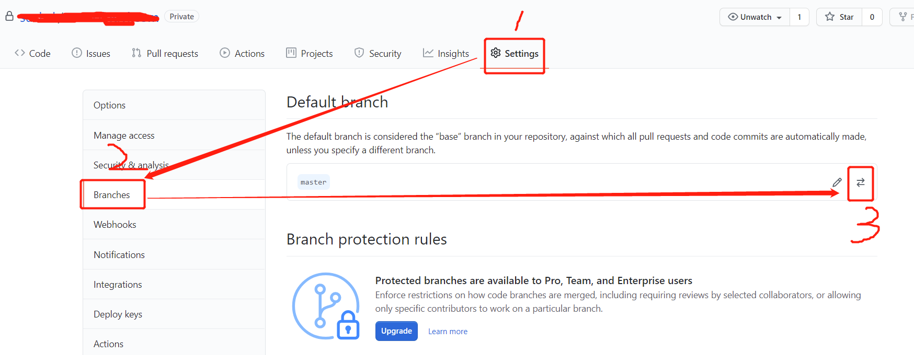
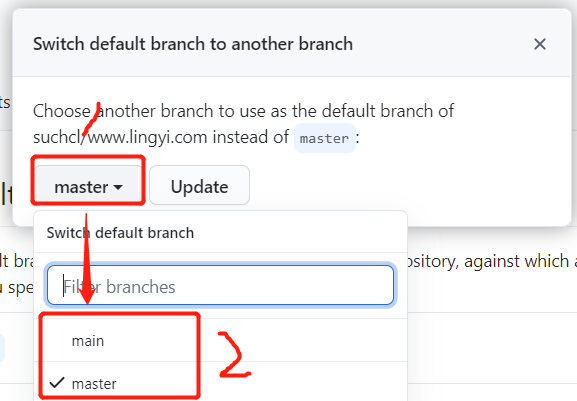

### github上为什么将默认的主分支由master更改为了main

应该是在2020年，美国爆发了大规模的种族冲突问题，发生的这些社会问题，对技术圈也产生了一些影响，明显的体现就是技术圈内关于master和slave的称呼都即将要成为历史了。github将分支的默认主分支由master更改为了main。其他的一些常用的技术术语，为了避免带有所谓的种族歧视色彩，许多科技公司都对自己的产品和业务做了部分的调整，著名的有mysql删除了master、黑名单和白名单术语；Linus通过了Linux中避免master/slave的术语提案；其他的公司如微软、Android、Linkdin等，都做了相应的一些调整。

### 怎么修改默认分支名称

对于一些习惯了使用master名称的人来说，我就看到master就是主分支，看到main不感冒，那么github也是支持我们去修改默分支名称的。

进入需要修改默认主分支名称的项目，点击当前项目的设置，进入设置页面后选择左侧的设置选项“Branches”：

然后根据提示继续点击编辑小图标，会有一个弹层出来，我们根据我们的习惯更改一个自己习惯的名称就可以了

我们回到代码视图看变化，

已经完美修改默认分支名称，万事大吉，又回到了我们习惯命名方式了，看着也顺眼。给自己洗白下，我可不是种族主义者，就是使用这个词时间久了，用起来更习惯一些。

### 怎么切换默认分支

我还是没有习惯使用main作为主分支，已经在github上建了一个master分支，那么能不能不是做名称修改而是直接将master作为我的默认分支呢？当然是可以的了。

主要的操作步骤还是和上面一样，就是到了第三步的时候，不是点击编辑的icon，而是点击切换的icon：

点击了切换分支的icon后，会弹出一个弹层，让我们去选择切换一个默认的分支：

现在，我们在github上既可以修改默认分支的名称，也可以切换一个默认的分支了。为了社会更加和谐，也照顾到了用户的使用习惯，还是比较人性化的。