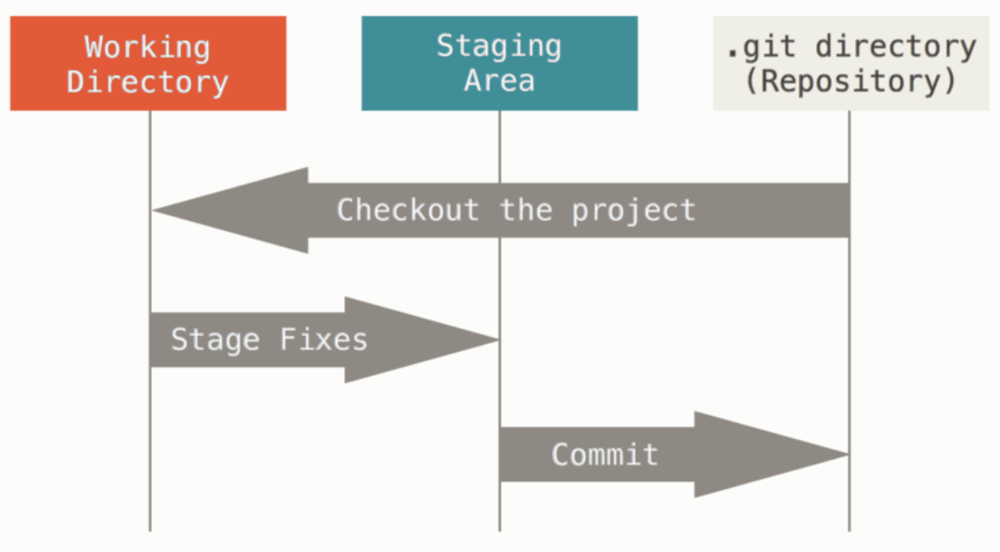
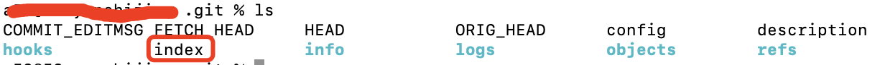

<!-- START doctoc generated TOC please keep comment here to allow auto update -->
<!-- DON'T EDIT THIS SECTION, INSTEAD RE-RUN doctoc TO UPDATE -->
**Table of Contents**  *generated with [DocToc](https://github.com/thlorenz/doctoc)*

- [1. git的安装](#1-git%E7%9A%84%E5%AE%89%E8%A3%85)
  - [2.1 用户信息配置](#21-%E7%94%A8%E6%88%B7%E4%BF%A1%E6%81%AF%E9%85%8D%E7%BD%AE)
  - [2.2 查看用户信息](#22-%E6%9F%A5%E7%9C%8B%E7%94%A8%E6%88%B7%E4%BF%A1%E6%81%AF)
- [3. 常用的图形客户端工具](#3-%E5%B8%B8%E7%94%A8%E7%9A%84%E5%9B%BE%E5%BD%A2%E5%AE%A2%E6%88%B7%E7%AB%AF%E5%B7%A5%E5%85%B7)
- [4. 常用指令](#4-%E5%B8%B8%E7%94%A8%E6%8C%87%E4%BB%A4)
- [5. 常见问题](#5-%E5%B8%B8%E8%A7%81%E9%97%AE%E9%A2%98)

<!-- END doctoc generated TOC please keep comment here to allow auto update -->

### 1. git的安装

Github文档:[https://docs.github.com/zh](https://docs.github.com/zh)

windows的话，直接从官网下载安装文件下载即可；Mac的话，系统已经内置了git，如果想要更新版本或者重新安装的话，可以通过homebrew来安装，git官方推荐的也是使用Homebrew进行安装；linux的话，根据不同的发型版使用各自的包管理器去安装，方式都比较简单；git的官网上都给出了很详细的方法。

git的下载链接：https://git-scm.com/downloads

> 关于对git的了解和学习，建议去git的官网去看，有一定英文基础的，可以查看英文文档：https://git-scm.com/book/en/v2，如果英文基础稍弱一些的，官网也给出了中文文档：https://git-scm.com/book/zh/v2，有些时候虽然看官网的文档有点晦涩难懂，但是官方给出的文档，是最权威的、最新的，只是对于查看、学习的人要有一定的耐心和总结能力。
### 2. git的简单配置

当git安装完成之后，需要做的第一件事就是配置好用户名和用户邮箱，这一点非常重要，因为每一次git的提交，都需要使用到这2个信息，且不可更改。

在做git配置的时候，共有3个级别的配置，分别为系统级别、当前用户级别和当前项目级别。

系统级别，是对当前系统的所有用户都生效，一般很少使用，个人使用电脑，很少做系统级别的配置。系统级别的配置文件:/etc/gitconfig,我当前使用的是mac，系统中默认是没有这个文件存在的，如果有需要，可以在/etc目录下使用管理员权限或者超级用户权限添加--system参数来修改；

用户级别，可以通过修改~/.config/git/cofnig文件或者~/.gitconfig文件来修改，我的系统中，默认有～/.gitconfig配置文件，没有~/.config/git/config文件，这可能不同的系统版本有关系吧，我现在不确认，但我觉着这个不重要，我们的系统中有哪个文件就去改哪个文件就可以了；用户级别的配置文件修改了，修改时可以通过添加--global参数，可以让系统中当前用户下所有的git项目都生效，除非有了项目级别的配置了。

项目级别，项目级别的配置信息，是在当前项目根目录下的.git目录中的config文件，在项目级别的配置文件配置的信息，只对当前项目生效，配置后不会影响到其他的git项目。

```bash
# 系统级别的信息配置  使用--system参数
git config --system user.name 用户名
git config --system user.email 用户邮箱

# 用户级别的信息配置 使用--global参数
git config --global user.name 用户名
git config --global user.email 用户邮箱

# 项目级别的信息配置 不需要使用任何参数
git config user.name 用户名
git config user.email 用户邮箱
```

**查看基本配置信息**

查看配置信息的方式和配置的方式相同，只要去掉最后面的属性值就可以了

```bash
# 查看系统级别的配置信息
git config --system user.name
git config --system user.email

# 查看用户级别的配置信息
git config --global user.name
git config --global user.email

# 查看项目级别的配置信息
git config user.name
git config user.email
```

配置时使用--system或者--global参数，位置固定，紧跟在config之后，不可放在最后如git config user.name 用户名 --system或者查看配置信息时使用git config user.name 用户名 --system这样的方式。

在配置信息时，将-- system或者--global参数放在最后，那么将不生效

在查看信息时，如果将--system或者--global参数放在最后，则参数会被当作配置项的值去生效

> Mac中，～表示当前目录，应该知道这个常识。
#### 2.1 用户信息配置

用户信息配置，使用最多的是用户名和邮箱配置，可以分为全局配置和本地配置。

用户名和邮箱配置，不同的技术团队会有不同的要求,有些团队可能会使用用户名和邮箱作为团队成员识别的标识。

但是我们可能也会在一些开源的社区贡献自己的一些力量，但是又不想暴露自己的真实信息，就需要对个人的信息做灵活的配置。

**全局配置**

全局配置，指当前电脑机器上所有的git仓库都可以使用的用户信息

```bash
git config --global user.name xxxx # 设置全局的git用户名称为xxx

git config --global user.email xxxx@xx.com  # 设置全局的git用户邮箱为xxxx@xx.com
```

**当前仓库配置**

当前仓库配置，就是配置只针对当前仓库的用户信息，和全局的配置方式一样，去掉--global修饰符就可以了

```bash
git config user.name xxxx # 设置当前仓库的用户名为xxxx

git config user.email xxxx@xx.com  # 设置当前仓库的用户邮箱为xxxx@xx.com
```

#### 2.2 查看用户信息

查看用户信息，和配置信息方式基本一致，不给配置项设置值就是查看操作了

**查看全局的用户信息**

```bash
git config --global user.name # 查看全局的用户信息

git config --global user.email # 查看全局的用户邮箱信息
```

> 注意--global参数的位置不可变，如git config user.name --global是不可以的,放到后面就成了name属性的值了。对于做前端、经常使用npm的同学需要注意下

**查看当前仓库的用户信息**

和配置用户信息相同，去掉--global参数即可。

```bash
git config user.name  # 查看当前仓库的用户名

git config user.email # 查看当前仓库的用户邮箱
```

### 3. 常用的图形客户端工具

用过的有sourceree和TortoiseGit,就是小乌龟，我个人首推sourcetree。

sourcetree的各种操作都比较简单，可以实现傻瓜式操作。我本地有太多的项目信息，不再贴图演示了。

### 4. 常用指令

```bash

git fetch  # 拉取代码，但是不合并代码

git pull  # 拉取&合并本地代码

git checkout 分支名 # 切换分支

git stash  # 将变动内容加入到本地暂存区、贮藏栈

git stash save "注释信息" 

```

### 5. git中的数据管理

#### 5.1 添加数据

我们使用git的时候，几乎只使用git添加数据，很难使用git从仓库中删除数据，所以说，使用git作为版本控制的管理工具，几乎不会有什么不可撤销的、可能导致灾难性的导致文件不可恢复的操作。所以我们的文件一旦提交到git，就很难会丢失，只要我们定期的向git仓库推送数据。

当然了，这了说的不可删除数据，并不是说我们不可撤销之前的做的一些动作，关于撤销动作，会在后面有介绍。

所以，在使用git的时候，看可以尽情的、大胆的尝试各种尝试，而不会把文件丢失，当然了，如果我们对git使用的不熟悉，想恢复正常，也是需要消耗点精力的。

#### 5.2 git的三种状态

git有三种状态：已提交(committed)、已修改(modified)和已暂存(staged)。

* 已修改：表示一个文件已经被修改了，但是还没有保存到版本数据库中

* 已暂存：表示对一个已经修改的文件已经做了修改的标记，但是也没有提交到版本数据库中，但是会包含在下次提交的快照中

* 已提交：表示已经修改的文件已经被安全的提交到了版本数据库中

由于git的这些特征，让git项目拥有了3个阶段：工作区、暂存区以及git目录，可参考下图：



**工作区域**

就是我们的项目，.git目录之外的部分，我们的日常工作就是在这部分，这部分的内容，我们可以任意修改

**暂存区域**

暂存区域，其实就是一个索引文件，这个文件包含了下次git提交包含的文件信息，这个文件一般在.git目录中。

暂存区域，在git的术语中，被称作是索引，但是在日常使用中，这个文件其实就是一个暂存文件的作用，所以经常被称作是暂存区域。



git目录，是git用来保存项目元数据的地方，这里是git最重要的部分，git的版本管理，就是管理的这里的数据。

所以说git的基本工作流就是：

1. 日常在工作区编辑文件；

2. 将编辑好的文件缓存到暂存区缓存；

3. 提交更新，将暂存区的文件快照提交到git仓库；

git目录中保存了特定版本的文件，这些文件就是已提交状态；如果需改的文件缓存到了暂存区，那么这些文件就是已暂存状态；如果文件已经被编辑过了，还没有缓存到暂存区，那么这些文件就是已修改状态。

**git仓库**

#### 5.3 撤销操作

用的不是很多，暂时可以先参考下：https://git-scm.com/book/zh/v2/Git-%E5%9F%BA%E7%A1%80-%E6%92%A4%E6%B6%88%E6%93%8D%E4%BD%9C吧
### 6. 常见问题

1. git fetch和git pull的区别？什么时候使用git fetch，什么时候使用git pull?

2. git stash和git add有什么区别？

先参考：https://www.dazhuanlan.com/sherry920122/topics/1523679

3. 完成一次完美的代码提交，需要哪些必须的步骤？

```bash
git add  # 将文件添加到暂存区

git commit -m "注释"  # 将变动文件提交，添加到本地仓库

git push  # 将本地仓库推送到远程服务器端
```

这是几个必须的步骤，但是还有一些其他的操作，日常的操作中也需要注意。

一般情况下，使用了版本控制的项目，都会是多人协作的项目，所以我们在进行commit之前，做一下git pull的拉取操作，拉取最新的代码到本地并进行合并，有了代码冲突从本地开发环境发现、解决，以保证提交干净、整洁的代码到远程的git仓库。