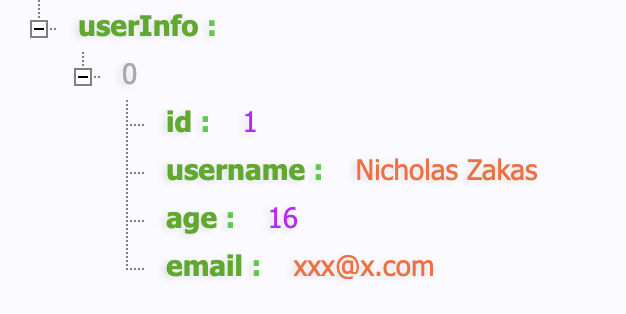

### 2022-01-14 11:28:31,609 ERROR 85756 nodejs.ER_NOT_SUPPORTED_AUTH_MODEError: ER_NOT_SUPPORTED_AUTH_MODE: Client does not support authentication protocol requested by server; consider upgrading MySQL client

egg项目中使用egg-mysql包链接mysql服务器，报错了：

```bash
2022-01-14 11:28:31,609 ERROR 85756 nodejs.ER_NOT_SUPPORTED_AUTH_MODEError: ER_NOT_SUPPORTED_AUTH_MODE: Client does not support authentication protocol requested by server; consider upgrading MySQL client
    at Handshake.Sequence._packetToError (/Users/xxx/Documents/workspace/learning/egg/EggAPI/node_modules/mysql/lib/protocol/sequences/Sequence.js:47:14)
    at Handshake.ErrorPacket (/Users/xxx/Documents/workspace/learning/egg/EggAPI/node_modules/mysql/lib/protocol/sequences/Handshake.js:123:18)
    at Protocol._parsePacket (/Users/xxx/Documents/workspace/learning/egg/EggAPI/node_modules/mysql/lib/protocol/Protocol.js:291:23)
    at Parser._parsePacket (/Users/xxx/Documents/workspace/learning/egg/EggAPI/node_modules/mysql/lib/protocol/Parser.js:433:10)
    at Parser.write (/Users/xxx/Documents/workspace/learning/egg/EggAPI/node_modules/mysql/lib/protocol/Parser.js:43:10)
    at Protocol.write (/Users/xxx/Documents/workspace/learning/egg/EggAPI/node_modules/mysql/lib/protocol/Protocol.js:38:16)
    at Socket.<anonymous> (/Users/xxx/Documents/workspace/learning/egg/EggAPI/node_modules/mysql/lib/Connection.js:88:28)
    at Socket.<anonymous> (/Users/xxx/Documents/workspace/learning/egg/EggAPI/node_modules/mysql/lib/Connection.js:526:10)
    at Socket.emit (events.js:314:20)
    at addChunk (_stream_readable.js:307:12)
    --------------------
    at Protocol._enqueue (/Users/xxx/Documents/workspace/learning/egg/EggAPI/node_modules/mysql/lib/protocol/Protocol.js:144:48)
    at Protocol.handshake (/Users/xxx/Documents/workspace/learning/egg/EggAPI/node_modules/mysql/lib/protocol/Protocol.js:51:23)
    at PoolConnection.connect (/Users/xxx/Documents/workspace/learning/egg/EggAPI/node_modules/mysql/lib/Connection.js:116:18)
    at Pool.getConnection (/Users/xxx/Documents/workspace/learning/egg/EggAPI/node_modules/mysql/lib/Pool.js:48:16)
    at /Users/xxx/Documents/workspace/learning/egg/EggAPI/node_modules/ali-rds/node_modules/pify/index.js:29:7
    at new Promise (<anonymous>)
    at Pool.<anonymous> (/Users/xxx/Documents/workspace/learning/egg/EggAPI/node_modules/ali-rds/node_modules/pify/index.js:12:10)
    at Pool.ret [as getConnection] (/Users/xxx/Documents/workspace/learning/egg/EggAPI/node_modules/ali-rds/node_modules/pify/index.js:56:34)
    at Pool.query (/Users/xxx/Documents/workspace/learning/egg/EggAPI/node_modules/mysql/lib/Pool.js:202:8)
    at /Users/xxx/Documents/workspace/learning/egg/EggAPI/node_modules/ali-rds/node_modules/pify/index.js:29:7
    sql: select now() as currentTime;
code: "ER_NOT_SUPPORTED_AUTH_MODE"
errno: 1251
sqlMessage: "Client does not support authentication protocol requested by server; consider upgrading MySQL client"
sqlState: "08004"
fatal: true
name: "ER_NOT_SUPPORTED_AUTH_MODEError"
pid: 85756
```

主要的错误信息，在第一行，大概意识是说nodejs模块不支持mysql客户端加密方式，简单的方式，就是修改下mysql的加密方式

```bash
ALTER USER 'root'@'localhost' IDENTIFIED WITH mysql_native_password BY '新密码';
```

这样就已经修改了mysql的加密方式，再运行egg程序，就已经没有问题了。



> 关于mysql数据库密码的加密方式，可以参考：[mysql数据库密码的加密方式](./mysql数据库密码的加密方式.md)

