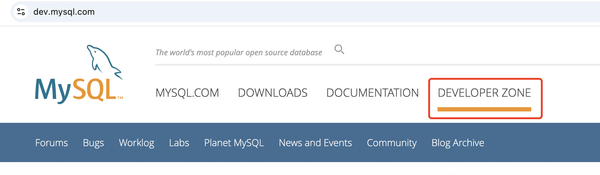
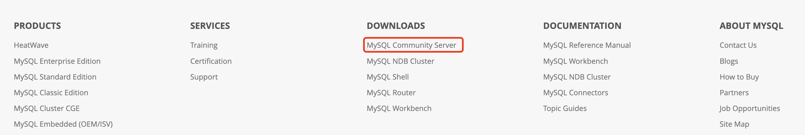
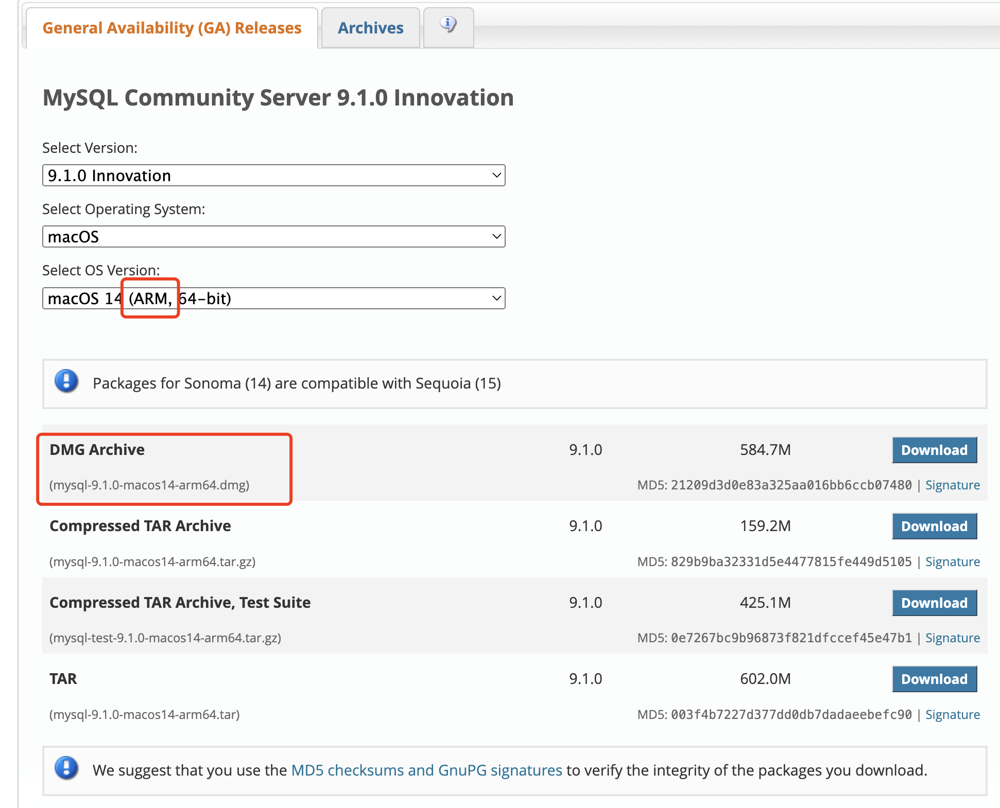
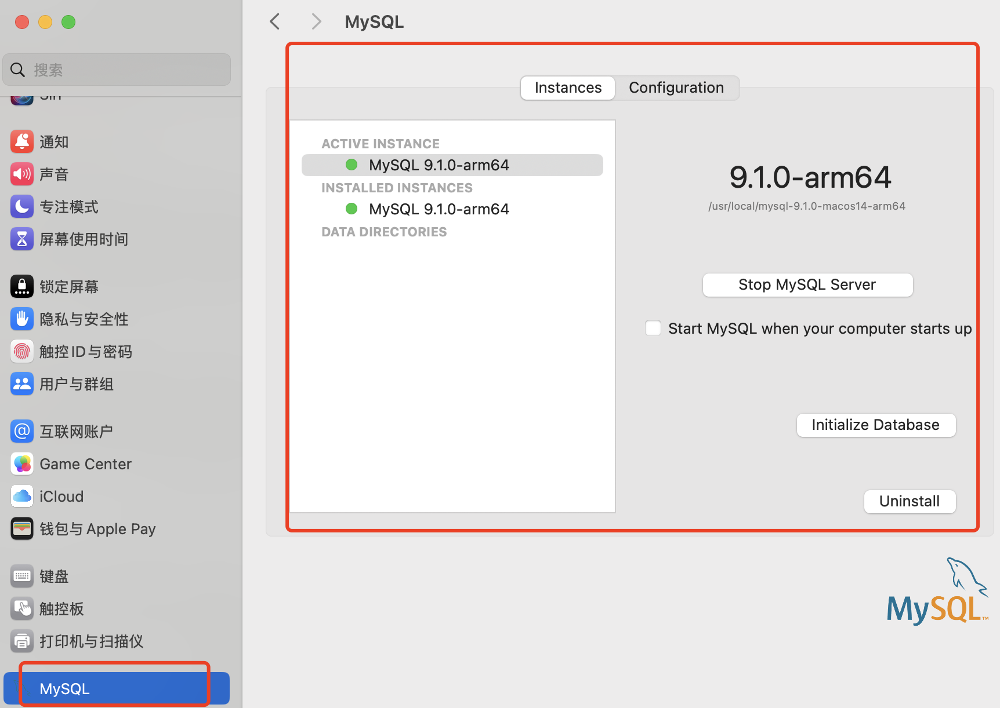

### Mac安装Mysql

Mac配置信息：

Apple M4

MacOS：15.1

相对来说，就是设备相对较新，系统版本相对较高了，之前Intel芯片中可以安装的mysql和客户端工具或者在M1中可以安装的Mysql和客户端工具都不行了。

不光是因为设备新和系统版本的原因，也有软件自身的原因。

1. mysql安装文件下载

下载地址：[https://dev.mysql.com/downloads/mysql/](https://dev.mysql.com/downloads/mysql/)

mysql有多种安装方式和安装文件，个人认为社区版本对于个人开发者来说是最为友好的，故提供的下载链接是社区版本的下载地址。

在mysql的官网上，社区版相关介绍可以从导航进入

社区版块，提供了很多非常好用的工具，大家可以根据需要去取，这里的都是免费的。mysql服务端工具的下载部分，在底部的导航部分：

这里进去后，也就是我们前面提供的下载链接地址。

在下载区域，我们可以根据我们设备的基本信息检索到我们需要的版本。mysql提供了多种安装方式的文件，这里推荐dmg格式的，因为简单，不为别的。

> 如果大家比较习惯命令行操作，也可以下载TAR文件取解压、安装，没有什么优劣之分，纯属习惯不同而已。我比较懒，就使用了傻瓜式的DMG格式的下载文件，一路点击就可以了。

2. 安装

安装环节，没有什么特殊的、需要注意的地方，直接点击下一步就可以了。

3. 服务管理

这种安装方式还有一个好处，就是mysql的服务，默认可以安装到设置中，服务的管理和配置都比较简单，可以通过UI的方式去操作，还不需要安装第三方的客户端工具。

4. 安装客户端

mysql的客户端，大家可以选择自己喜欢的客户端，或者也可以根据自己的习惯不使用客户端，直接使用命令行即可。以我为例，我比较习惯了使用navicat，就以安装navicat为例介绍了。

navicat是收费的，如果大家米够了，那就不需要往下看了，直接提米换货就可以了。我们简单介绍下怎么节省一点米也可以达到学习的目的。

下载地址：[https://macwk.com.cn](https://macwk.com.cn)、[https://www.52mac.com/](https://www.52mac.com/),可以从这两个站点里面去下载。

**安装**

由于从第三方站点下载的应用，安装的时候，被系统的安全直接拦截了，导致没有办法直接安装。可以通过修改一下系统配置：

1. 设置允许安装任何来源的应用

设置-隐私与安全性-允许以下来源的应用，这里选择下“任何来源”，如果没有这个选项，可以自行网络上查询一下，比较容易设置

2. 