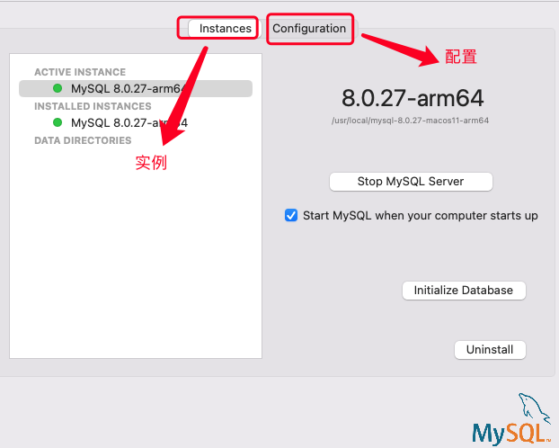
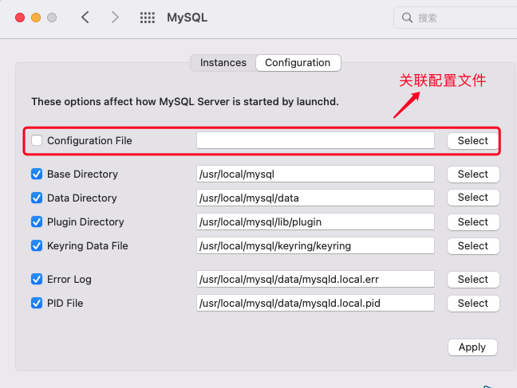

### mac中通过dmg安装文件安装的mysql自定义配置

mac中通过dmg安装文件安装的mysql，默认没有配置文件，如果需要，可以自己创建mysql的配置文件。

mac中通过dmg方式安装的mysql，服务的管理既可以通过命令行的方式管理，也可以通过UI的方式管理。今天主要说说通过UI设置的方式来管理mysql服务。

mysql正常安装以后，就会在设置界面中有一个mysql服务管理的入口：

点计入mysql标识进来后，可以看到mysql的一些基础信息，上面有mysql实例和配置的切换标签：

在配置(Configuration)面板，已经关联好了mysql的一些基础文件，如pid、log、数据文件存储位置等，但是没有配置文件，因为默认就没有配置文件。

如果需要的话，自己创建一个my.cnf文件，然后关联一下就可以了。

> 本文中所说的，都是基于通过dmg方式安装的mysql来介绍的，没有介绍命令行方式的服务管理。