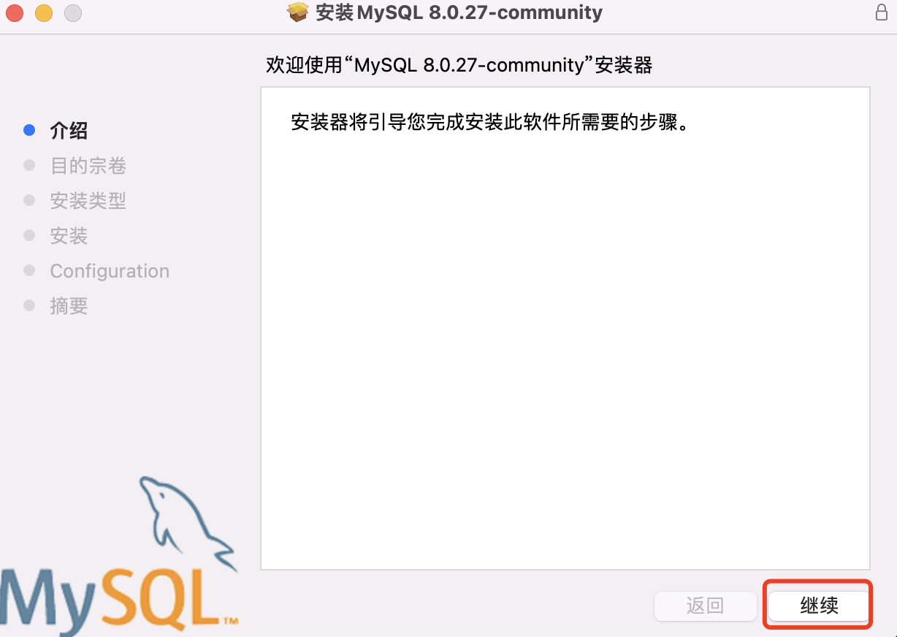
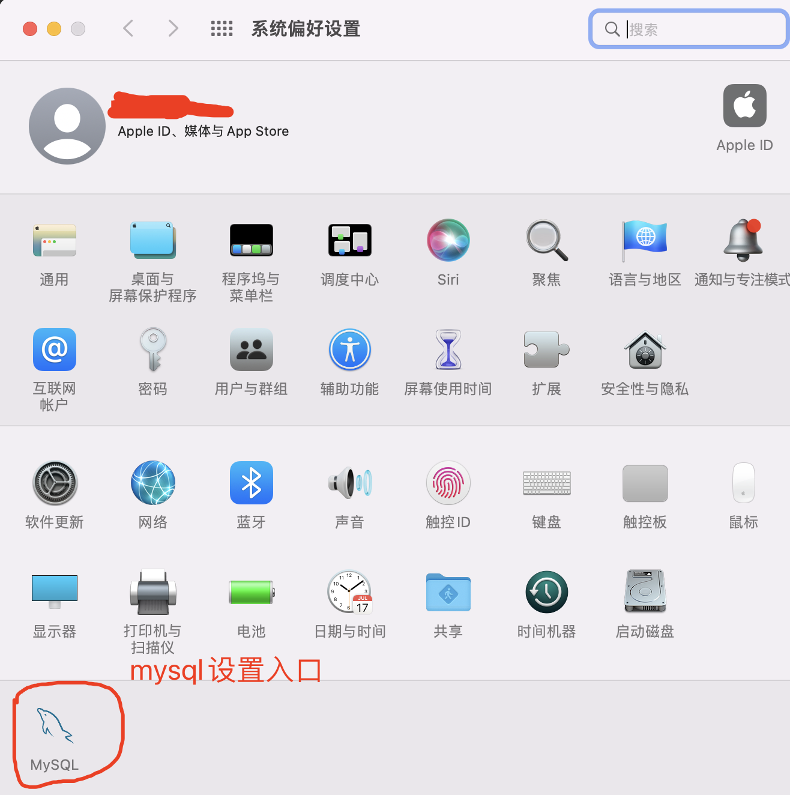
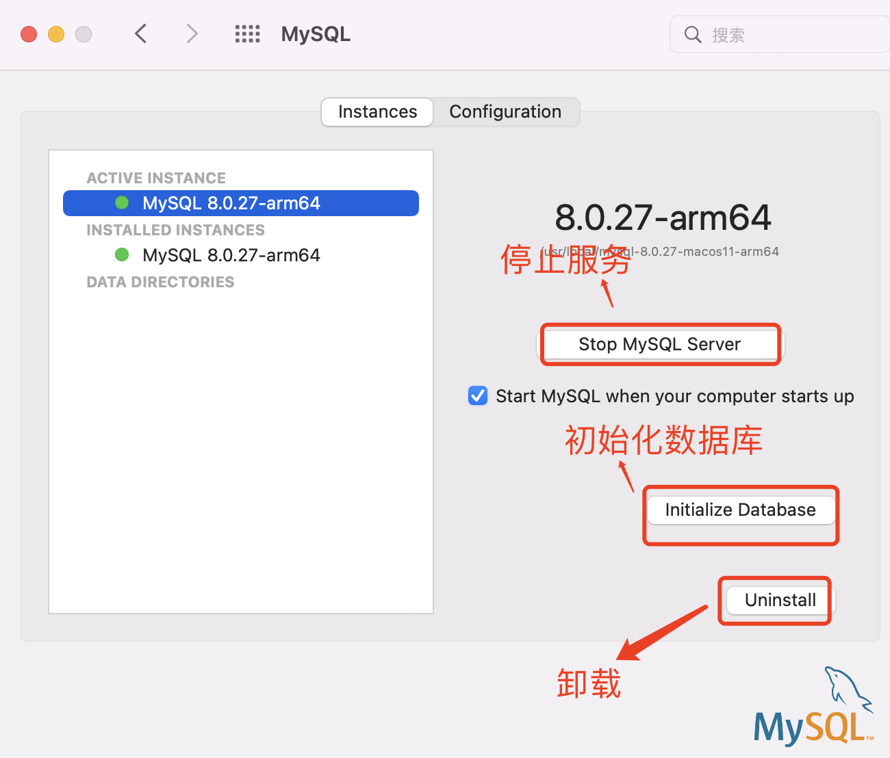
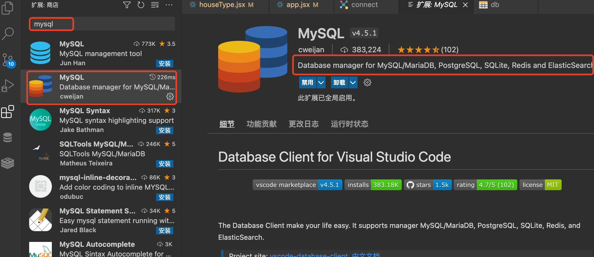

### 1. mysql数据库安装及环境配置

mac上安装mysql，我常用的有两种方式，一种方式是使用Homebrew，一种是直接下载dmg安装文件安装。

#### 1.1 安装文件安装及管理

下载链接：https://dev.mysql.com/downloads/mysql/


最新的Mac M1芯片的是ARM架构的，如果有显示是Intel的，就下载x86版本的安装包。

下载后双击安装文件安装，一路“继续”就可以了



安装的过程中可能需要输入电脑账号，根据需要输入就可以了.

安装过程中还会让选择密码方案，是选择加强的加密方案，还是常规的加密方案，我选择了默认的加密方案：加强的加密方案，加强的加密方案，就是设置密码要复杂一点，同时使用数字、字母组合。没有把图片给截下来，遗憾了。

设置好密码后点击finish，继续下一步就可以了。

安装成功后，在设置面板中会有一个mysql的设置入口。



点击入口，打开mysql的管理窗口



##### 1.1.1 vscode中安装mysql插件管理mysql

mysql的客户端管理软件很多，比较常用的有Navicat、MySQL Workbenc、phpMyAdmin、SQLyog，服务端开发人员可以根据需要选用这些工具，功能强大，我是非专业的数据库开发角色，只要有一个简单的帮我看下数据库就可以的，我选择使用vscode的mysql插件。



这个插件功能相对比较强大，支持SQLite、Redis。


#### 1.1.2 终端操作mysql

通过dmg文件安装，文件的安装目录：/usr/local/mysql

安装完成后，直接在终端执行指令，正常情况下会给异常信息提示：zsh: command not found: mysql,是因为没有配置mysql的环境变量，需要将mysql的可执行文件添加到环境变量

如果终端使用的是bash，

```bash
vi ~/.bash_profile

export PATH=/usr/local/mysql/bin:$PATH

export ~/.bash_profile
````

如果终端使用的是zsh

```bash
vi ~/.zshrc

export PATH=/usr/local/mysql/bin:$PATH

source ~/.zshrc  # 重启配置文件
```

**通过终端启动、停止服务**

mysql服务管理的脚本在/usr/local/mysql/support-files,可以在该目录下执行：

```bash
# 开启服务
sudo ./mysql.server start

# 停止服务
sudo ./mysql.server stop
```

但是这样太麻烦了，可以做一些配置，简化操作。

可以在shell的配置文件中配置一下：

```bash
# 打开shell配置文件
vi ~/.zshrc

# 将下面的代码复制到配置文件中
alias mysqlstart='sudo /usr/local/mysql/support-files/mysql.server start'
alias mysqlstop='sudo /usr/local/mysql/support-files/mysql.server stop'
alias mysqlreload='sudo /usr/local/mysql/support-files/mysql.server reload'
alias mysqlrestart='sudo /usr/local/mysql/support-files/mysql.server restart'

# 重启配置文件
source ~/.zshrc
```
之后就可以通过mysqlstart和mysqlstop来启动和停止服务了,同样mysqlreload和mysqlrestart也可以使用了
#### 1.2 通过Homebrew安装及管理

https://blog.csdn.net/weixin_34026997/article/details/113579589?utm_term=mac%E6%9F%A5%E7%9C%8B%E6%98%AF%E5%90%A6%E5%AE%89%E8%A3%85%E4%BA%86mysql&utm_medium=distribute.pc_aggpage_search_result.none-task-blog-2~all~sobaiduweb~default-1-113579589&spm=3001.4430

### 2. 服务管理

#### 2.1 查看服务状态

#### 2.2 开启服务


#### 2.3 停止服务

#### 2.4 重启服务

### 3. mysql客户端工具

常用的有Navicat，但是它收费的，如果是个人使用，网上有破解方法；如果是工作使用，就企业购买正版吧，支持正版。

如果使用vscode作为编辑器的话，可以安装mysql插件，因为我不是专职DBA，vscode插件已经基本满足了我的需求了。

### 4. mysql基础指令