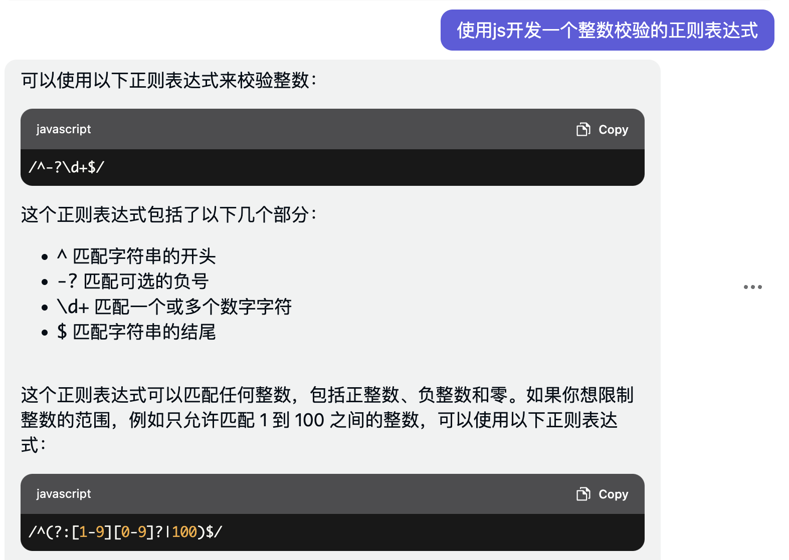

### 了解ChatGPT

ChatGPT是一个大型的语言模型，由OpenAI公司基于GPT-3.5架构训练。它使用了人工智能技术，能够理解并回答各种自然语言的问题，包括但不限于语音识别、自然语言处理和文本生成等任务。它可以与用户进行交互，回答各种问题，提供各种服务。

#### ChatGPT的使用场景

前面提到了ChatGPT可以提供多种能力，那么它究竟都可以有哪些使用场景呢？

做过一些简单的调研，ChatGPT有以下几个但又不限于以下几种的应用场景：

1. 客服机器人：ChatGPT可以作为客服机器人，与客户进行交互，回答关于产品或服务的问题，提供帮助和解决方案；

2. 智能助手：ChatGPT可以作为智能助手，回答用户的各种问题，提供日程安排、天气预报、交通信息等各种服务；

3. 内容生成：ChatGPT可以用于生成各种文本内容，如文章、新闻、小说、报告等；

4. 语音识别：ChatGPT可以将语音转换为文字，帮助人们更好的进行交流、沟通；

5. 机器翻译：ChatGPT可以将一种语言翻译成另外一种语言，帮助人们跨域语言障碍进行交流；

上面是ChatGPT的一些典型、简单的使用场景，实际上ChatGPT可以应用到更多的不同领域和业务中。

除了上面的一些使用场景，作为一名开发者，我觉着ChatGPT还有一个有趣的使用场景，就是可以写代码，可以帮助我减少很多知识获取的时间消耗。原来我想获取某个方面的知识可以通过baidu或者google，然后通过各种分析形成一个问题的解决方案，现在我可以直接让ChatGPT告诉我解决方案，且ChatGPT给我的解决方案后面还带有解释说明。这对于一个开发者来说简直是不要太友好。

ChatGPT不仅给出了代码，还做了详细的解释，这对于开发者来说是非常的友好。

#### ChatGPT的数据源？

我们已经了解到ChatGPT是一个大数据语言模型，那么它的数据来源是哪里呢？

ChatGPT的数据来源主要是互联网上的文本数据，包括网页、新闻、书籍、论文、社交媒体等。这些数据被用来训练ChatGPT，使其能够学习和处理自然语言和语法、语义和上下文等方面的知识。

ChatGPT的数据有来自互联网的大量文本数据，但这些数据并不是通过网络爬虫爬取的(网络爬虫爬取数据会涉及到法律风险问题)。ChatGPT是从公共数据集和其他可获取的数据源中获取数据。

**公共数据集**：公共数据集指由行业组织、政府、或个人维护和管理的、可供公众免费下载和使用的数据集合。这些数据集通常包含大量的结构化的或非结构化的数据，可以用于各种研究、分析和应用领域。下面为一些常见的公共数据集的案例：

1. 维基百科数据集：维基百科是一个由志愿者创建和维护的百科全书，其内容可供免费下载和使用； 

2. Common Crawl数据集：Common Crawl是一个非营利组织，致力于收集和提供互联网上的大规模web数据集，其数据可供免费下载和使用；

3. Kaggle数据集：Kaggle是一个知名的数据科学竞赛平台，其网站上也提供了大量的公共数据集，可供免费下载和使用；

4. 政府数据集：各国政府也会发布一些公共数据集，比如美国的data.gov网站、英国的data.gov.uk网站等；

5. 学术数据集：许多学术机构和研究者也会发布一些公共数据集，以供其他研究者和学生使用，比如UCI机器学习库、ImageNet图像数据集等。

这些公共数据集对于研究、分析和应用领域都非常有用，可以为数据科学家、研究者和开发者等提供免费且高质量的数据资源，帮助他们更好的进行研究和开发。同时，使用这些数据集也要遵守相关的规定和协议，以确保数据的合法性和隐私安全。

**其他可获取数据源的渠道**：其他可获取数据源的渠道，是指OpenAI公司与其他公司或组织进行合作，获取一些可用的数据集，这些数据集可能包括社交媒体数据、新闻数据、电子邮件数据等，这些数据可能需要付费或者授权。