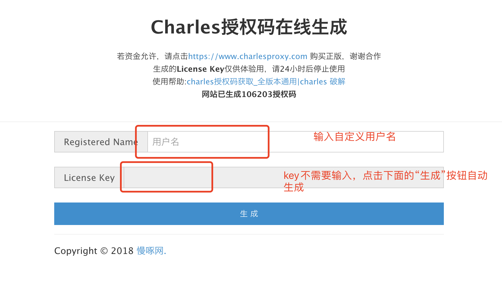
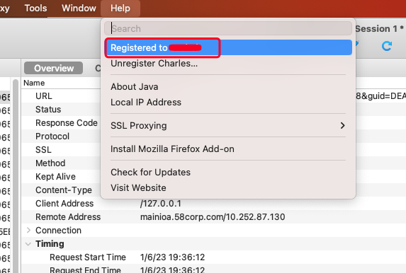

### Charles license key

charles可以说是现在web开发中使用频率非常高的工具了，但是它需要license key激活，否则好像是只能试用30分钟，然后会退出。虽然退出后还能通过再次开启的方式继续使用，但是每30分钟就自动退出的方式还是不那么的友好。

对于经济条件允许的，是非常推荐去购买官方的版权，支持作者的劳动，尊重知识，为知识付费。

但是对于经济条件有限，而不常用，仅仅是用来体验试用的，可以推荐一个在线工具来生成临时license key，可以让我们体验charles。

在线工具地址：https://www.charles.ren/

使用方式：

1. 输入用户名；

2. 点击"生成"按钮自动生成key

3. 将自定义的用户名和license key输入到Charles的注册框即可。

注册过后的Charles如下所示：

然后再使用Charles的时候，启动界面也不需要再等待10s才能进入界面，也不会再每使用30分钟就会自动退出了。接下来就可以正常的使用了。

> 尊重作者的劳动，尊重知识，还是建议有经济能力的看官购买正版。