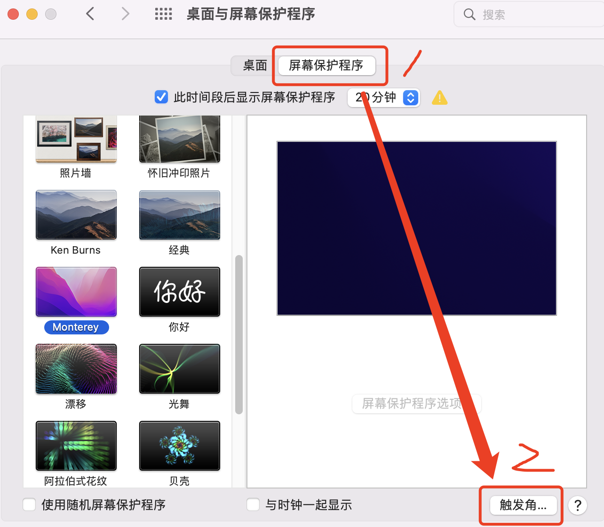

<!-- START doctoc generated TOC please keep comment here to allow auto update -->
<!-- DON'T EDIT THIS SECTION, INSTEAD RE-RUN doctoc TO UPDATE -->
**Table of Contents**  *generated with [DocToc](https://github.com/thlorenz/doctoc)*

- [Mac电脑锁屏](#mac%E7%94%B5%E8%84%91%E9%94%81%E5%B1%8F)

<!-- END doctoc generated TOC please keep comment here to allow auto update -->

### Mac电脑锁屏

日常中，电脑中保存了我们生活和工作的各种文件，还会有很多涉及到个人隐私、工作机密的事情，所以当我们不在电脑跟前的机会，及时锁屏就很有必要了。

经常使用windows的同学应该都知道，使用windows+L组合键，可以快速锁屏，但是Mac上没有快速锁屏的快捷键。那是用Mac，怎么也可以做到快速锁屏呢？

Mac虽然没有给我们提供快速锁屏的快捷键，但是Mac却给我们提供了“屏幕保护程序”可以实现快速锁屏，比使用快捷键更加便捷。

设置方法：

打开设置，选择“桌面与保护程序”，再进入“屏幕保护程序”选项卡

进入到“屏幕保护程序”页签后，点击右下角的“触发角”按钮，会弹出一个”活跃的屏幕角“弹层

弹层中的4个下拉框分别对应了电脑屏幕的4个角，表示当电脑鼠标移动到这些角的时候可以触发的一些动作。比如我选择了左上角，触发锁定屏幕的动作

这样当电脑鼠标移动到左上角的时候，就会锁屏屏幕。这就是在没有快捷键的情况下的另一种快速锁屏的办法。