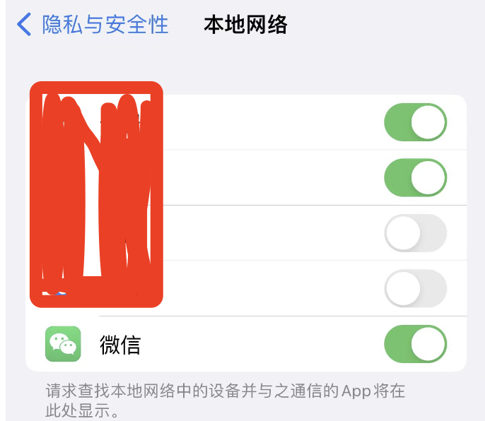

在前端开发中总是会涉及到网络请求，在日常的开发中，charles是一种非常好用的抓包工具。

配置方式，可以直接百度，介绍的内容很多，不需要赘述。但是这几天在iOS上配置时，微信小程序总是没有办法代理成功、无法抓包的问题，困惑了我好几天。今天终于解决了。

### charles配置网络代理，没有办法在iOS上代理微信小程序网络，无法抓取微信小程序请求包？

按照从网上查询来的配置方式、证书、charles自己本身，已经装装卸卸了不知道多少遍了，也请教了n多人，都尝试了很多办法，但最终都是以失败而告终。

我的工作环境是：Mac(Apple M1)、iphone13(iOS16.5.1)，charles(4.6.4,目前是最新版本)。

原来尝试了很多办法后都以失败告终，但是作为一名前端开发者，日常开发离不开网络抓包，没有这个抓包的能力是不行的。这个困惑我多天的问题，今天终于被我解决了。

**故障原因及解决方式**

原来是iOS升级了网络本地的网络权限，默认情况下，系统代理是没有办法代理到微信的网络的。

解决：

设置->隐私与安全->本地网络,找到微信，将控制开关打开，然后就可以使用charles正常代理微信网络并抓取微信小程序的http请求包了

