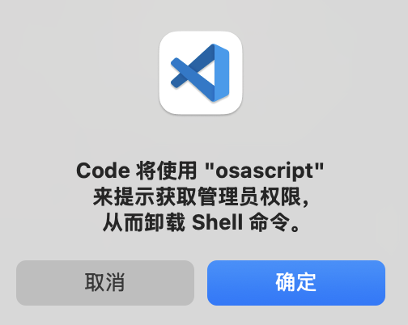

### mac在终端通过code指令打开vscode

前几天新更换了设备，配置了在终端可以通过code指令来快速启动vscode，今天早上突然发现没有办法通过code来启动vscode了。

于是想可能是最近几天在配置开发环境，是不是配置什么的时候，影响到了path变量？从而导致vscode不能正常启动了？那么就来重新配置一下vscode吧。

参考[mac终端设置vscode快捷启动](./mac不能在终端通过code指令打开vscode.md)

可是在重新安装code指令时提示没有权限。

**解决方案**

卸载掉原来的code指令，重新安装一次。

1. 卸载code指令

通过shift+command+p指令打开搜索面板，输入或者选择“Shell Command: Uninstall 'code' command from Path”

卸载的时候会出现提示框：“Code将使用osascript来提示获取管理员权限，从而卸载Shell命令”，选择确定就可以了。

2. 重新安装code指令

通过shift+command+p组合指令打开搜索命令面板，输入“Shell Command:Install ‘code’ Command in Path”

在安装code指令的时候，可能也会出现一个提示弹层，选择同意就可以了。

> 出现code指令不可用，并在卸载和重新安装的时候出现提示的原因，可能是我的设备上安装了rosetta的原因。有的基于Intel的应用，在Apple芯片的设备上安装的时候，会提示让安装一下rosetta才可以正常运行，于是就安装了。

> 关于rosetta，可以参考[https://support.apple.com/zh-cn/102527](https://support.apple.com/zh-cn/102527)