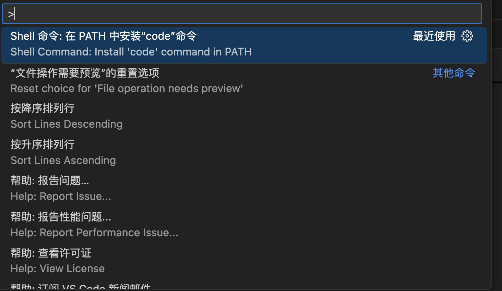
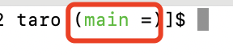

<!-- START doctoc generated TOC please keep comment here to allow auto update -->
<!-- DON'T EDIT THIS SECTION, INSTEAD RE-RUN doctoc TO UPDATE -->
**Table of Contents**  *generated with [DocToc](https://github.com/thlorenz/doctoc)*

- [Mac开发环境搭建](#mac%E5%BC%80%E5%8F%91%E7%8E%AF%E5%A2%83%E6%90%AD%E5%BB%BA)
  - [Homebrew的安装](#homebrew%E7%9A%84%E5%AE%89%E8%A3%85)
  - [编辑器安装](#%E7%BC%96%E8%BE%91%E5%99%A8%E5%AE%89%E8%A3%85)
  - [host管理应用switchhosts安装](#host%E7%AE%A1%E7%90%86%E5%BA%94%E7%94%A8switchhosts%E5%AE%89%E8%A3%85)
  - [pnpm安装](#pnpm%E5%AE%89%E8%A3%85)
  - [yarn安装](#yarn%E5%AE%89%E8%A3%85)
  - [nvm安装](#nvm%E5%AE%89%E8%A3%85)
  - [nrm安装](#nrm%E5%AE%89%E8%A3%85)
  - [Git安装](#git%E5%AE%89%E8%A3%85)
  - [chales安装配置](#chales%E5%AE%89%E8%A3%85%E9%85%8D%E7%BD%AE)
  - [postman](#postman)
  - [nginx](#nginx)

<!-- END doctoc generated TOC please keep comment here to allow auto update -->

### Mac开发环境搭建

主要是前端开发环境搭建,前端的开发场景，主要会涉及到下面的一些环境。

#### Homebrew的安装

官网链接：[https://brew.sh/](https://brew.sh/)

安装:

```bash
/bin/bash -c "$(curl -fsSL https://raw.githubusercontent.com/Homebrew/install/HEAD/install.sh)"
```

> 安装过程中，如果出现关于githubusercontent.com的网络连接问题，可以尝试修改下DNS，可以修改为Google的公共DNS(8.8.8.8、8.8.4.4)或者阿里云的公共DNS(223.5.5.5、223.6.6.6)试试

#### 编辑器安装

常用的编辑器有vscode和Cursor

1. vscode安装和配置

官网: [https://code.visualstudio.com/](https://code.visualstudio.com/)

vscode是绿色应用，无需安装，下载解压后可直接使用。

mac中，最好是把下载后的应用移动到应用程序目录中，这样可以应用可以被添加到启动台中，之后就可以直接通过启动台来找应用去启动了。

**配置终端中通过code指令启动vscode**

mac作为开发者的利器，开发者离不开终端命令行工具，对于vscode来说，可以直接通过指令来启动。配置方式：

- 同时按下shift+command+p，打开命令面板,选择“Shell命令：在path中安装code命令”



然后就可以直接在终端命令行中通过执行code来启动vscode了。

也可以参考: [mac终端设置vscode快捷启动](./mac终端设置vscode快捷启动.md)

2. Cursor安装配置


#### host管理应用switchhosts安装

官网: [https://switchhosts.vercel.app/](https://switchhosts.vercel.app/)

由于网络环境的原因，国内的网络环境最近一直打不开。

github:[https://github.com/oldj/SwitchHosts/releases](https://github.com/oldj/SwitchHosts/releases)

github的网络环境，比它官网的网络环境稍好，国内偶尔可以打开。

> 版本简单说明：arm：apple芯片，M1-M4的，没有arm标识的，为Intel芯片的。近几年的Macbook好像没有了Intel的设备了。

#### pnpm安装

中文网站: [https://www.pnpm.cn/](https://www.pnpm.cn/)

也可以参考另外一个文档站点: [https://pnpm.nodejs.cn/](https://pnpm.nodejs.cn/),这个站点有一点不好的地方，就是有广告，但是内容相对来说更新更快、更及时，和英文官网数据同步的更快。根据需要查看文档吧。

pnpm没有集成在node.js中，pnpm有多种安装方式，可以通过npm、yarn等包管理工具安装，也可以通过corepack。通过corepack安装有一个优势，就是可以将pnpm直接添加到系统的环境变量path中，永远使用pnpm的最新版本。使用npn、yarn等包管理工具安装，也是可以正常使用。

pnpm需要node的最低版本：18.12

如果使用npm、yarn全局安装的pnpm，或者其他的全局依赖，都不会添加到系统的环境变量path中，所以需要手动添加。也可以通过在新的node版本中重新安装全局依赖的方式解决。

```bash
npm install pnpm -g
```

#### yarn安装

中文网站：[https://www.yarnpkg.cn/](https://www.yarnpkg.cn/)

```bash
npm install yarn -g
```

> pnpm和yarn按说都是一个包管理工具而已，node已经内置了npm，这2个其实有没有必要安装，各位可以根据自己的事情情况去选择。pnpm确实存在一些npm和yarn不具备的优势。

自node.js的v16.13开始，node.js发布了用于管理包管理工具的corepack，可参考[https://pnpm.nodejs.cn/installation#using-corepack](https://pnpm.nodejs.cn/installation#using-corepack),不过这个corepack是一项实验性的性能，因此可能不太稳定。

#### nvm安装

nvm的相关介绍，可以参考github主页: [https://github.com/nvm-sh/nvm](https://github.com/nvm-sh/nvm)

安装方式：

```bash
# 通过curl安装，mac中推荐使用curl方式安装
curl -o- https://raw.githubusercontent.com/nvm-sh/nvm/v0.40.1/install.sh | bash

# 通过wget方式安装，因为mac默认没有安装wget，所以可以优先使用curl方式去下载
wget -qO- https://raw.githubusercontent.com/nvm-sh/nvm/v0.40.1/install.sh | bash
```

[wget介绍](../电脑应用/wget.md)

#### nrm安装

```bash
npm install nrm -g
```

nrm本身就是一个npm包，可以直接通过npm包管理器安装。更多关于nrm的介绍，可以参考[nrm](../frontend/node/nrm.md)

#### Git安装

1. git安装

git有多种安装方式，在mac中，最常用的是通过homebrew安装和安装包直接安装。

- 通过homebrew安装

```bash
brew install git
```

homebrew就合前端开发领域中的包管理工具npm一个概念，只不过不是管理node的开发工具包的，而是管理mac的应用的，功能类似。

- 下载安装文件直接安装

git没有提供单独针对M芯片的安装文件，而是通过集成xcode命令行工具去使用git。

2. 终端中显示分支名

- 在低版本的mac中，然后使用的bash，可以通过下列方式去修改

```bash
# 在bash的配置文件中末尾添加如下内容
vi ~/.bash_profile
function git_branch {
   branch="`git branch 2>/dev/null | grep "^\*" | sed -e "s/^\*\ //"`"
   if [ "${branch}" != "" ];then
       if [ "${branch}" = "(no branch)" ];then
           branch="(`git rev-parse --short HEAD`...)"
       fi
       echo " ($branch)"
   fi
}
export PS1='\u@\h \[\033[01;36m\]\W\[\033[01;32m\]$(git_branch)\[\033[00m\] \$ '
```

然后重载配置文件

```bash
source ~/.bash_profile
```

如果使用的是zsh，那么就在zsh的配置文件末尾添加上面的内容，然后重载下配置文件即可

```bash
vi ~/.zshrc
function git_branch {
   branch="`git branch 2>/dev/null | grep "^\*" | sed -e "s/^\*\ //"`"
   if [ "${branch}" != "" ];then
       if [ "${branch}" = "(no branch)" ];then
           branch="(`git rev-parse --short HEAD`...)"
       fi
       echo " ($branch)"
   fi
}
export PS1='\u@\h \[\033[01;36m\]\W\[\033[01;32m\]$(git_branch)\[\033[00m\] \$ '

# 重载配置文件
source ~/.zshrc
```

- 较新版本的mac系统中，上面的方式失效了，默认的终端也从bash改为了zsh，对于这些较新版本系统来说，可以使用下面的方式来修改配置

> 具体的系统版本好像是Big Sur吧

首先下载这个脚本到本地，可以存储到当前用户目录下，并命名为.git-prompt.sh

[https://gitcode.com/gh_mirrors/gi/git/blob/master/contrib/completion/git-prompt.sh](https://gitcode.com/gh_mirrors/gi/git/blob/master/contrib/completion/git-prompt.sh)

然后将下的配置添加到.zshrc文件的末尾

```bash
GIT_PS1_SHOWUPSTREAM="auto"
GIT_PS1_SHOWCOLORHINTS="yes"
source ~/.git-prompt.sh
setopt PROMPT_SUBST
PS1='[%n@%m %c$(__git_ps1 " (%s)")]\$ '
```

最后重载配置文件

```bash
bash ~/.zshrc
```

到此，mac终端应该就会正常显示分支名称了,看起来直观了，不用再担心修改错代码了。



#### chales安装配置

#### postman

#### nginx