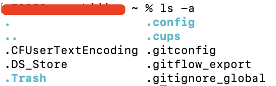

### mac终端命令行ls怎么区分文件和文件夹？

mac，在终端使用ls指令的时候，所有的文件和文件夹都给罗列了出来，都是黑字白底，傻傻分不清哪个是文件，哪个是文件夹，对于从事技术工作的人来说，不需要把各个工具的UI都搞的很漂亮，但是也需要一些最基本的视觉区分，如罗列文件时可以从视觉上区分下某个文件是文件还是文件夹，只要能做到这个就可以了。


终端是bash或者zsh的都可以通过这个设置方式

**bash的设置方式**

首先，我们要知道，bash的配置文件为～/.bash_profile,

```bash
# 打开bash的配置文件,用户目录下的.bash_profile配置文件
vim ~/.bash_profile
# 写入下面两行
export CLICOLOR=1
export LSCOLORS=GxFxCxDxBxegedabagaced

# 重新加载配置文件，让配置立即生效
source ～/.bash_profile
```

经过这几步的简单配置后，再执行ls指令时，文件和文件夹就呼有一个颜色的区分了。

> 配置完成后，一定要执行一下source ～/.bash_profile指令，让配置文件生效，否则配置文件不会立即生效

**zsh的设置方式**

zsh和bash的设置方式基本相同，只是配置不同的配置文件，zsh的配置文件是~/.zshrc

```bash
# 打开zsh的配置文件,用户目录下的.zshrc配置文件
vim ~/.zshrc
# 写入下面两行
export CLICOLOR=1
export LSCOLORS=GxFxCxDxBxegedabagaced

# 重新加载配置文件，让配置立即生效
source ～/.zshrc
```

可以区分文件和文件夹后的效果比之前好多了：

