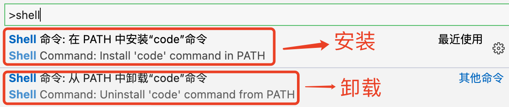

### mac终端设置vscode快捷启动

在windows上使用vscode的时候可以直接在命令行通过code .指令快速启动vscode，最近几天将工作台切换成了mac，发现在mac的终端不能直接通过code .指令快速启动vscode，那么怎么也可以在mac的终端上通过指令快速启动vscode呢？

无论是通过哪种方式启动，最终肯定是要通过vscode的启动文件，通过命令行，无非就是把vscode的启动文件路径加入到了系统的环境变量，然后执行的指令直接指向了vscode的执行文件，有2种配置方法：

1. 通过在vscode中安装"code"命令工具

打开vsocode，使用快捷键⇧⌘P，然后输入shell，会弹出来“Shell命令：在PATH中安装‘code’命令”浮窗，选择安装就可以了，然后就可以在终端通过code .来快速启动vscode了



2. 直接将vscode的启动文件的启动路径通过别名的方式配置的shell的配置文件中

```bash
vi ~/.zshrc
alias code='/Applications/Visual\ Studio\ Code.app/Contents/Resources/app/bin/code'
:wq
```

配置完成，然后也可以通过在终端通过code .的方式快速启动了。

> 文中介绍了两种配置方式在终端通过指令的方式快速启动vscode，但是其背后的逻辑是一样的，都是通过将vscode的启动文件路径加入到系统的环境变量中，可以让指令快速调用vscode的启动文件。