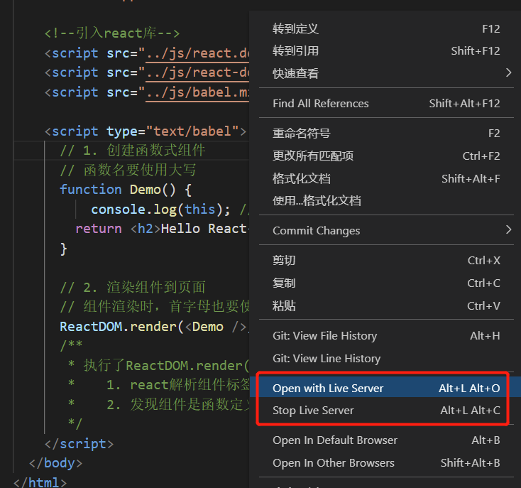

<!-- START doctoc generated TOC please keep comment here to allow auto update -->
<!-- DON'T EDIT THIS SECTION, INSTEAD RE-RUN doctoc TO UPDATE -->
**Table of Contents**  *generated with [DocToc](https://github.com/thlorenz/doctoc)*

- [1. vscode简介](#1-vscode%E7%AE%80%E4%BB%8B)
- [2. Vscode 和 webstorm 对比](#2-vscode-%E5%92%8C-webstorm-%E5%AF%B9%E6%AF%94)
- [3. 高频率快捷键](#3-%E9%AB%98%E9%A2%91%E7%8E%87%E5%BF%AB%E6%8D%B7%E9%94%AE)
- [4. vscode下的.vscode目录](#4-vscode%E4%B8%8B%E7%9A%84vscode%E7%9B%AE%E5%BD%95)
- [5. 推荐插件](#5-%E6%8E%A8%E8%8D%90%E6%8F%92%E4%BB%B6)

<!-- END doctoc generated TOC please keep comment here to allow auto update -->

### 1. vscode简介

vscode是微软推出的一款轻量级编辑器。

vscode的使命：让开发者在编辑器里拥有IDE的开发体验。

Vscode自带了Js、Ts和Node的语法支持，如果我们使用vscode开发 js、ts和node应用，那么编辑器是自带智能提示的。如果是其他的编程语言，可以通过安装扩展包插件来支持智能提示。

### 2. Vscode 和 webstorm 对比

vscode 很占用内存，尤其是开了多个窗口之后，webstorm也是非常的占用内存，但是webstorm在占用内存很多的情况下，使用起来很卡顿，这一点没有 vscode 的使用体感好。如果希望使用一款既轻量级、又不卡顿的编辑器，更加推荐的是 sublime Text、editplus、nodepad++。

### 3. 高频率快捷键

參考：https://juejin.cn/post/6844903826063884296

每天记住一个吧，不要贪多

### 4. vscode下的.vscode目录

.vscode 目录保存了vscode的配置文件,只针对当前项目生效，将.vscode提交到代码仓库，团队统一配置，非常方便。

settings.json：工作空间、代码格式化配置、插件配置

sftp.json：ftp 文件传输配置

### 5. 推荐插件

1. Prettier代码格式化插件

Prettier是一个代码格式化插件，它只关注格式化，但不具备校验功能。在由多人协作的团队中，统一的代码规范很重要，可以做到代码风格的一致性，提高代码的可读性和统一性，维护性也较高。

2. ESLint代码格式校验

日常开发中，建议使用Prettier做代码格式化，使用ESLint做格式的校验；

3. Beautify代码格式化工具

Beautify和Prettier相同，都是代码格式化工具，但是在相比之下，Prettier的使用量更大。更推荐使用Prettier

4. live-server轻量级服务器

live-server是一个具有实时重载功能的小型开发服务器，可以用来热加载 html 文件，但是不能用来部署线上服务。

