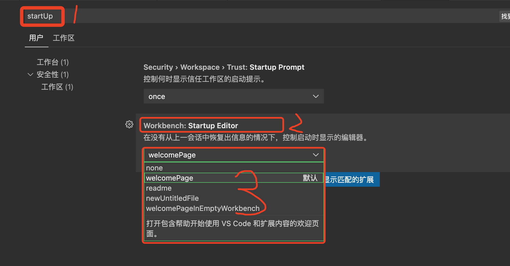

### vscode开启和关闭启动欢迎页

前段时间在使用vscode的过程中，每次启动vscode总是显示一个欢迎页，感觉没什么用，就从提示页中的一个选择框勾选下次不再提示了，之后就没有了提示。

但是关闭之后再重新打开vscode的时候直接出现的是一个空页面，没有任何内容，又想到了欢迎页的好了，欢迎页虽然每次打开都会出现，但是会给一些提示，比如最近打开的项目、页面列表，我们可以快速的知道我们最近打开了什么项目，而且也可以从这里快速进入最近打开的项目或者文件，感又觉着这个页面其实是挺实用的一个页面，就又想把它给设置回来。

打开设置，在设置界面输入框输入startUp，然后从Startup Editor选择自己想要的选项就可以了，一共有5个选项，我们选择这些选项的时候都有提示，我们根据自己需要选择就可以了

