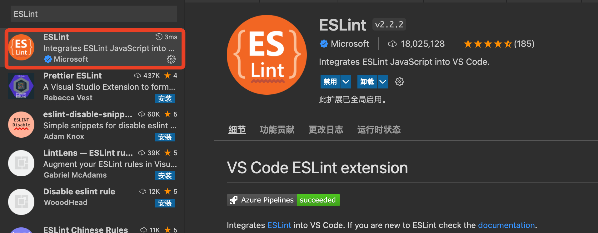
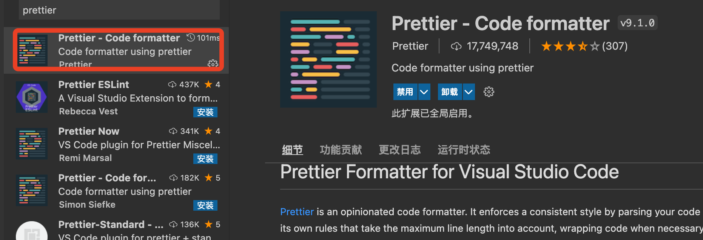

### 1. 简单的了解Prettier和Eslint

相信vscode是很多前端开发者的开发工具，很多使用vscode的开发者也都配置了Prettier和Eslint插件，但是我相信在很多配置了Prettier和Eslint的同学中并不了解这2个插件之间的关系，每个插件都是用来做什么的，具体是什么作用。

#### 1.1Prettier

官网：https://prettier.io

Prettier，是一个支持 js、jsx、ts、html、css、less、vue、JSON等前端技术体系的代码格式化工具，它只负责代码的格式化，比如语句的技术是否要添加分号、属性是使用单引号还是双引号等语法问题，只关心语法是否按照一定的规则去书写，但是并不负责语法正确性的校验。

那么语法正确性的校验谁来做呢？这就是Prettier的好搭档Eslint了。

#### 1.2ESLint

官网：https://eslint.org

中文文档: [https://zh-hans.eslint.org/](https://zh-hans.eslint.org/)、[https://eslint.nodejs.cn/](https://eslint.nodejs.cn/)

上面的Prettier和这里的Eslint，一上来就贴上了官网，我认为官方给出的文档，应该是最具有权威性和实时性最好的，只是我们每个人的精力不同，都把自己经历过的、遇到过的问题分享出来，减少学习的成本。

ESLint，和上面的Prettier不同的是，ESLint是语法检查的工具，不是语法格式化的工具。ESLint配置一些规则，检测我们的代码是否符合我们配置的规则。如果我们编写的代码不符合既定的规则，那么ESLint就会给出提示或者警告，严重的就可能是阻断性的流程中断。但是ESLint并不负责代码的格式化。

从上面两个工具的简单介绍中，可以了解到，Prettier只负责代码的格式化，但是不负责规则的校验，ESLint只负责规则的校验，但是并不负责代码的格式化。所以这2个工具的任何一个，都只能完成一部分的功能。那么这2个工具如果能够配合起来使用，就会完美的满足我们的诉求，提高我们代码的可读性和质量。

### 2. vScode中Prettier和ESLint配置

安装ESLint插件



安装Prettier插件



```js

```

### 3. 常见问题

#### 3.1Eslinterror: 'import' and 'export' may only appearatthetop level

```bash
ParsingError: 'import' and 'export' may only appearatthetop leveleslint
```

这个错误是提示import和export只能用在顶部，不能出现在其他逻辑的内部。

解决办法：

```js
// .eslintrc.js
parser: "babel-eslint"; // 可以规避掉只有在顶部才能使用import和export的报警
```
