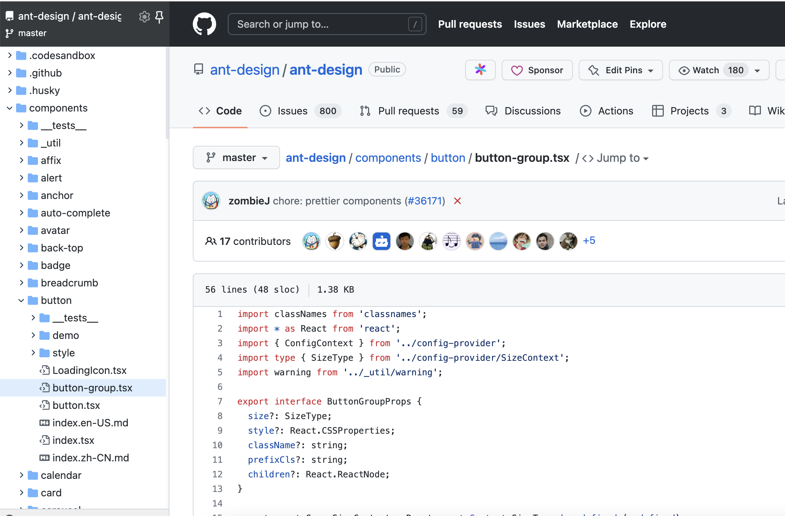
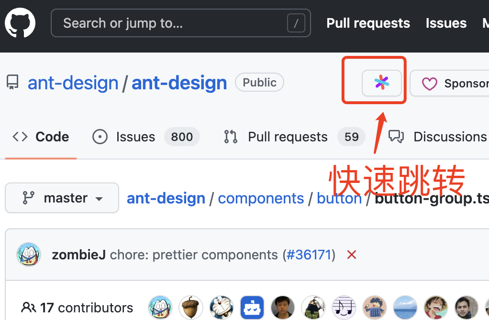
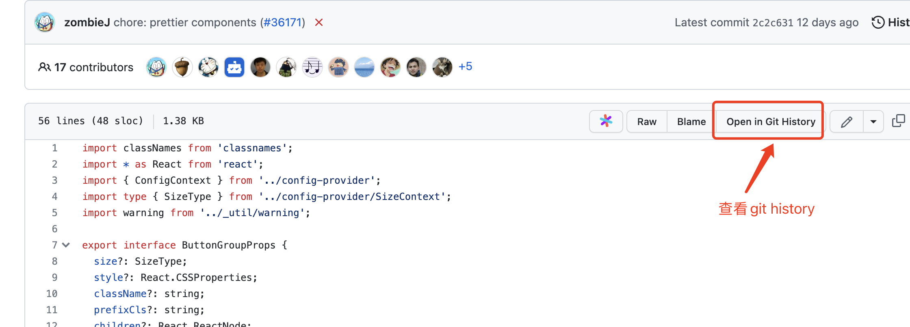
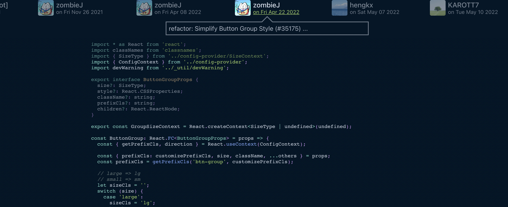

### 推荐浏览器扩展

1. Octotree

链接：https://chrome.google.com/webstore/detail/octotree-github-code-tree/bkhaagjahfmjljalopjnoealnfndnagc?utm_source=chrome-ntp-icon

浏览器项目时，可以项目的目录树固定在左侧，浏览方便。

2. Sourcegraph

链接：https://chrome.google.com/webstore/detail/sourcegraph/dgjhfomjieaadpoljlnidmbgkdffpack/related?utm_source=chrome-ntp-icon

可以让浏览器向编辑器一样便利，使用方式可以参考：chrome-extension://dgjhfomjieaadpoljlnidmbgkdffpack/after_install.html

也可以直接在github中实现快速跳转

3. Git History

链接：https://chrome.google.com/webstore/detail/git-history-browser-exten/laghnmifffncfonaoffcndocllegejnf/related?utm_source=chrome-ntp-icon

可以让我们直接在github上浏览器代码仓库的时候，优雅的查看项目、文件的commit记录。

