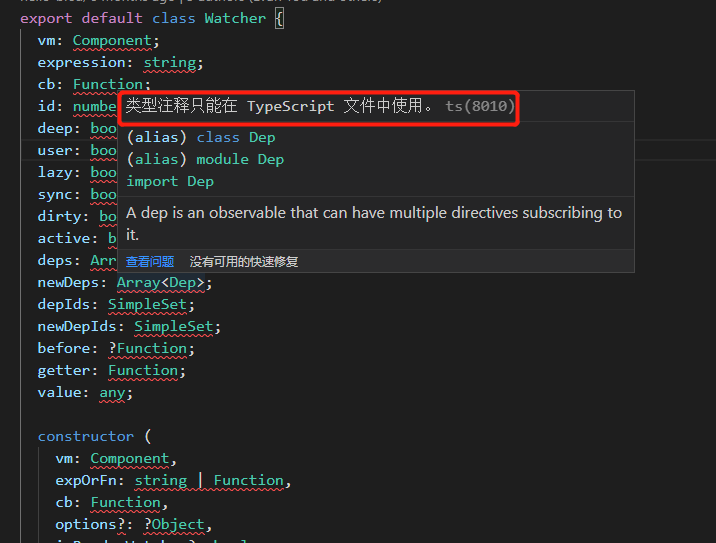
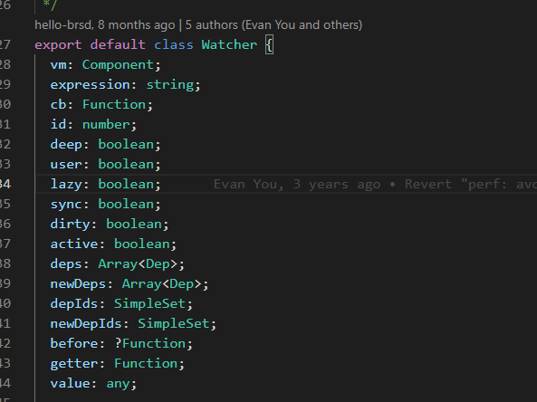

### 类型注释只能在 TypeScript 文件中使用（vscode编辑器）

在看代码的时候，以及自己写一些代码的时候（js代码），经常会用到类型注释，由于vscode自己可以识别typescript，它把js直接当前ts去校验了，导致编辑器总是报一些提示：



如果不理会它，这种提示对我们的代码运行不会有任何的影响，但是看着很不舒服，总觉着代码哪里有什么问题。

那就直接禁止vscode对js代码的校验吧。

ctrl + shift + p,输入settings.json，在vsode的配置文件中添加一行禁止校验js代码的配置就可以了。

```json
"javascript.validate.enable": false
```

直接在settings.json最后添加一行就可以了，代码中的信息提示就没有了。

