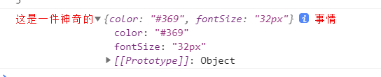

### console

console在前端开发中是必不可少的一个调试工具，我们常用的可能就是console.log了，但是除了console.log之外，console还有很多的调试方法。

console.log()：向控制台输出一条信息，向控制台输出信息时可以带有格式：

1. 常见的、可支持的格式：

| 占位符 | 描述 |
| --- | --- |
| %s | 字符串 |
| %d或%i | 整数 |
| %c | css样式 |
| %f | 浮点数 |
| %o或%O | Object对象 |

```javascript
console.log("%d + %d = %d", 1, 1, 3); //格式化输出： 1 + 1 = 3,C语言中有类似的语法

// 整数格式输出：%d和%i都是相同的效果，对于后面需要格式化的数字，都是去尾法输出
console.log("%i",3.2); // 3
console.log("%i",3.7); // 3
console.log("%d",3.2); // 3
console.log("%d",3.7); // 3

// 设置个性化的输出格式，每个%c对应一个CSS样式，每个被%c标识的文本，都只能设置一个个性化样式
console.log("%c这是一件神奇的%c事情","color: #f20","font-size: 32px");


// 被%o标识的部分，会以object的样式输出，如下图所示：
console.log("%c这是一件神奇的%o事情","color: #f20",{color: "#369",fontSize: "32px"});
```



console.info()

console.warn()

console.error()

console.clear():　清空控制台信息

console.timer()　计时器,单位毫秒ms，使用方式看demo：

```javascript
console.time("timer");
let sum = 0;
for (let i = 0; i < 1000; i++) {
    sum += i;
    console.log(sum);
}
console.timeEnd("timer");
```

页面中最多可以设置10000个计时器，计时器名字必须唯一，结束以此计时器时调用console.timeEnd(),会输出对应计时器所经过的时间。计时器的名字可以自定义，不是必须以demo中的timer，但是需要注意统计同一个计时器，要知道开始时调用console.time(计时器名)，结束时调用console.timeEnd(计时器名)就可以了。