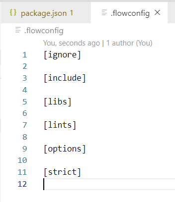

### Flow静态类型检查方案

flow，类型检查器，是facebook在2014年推出的一个类型检查器，为js提供了更加完善的类型系统。

flow的原理：在代码中添加类型注解，来标明变量的类型，称为类型注解。

在js原生的代码中，是不允许使用类型注解的，那么在js中怎么使用flow呢？

<font color="#f20">flow的根本，就是类型注解，为变量添加类型的限制。</font>

**flow的使用**

1. 初始化项目，建立package.json文件

   我习惯npm，直接使用npm init初始化即可。

   ```bash
   npm init
   ```

   执行命令后，直接下一步即可。

2. 安装flow

```bash
npm install flow-bin --save-dev
```

3. 在package.json的scripts添加flow指令

   ```json
     "scripts": {
       "test": "echo \"Error: no test specified\" && exit 1",
       "flow": "flow"
     },
   ```

4. 初始化flow的配置文件.flowconfig

   ```bash
   npm run flow init
   ```

   执行指令后，生成.flowconfig文件



.flowconfig文件的配置，可以参考：[https://flow.org/en/docs/config/](https://flow.org/en/docs/config/)

5. 新建文件验证效果

在需要flow进行类型校验的文件，需要在文件顶部加入：// @flow 或者 /* @flow */，就是一行注释+@flow，表示是

### 5. Typescript语言规范与基本应用


