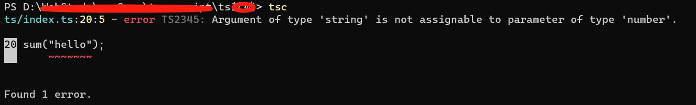
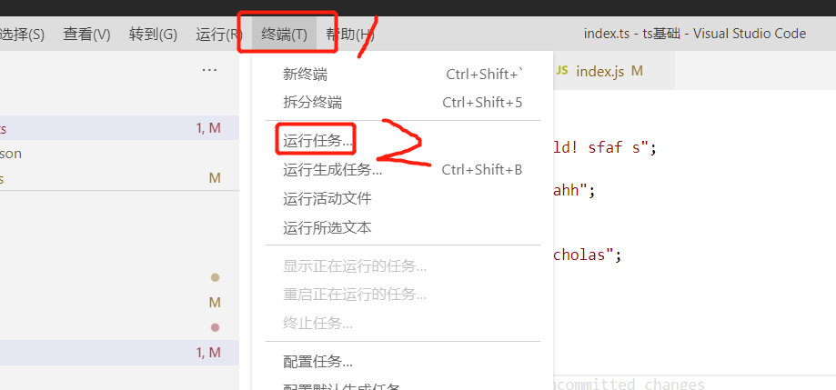
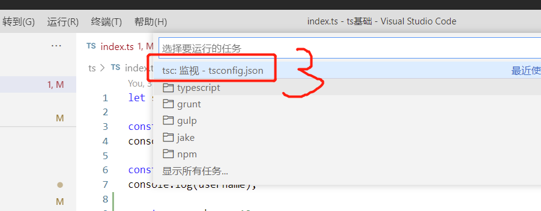
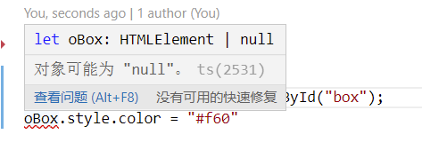

### 快速上手Typescript

1. 安装Typescript

安装Typescript一般情况下有两种方式：

* 使用npm安装
* 使用VSCode的Typescript插件

我习惯使用npm

```bash
npm install typescript -g
```

> 注意是全局安装typescript，这里安装的是Typescript的编译器

编写ts代码：

```typescript
function greeter(person: string) {
    return "Hello," + person;
}

let user: string = "Jane User";
document.body.innerHTML = greeter(user);
```

我们把这段代码保存到一个名为index.ts的文件中，然后使用tsc编译器编译，之后会生成一个index.js的js文件，文件内容如下：

```javascript
function greeter(person) {
    return "Hello," + person;
}
var user = "Jane User";
document.body.innerHTML = greeter(user);
```

我们可以看到，ts源文件和编译后的js文件，变化是去掉了类型控制，其他的没有什么变化。

另外，在Typescript中，有了接口、class的概念，再配合类型注解，可以让我们在代码的编写中增加很多乐趣。

### Typesript的应用

可以使用node的包管理工具npm、cnpm、yarn，都可以使用。

使用npm需要安装了nodejs，使用cnpm，需要先安装cnpm，使用yarn，也需要先安装了yarn管理工具。

**安装**

```bash
npm install typescript -g
cnpm install typescript -g
yarn add typescript global
```

安装cnpm

```bash
npm install cnpm --registry=https://registry.npm.taobao.org -g
```

检测typescript是否安装成功：通过查看typescript版本的方式去验证

```bash
PS C:\Users\xxx> tsc -v
Version 4.2.3 # 正常的打印出来了typescript的版本号，说明typescript已经安装成功
```

yarn的安装方式：

```bash
npm install yarn -g
```

> typescript安装完成后，需要重新打开一个终端去验证typescript的安装状态。

浏览器默认是不能执行typescript代码的。

**编译**

我认为Ts比js具备优势的地方，就是Ts是强类型的语言，需要经过编译，这样就可以发现代码中一些语言层面的漏洞。

默认情况下，我们只安装了typescript，它需要手动的去执行tsc index.ts（文件名）的方式去编译文件

```bash
tsc index.ts # 会在当前目录生成一个index.js文件。
```

这种手动编译的方式，调式或者学习某个技术点的时候，比较合适，但是如果到了项目中，就有点不高效了，所以我们需要探索自动编译的方式。我希望我一边写代码一边去编译ts代码。

可以通过配置ts的配置文件、编辑器的方式，实现实时编译，下面以vscode为例，来逐步了解配置方法。

1. 创建ts的配置文件tsconfig.json

```bash
tsc --init
```
2. 对ts的配置文件进行相应的配置就可以了

```json
    "outDir": "./js",
    "rootDir": "./ts",   
```

配置好这两项就可以了，可以找到原ts代码，可以指定目标输出目录

3. 在项目的根目录下执行tsc进行编译

```bash
PS D:\ts> tsc
PS D:\ts> 
```

我测试执行完命令后没有任何提示，没有提示就说明已经正常编译了，如果有信息，则说明是出现了异常的信息提示，可以看下示例：



4. 设置自动实时编译

虽然前面我们已经配置了ts的配置文件tsconfig.json，只通过tsc指令就可以进行文件的编译了，不需要tsc指定具体的文件了，但是我们还可以进一步让编辑器给我们实时的自动编译，以vscode为例：

依次选择：终端-运行任务-tsc监视tsconfig.json，可看下图：





每次当我们修改了ts源码后，在进行保存动作时编辑器就会自动执行tsc指令，进行ts文件的编译。

> 如果编辑器关闭了，那么编辑器再次打开时需要重新进行第4步动作。

### 数据类型

Ts提供了：

1. boolean（布尔类型）：只有两个值：true、false
2. number(数字类型)
3. string(字符串类型)
4. array（数组）
5. tuple（元组）
6. enum（枚举）
7. any（任意）
8. null
9. undefined
10. void（空类型）
11. never

ts共计提供了这11种类型。

> Ts中没有对整型和浮点型数据类型做具体的区分，只使用了number做了数字类型和其他类型的区分。

数组类型的定义，和js稍微有些区别，可看案例:

1. 看第一种定义数组的方式

```javascript
let num: number[] = [3, 4, 89];
let strArray:string[] = ["Hello world!"];
```

这都是定义的合法的ts数组，类型后面跟上[]表示数组。

2. 第二种定义数组的方式：通过泛型的方式定义

```javascript
// 表示定义一个字符串类型的数组，这种怪怪的方式，叫做泛型
let fruits: Array<string> = ["apple", "peach", "banana"];
```

**元组**

tuple，属于数组的一种，可以指定数组中每个元素的类型。

tuple，只能给数组赋值指定的个数的元素，元素个数和定义数组的类型的个数相同，如：

```javascript
// 案例中，定义元组时定义了3个数据类型，那么具体赋值时也只能是赋3个值，且类型要一一对应，元素的数量不能比声明的数据类型的数量多，也不能少
let books: [string, number, boolean] = ["Javascript高级程序设计", 99.86, true];
```

**枚举类型**

枚举类型，主要用来定义标识符，如在这样的一个场景中：

一个交易环节，有支付状态这个字段pay_status  0:未支付  1:支付  2:交易成功

在这场景中，刚开始编码时，记得清清楚楚，每个数字代表了什么意思，但是过段时间，或者来了新的团队成员，就不明白0、1、2表示什么意思了，怎么办呢？可以使用枚举来标识。

定义方式：通过关键字enum来定义，具体如下：

enum 枚举名{
    标识符[=常量值],
    标识符[=常量值],
    标识符[=常量值],
    ……
    标识符[=常量值]
}

```javascript
enum PayStatus {
    unpaid = 0,
    paid = 1,
    success = 2
}
const pageStatus: PayStatus = PayStatus.paid;
```

案例定义了一个支付状态的枚举，0表示未支付，1表示已支付，2表示交易成功

> 枚举元素中的标识符不能是数字

```javascript
// 枚举中不允许有数字类型的标识符，如案例中都是以数字为标识符的，是不合法的
enum PayStatus {
    1 = 未支付,
    2 = 已支付,
    3 = 交易成功
}
```

如果仅仅定义了枚举的标识符而没有对应常数值那么在使用枚举值的时候，就会使用枚举元素的索引

```javascript
enum PayStatus {
    unpaid, paid, success
};
const payStatus: PayStatus = PayStatus.paid;
console.log('payStatus: ', payStatus); // 2 没有给枚举元素赋常量值，最终取枚举元素的索引
```

几个细节，需要注意下：

1. 枚举成员如果都是数字的常量值的时候，枚举元素可以部分元素有初始值，部分元素没有初始值；
   
   1. 如果枚举的某个元素赋值了，那么整个的枚举索引是从0开始，赋值的那个元素值为指定的值
      
      1. 如果赋值后的元素赋值了：那么该元素就取指定的值

      2. 如果赋值后的元素没有赋值：该元素取值为前一个赋值元素的值+1

```javascript
enum PayStatus {
    unpaid, paid=2.3, success
};

const paySuccess: PayStatus = PayStatus.success;
console.log('paySuccess: ', paySuccess);  // 3.3  前一个元素赋值了2.3，而当前元素没有赋值，就取值为前一个元素的值+1
const payUnpaid:PayStatus = PayStatus.unpaid;
console.log('payUnpaid: ', payUnpaid); // 0 索引仍从0开始
```

2. 如果枚举成员有非数字类型的初始值的时候，那么该初始值成员之后的元素都需要初始化值；

```javascript
enum HelloMsg {
    welcome, // 第一个元素，可以没有初始化值，取值为该元素的索引值
    hello = "你好", // 元素初始化了非数字类型的值，该元素之后的元素world也要初始化值
    wolrd="hello world"
}

const welcomeMsg:HelloMsg = HelloMsg.welcome;
console.log('welcomeMsg: ', welcomeMsg);  // 0
const helloMsg:HelloMsg = HelloMsg.hello;
console.log('helloMsg: ', helloMsg); // 你好
const wordMsg:HelloMsg = HelloMsg.wolrd;
console.log('wordMsg: ', wordMsg); // hello world
```

**any类型**

表示任意类型，变量值可以赋值任意类型的值。

当给一个变量设置为一个any类型的时候，就相当于之前的Es5，没有给变量设置任何的类型。

那么any类型有什么用呢？在现在较多的基于Vue、React或者小程序开发的时候，都是基于数据驱动的，不建议使用any类型，那么在一些场景中需要操作dom的时候，可以使用any类型。



虽然代码可以正常运行，但是从语法上没有编译通过，提示变量oBox可能是一个null类型，但是不能给变量oBox设置为null类型，因为变量接收的是一个Element对象的DOM，这个时候就给oBox设置为any类型最为合适。

```javascript
let oBox:any = document.getElementById("box");
oBox.style.color = "#f60"
```

oBox设置为any类型，效果上完全符合要求，在语言层面上也完全符合语法要求。

> ts语言，在编译时，有些场景即使编译出了异常，也不会影响代码的运行。Ts只是让我们的代码更加严谨了，但最终是编译成js去执行的。