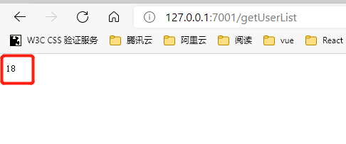

# 框架内置基础对象

Egg从koa继承了4个对象：Application、Context、Request、Response以及egg框架本身扩展的一些对象：Controller、Service、Helper、Config、Logger。

## Application

Application是全局应用对象，在一个应用组中，只会实例化一个，它继承自Koa.Application，在它上面我们可以挂载一些全局的方法和对象，可以轻松的在插件或者应用中扩展Application对象。

### 事件

egg框架在运行时，会在Application实例上触发一些事件，应用开发者或者插件开发者可以通过监听这些事件做一些事情，一般会在[启动自定义](启动自定义.md)脚本中进行监听。

1. server：该事件一个worker进程只会被触发一次，在HTTP完成启动后，会将Http  Server通过这个事件暴露给开发者

2. error：运行时有任何的异常被onerror插件捕获后，都会触发error事件，将错误对象和关联的上下文（如果有）暴露给开发者，可以进行自定义的日志记录上报等处理。

3. request和response：应用收到和响应请求时，分别会触发request和response事件，并将当前请求上下文暴露出来，开发者可以通过监听这两个事件来进行日志记录。

```javascript
// app.js
module.exports = app => {
    app.once("server", server => {
        console.log("server开始了");
        console.log(server);
        console.log("server结束了");
    });

    app.on("request", ctx => {
        console.log("request进来了");
        console.log(ctx);
        console.log("request走了");
    });

    app.on("response", ctx => {
        console.log("response开始了");
        console.log(ctx);
        console.log("response结束了");
    });
}
```

### 获取方式

因为Application是一个全局对象，它几乎可以在编写应用的任何一个地方被获取到，可以看有下面几种常见的方式：

几乎所有被框架Loader加载的文件（Controller、Service、Schedule等）都可以export一个函数，这个函数会被Loader调用，并使用app作为参数：

* 启动自定义脚本

```javascript
// app.js 定义个属性
app.age = 18
```

* Controller

```javascript
// app/controller/home.js
  async fetch(){
    this.ctx.body = this.app.age; // 将在app.js中声明的变量返回并展示到页面中
  }
```

效果如下：



和Koa一样，在Context对象上，可以通过ctx.app访问到Application对象，上面就是实例。

在基于Controller、Service基类的实例中，可以通过this.app访问到Application对象,可以看下面的demo：

```javascript
// app/controller/home.js
'use strict';

const Controller = require('egg').Controller;

class HomeController extends Controller {
  async userList() {
    const {ctx} = this;
    const data = {
      msg: "用户列表",
      info: ctx.app.age // 这里是Context对象的实例ctx上，所以可以通过ctx.app来访问Application对象
    };
    ctx.body = data;
  }

    async fetch(){
        this.ctx.body = this.app.age;  // HomeController集成自Controller，所以需要使用this.app的方式访问Application对象
    }
}

module.exports = HomeController;
```

可以看下效果：

