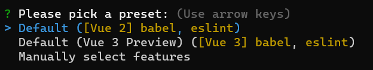

### 通过使用基于webpack的@vue/cli工具来创建一个vue3项目，安装@vue/cli

@vue/cli工具很强大、很实用，给我们内置了很多实用、便捷的功能，并且把常用的webpack给我们封装了，如果我们没有特别多差异化、个性化的需求，那么这个内置的功能，就已经基本满足了我们的大部分的场景需求了。所以说虽然现在虽然有了vite这个新的神器，但是我们还是应该好好学习下webpack的。

既然我们想通过@vue/cli这个工具来构建项目，那么首先就需要安装下它。记得，是全局安装，也就是安装时需要加参数-g.

```bash
npm install @vue/cli -g
```

我比较习惯使用npm，当然了使用yarn也是完全可以的，只要是自己习惯的、喜欢的，就可以了，不必纠结到底是使用npm或者yarn了。对于一些刚入门或者转行前端的开发者会有些迷茫，我写的一些东西都很白话、很入门，有一定基础的，直接略过就可以了。

安装后，可以通过vue --version来确认是否安装成功。

```bash
PS D:\> vue --version
@vue/cli 4.5.12
````

有了类似这样版本的输出后，表明@vue/cli已经安装成功。

### 通过@vue/cli来创建项目

运行下面指令，可以快速创建一个vue项目

```bash
vue create project_name
```

忘记了从@vue/cli的哪个版本开始了，在创建项目的时候，可以选择是创建vue2版本的vue项目，还是创建vue3版本的vue项目，如图所示：



这里我选择vue3.个人项目，当做学习使用吧。如果是线上的正式项目，需要慎重考虑，毕竟vue3上线的时间还不太长，生态还在建设中，稳定性和安全性也还需要继续验证。

选择好了版本后，就等会吧，它需要拉取各种包，有的时候还会由于网络的原因可能会耗时稍长。我这差不多耗时不到1分钟，项目创建完成。项目创建完成后，已经帮我们拉取好了npm包，也就是说node_modules目录已经被建好了，包也拉取好了，我们直接进入到项目目录运行项目就可以了。

一般情况下，很少有创建项目失败的，如果有失败的，切换下npm包的源试下应该就可以了。
