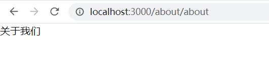
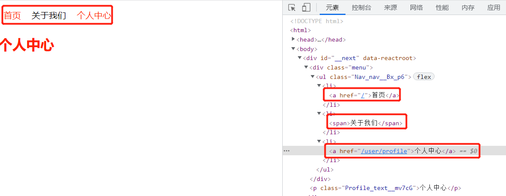

<!-- START doctoc generated TOC please keep comment here to allow auto update -->
<!-- DON'T EDIT THIS SECTION, INSTEAD RE-RUN doctoc TO UPDATE -->
**Table of Contents**  *generated with [DocToc](https://github.com/thlorenz/doctoc)*

- [1. 环境要求](#1-%E7%8E%AF%E5%A2%83%E8%A6%81%E6%B1%82)
- [2. next.js 应用编译指令](#2-nextjs-%E5%BA%94%E7%94%A8%E7%BC%96%E8%AF%91%E6%8C%87%E4%BB%A4)
- [3. next.js 应用的页面](#3-nextjs-%E5%BA%94%E7%94%A8%E7%9A%84%E9%A1%B5%E9%9D%A2)
- [4. 路由与跳转](#4-%E8%B7%AF%E7%94%B1%E4%B8%8E%E8%B7%B3%E8%BD%AC)
  - [4.1 文件之间的跳转](#41-%E6%96%87%E4%BB%B6%E4%B9%8B%E9%97%B4%E7%9A%84%E8%B7%B3%E8%BD%AC)
- [13. 部署](#13-%E9%83%A8%E7%BD%B2)

<!-- END doctoc generated TOC please keep comment here to allow auto update -->

### 1. 环境要求

要求 nodejs 版本在 10.13 以上

### 2. next.js 应用编译指令

一般情况下，我们创建 next.js 应用都是通过 create-next-app 脚手架，在使用脚手架创建完项目后，默认给我们提供了几个指令：dev、build、start。

1. dev：启动开发服务器，可以在本地调试，开发环境的代码也会被编译到项目根目录.next 目录中的

2. build：编译，生成用于生产环境使用的代码，编译后的代码会存在项目根目录.next 目录中

3. start：启动 next.js 应用的生产环境服务器。需要先 build，然后才能 start，start 执行的是.next 目录中的代码

在没有 build 的时候，直接 start 可以吗？不可以，因为 start 运行的是.next 目录中的代码。

### 3. next.js 应用的页面

next.js应用，和其他形式的应用稍有不同。next.js应用是围绕页面来构造的，next.js中，页面的文件格式可以是.js、.jsx、.ts、.tsx,因为next.js 应用是基于react的框架，组件也是可以是类式组件，也可以是函数式组件，当然了，现在使用函数式组件相对流行，主要是因为hooks么。

next.js 应用的 view（视图）是在pages目录中的，pages目录名不许更改，有特别配置的另说。如首页就是 pages/index.js。

next.js 中的文件名与路由关联，如pages/about/about.js，这个目录文件就会被映射到/about/about 路由下,甚至可以在文件名中添加动态路由参数。

```javascript
function About() {
  return <div>关于我们</div>;
}

export default About;
```
效果：



### 4. 路由与跳转

#### 4.1 文件之间的跳转

next.js应用中文件之间通过next/link组件实现跳转。

```react
import Link from "next/link";
import NavStyle from "../../styles/Nav.module.css";
function Nav() {
  return (
    <div className="menu">
      <ul className={NavStyle.nav}>
        <li>
          <Link href="/">
            <a>首页</a>
          </Link>
        </li>
        <li>
          <Link href="/about/about">
            <a>关于我们</a>
          </Link>
        </li>
      </ul>
    </div>
  );
}

export default Nav;
```

注意：

1. Link组件内的连接文字，使用a包裹，但是<font color="#f20">href属性要加载Link组件上，不能加在a标记上面</font>

   连接文字的包裹标签，仅仅指定了连接文字用什么标签去渲染，即便不是使用的a标签，也能够实现路由的跳转功能

2. Link组件内，默认使用a标签渲染

   即Link组件内可以直接写连接内容，而不用a包裹，在被解析完渲染完成的时候，效果是使用a包裹的

3. Link组件内，不使用a标签渲染内容的时候，也可以实现跳转

   Link组件内的连接文字，也可以使用除了a之外的其他标记，最终也能实现路由的跳转功能

```react
import Link from "next/link";
import NavStyle from "../../styles/Nav.module.css";
function Nav() {
  return (
    <div className="menu">
      <ul className={NavStyle.nav}>
        <li>
          {/* 
            Link组件实现客户端路由跳转，Link组件需要href属性，属性值为字符串或者对象类型
            next.js应用中的客户端路由跳转，是通过Link组件，而不是a标记
            我们需要厘清一个技术点：这里的组件，已经不是纯粹的DOM元素即HTML标签了，而是React组件，是被react和next做了两重处理后的结果了
            */}
          <Link href="/">
            {/* 连接文字，可以用a包裹 */}
            <a>首页</a>
          </Link>
        </li>
        <li>
          <Link href="/about/about">
            {/* 连接文字也可以使用除了a之外的标签表过，最终也能实现跳转功能 */}
            <span>关于我们</span>
          </Link>
        </li>
        <li>
          {/* 跳转文字，也可以不使用标记包裹，缺省的时候的默认标记是被a包裹 */}
          <Link href="/user/profile">个人中心</Link>
        </li>
      </ul>
    </div>
  );
}

export default Nav;
```

看效果：‘



Next.js应用中客户端路由的跳转，是通过next/link组件实现的，而不是DOM中的a标签：next.js应用中的组件，是经过react和next两重处理的元素，已经不是原生的DOM组件了，这点需要特别注意。

### 12. next.config.js/next.config.mjs

**关于.mjs文件的一些说明**

.mjs是一种类似.js的文件扩展名，只不过常用来标识这是一个javascript模块，而不是常规的javascript脚本。

关于.mjs的更多说明，可以参考：

https://v8.dev/features/modules#mjs

https://developer.mozilla.org/zh-CN/docs/Web/JavaScript/Guide/Modules#.mjs_%E4%B8%8E_.js


### 13. 部署

常用的有3种部署方式

1. vervel

这种方式最为简单，但是国内网络环境原因，不太适合，不做过多介绍。

2. node.js服务器

这种方式也比较简单，只要是支持 nodejs 的服务器，都可以，这种方式稍微有点麻烦。nodejs 服务器，可以通过pm2来管理，一般情况下，nodejs服务会弄人占用3000端口，然后再使用诸如nginx、apache等之类的web服务器做一个反向代理，因为我们不能让我们的 localhost:3000 这样跑在客户端的机器上。

3. docker

docker 也是一种方式，具体的部署方式我还不太清楚，后续补上具体内容吧。

具体的部署细节应该不会太复杂，首先找准了方向，选择一种适合自己的方式就可以了。
