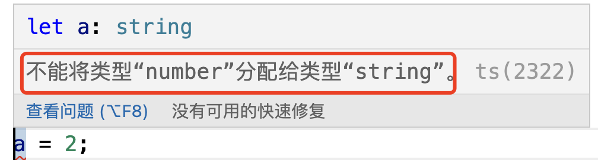

参考文档:https://juejin.cn/post/7207617774633549880?
### 1. Javascript和Typescript的区别

最近在和一位服务端同学配合时，他看起了前端的项目，看着看着问起我，你看下这段代码是什么代码？看着像java，又像js，到底是啥东西。

我还没有过去看，我就大概猜到了，他看的肯定是ts了，之后又问了我好多js、ts、tsx和jsx的东西。两天后他告诉我，不看了，东西太多了，这怎么看的过来。

对于一个非前端开发的人来说，这么多的名词确实让人眼花缭乱，不知道是从哪里入手。对于专业从事前端开发的同学来说，估计也有好多人会有好多模糊的地方，我们就来对比、总结一下这两种语言的一些特性。

### 2. 大概的认识

从ts的文档上可以看到，ts是js的超集，这是什么意思呢？看图:


这就是ts和js的关系，ts是js的超集，就是说js有的功能，ts全都有，js没有的功能和能力，ts也有。从这个关系中我认为可以得出这么一个结论，就是js文件，可以直接更改为.ts文件，js代码可以直接复制到ts文件中，直接运行。

虽然是这样的，虽然ts很强大，但是现在浏览器中还不能直接运行ts，我们开发的ts代码还是需要先编译成js后才能运行在浏览器中。

> 现在的很多前端项目的开发语言都已经是ts了，但这并不能说浏览器中可以直接运行ts，我们在项目中开发的代码，都是有本地ts编译器的，不管我们是使用的vite还是webpack，又或者其他的工具，都会集成管理ts的编译。

Typescript是一种同时支持动态类型和静态类型的编程语言([关于静态类型和动态类型，可参考](../%E5%89%8D%E7%AB%AF%E5%9F%BA%E7%A1%80/%E9%9D%99%E6%80%81%E7%B1%BB%E5%9E%8B%E5%92%8C%E5%8A%A8%E6%80%81%E7%B1%BB%E5%9E%8B.md)),它提供类、可见性范围、命名空间、继承、联合、接口等许多其他的特性，除此之外，也提供了注释、变量、语句、表达式、模块和函数。

> 没有类型约束的ts代码可以直接在支持ECMAScript3标准的浏览器上运行，但是加上了类型约束的代码浏览器就不能直接运行了，但是一般情况下我们写js的时候都会使用到类型约束的。关于ts在浏览器中的运行，这是一个容易让人混淆的点，我们需要明确一下。在不久的将来，浏览器也许可以支持ts的直接运行。

**什么是类型约束呢?**

刚入门或者刚接触ts的朋友可能会有个迷惑的点，查ts都说类型约束，那么究竟什么是类型约束呢？很简单，就是在声明变量的时候给它添加一个变量类型，在变量的定义的时候就约定好了这个变量的类型。这一点和js不同。如:

```ts
const name:string = "Nicholas Zakas"; // 声明了string类型的变量name
```

因为ts是增强的js，所以所有的js代码都是有效的ts代码，但这不意味着ts编译器可以正常编译、处理所有的js。如：

```ts
let a = "a";
a = 2;
```

会提示“不能将类型“number”分配给类型“string”。”



说明了一些不符合ts语法的js代码，ts编译器是不能正常的处理和被编译的。

有研究表明，ts能够识别出大概15%的js错误。

动态类型的自由性经常导致一些语法错误，不仅降低了开发人员的开发效率，并且新增的代码的开销使开发变的费劲。正因缺乏类型和编译时的语法检查，javascript对于组织大型代码库中的服务端代码来说是一个非常糟糕的选择。也正是这个原因，ts可以很好的扩展js，现在的ts使用范围在快速增大。

**Tyepscript适合前端还是后端？**

由于ts可以被编译js，所以它同时适用于前端和后端。

### 3. TS的数据类型

Ts的数据类型包含了Js中所有的数据类型

**JS中的数据类型**

js中有6种基本数据类型和2种引用类型：

1. 6种基本数据类型：number、string、boolean、undefined、null、symbol

2. 2种引用类型：object、array

**TS中的数据类型**

Ts中除了Js中的数据类型外，还有一些自己特有的类型，如tuple(元祖)、any、unknown、void、never、交集和并集(交集和并集，又叫做交叉类型和联合类型，可参考: [交叉类型和联合类型](./ts%E4%B8%AD%E7%9A%84%E4%BA%A4%E5%8F%89%E7%B1%BB%E5%9E%8B%E5%92%8C%E8%81%94%E5%90%88%E7%B1%BB%E5%9E%8B.md)).

1. any


2. unknonw

3. void

4. never

5. 交集和并集(交叉类型和联合类型)