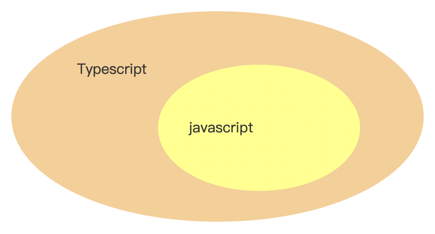

参考文档:https://juejin.cn/post/7207617774633549880?
### Javascript和Typescript的区别

最近在和一位服务端同学配合时，他看起了前端的项目，看着看着问起我，你看下这段代码是什么代码？看着像java，又像js，到底是啥东西。

我还没有过去看，我就大概猜到了，他看的肯定是ts了，之后又问了我好多js、ts、tsx和jsx的东西。两天后他告诉我，不看了，东西太多了，这怎么看的过来。

对于一个非前端开发的人来说，这么多的名词确实让人眼花缭乱，不知道是从哪里入手。对于专业从事前端开发的同学来说，估计也有好多人会有好多模糊的地方，我们就来对比、总结一下这两种语言的一些特性。

### 大概的认识

从ts的文档上可以看到，ts是js的超集，这是什么意思呢？看图:\

这就是ts和js的关系，ts是js的超集，就是说js有的功能，ts全都有，js没有的功能和能力，ts也有。从这个关系中我认为可以得出这么一个结论，就是js文件，可以直接更改为.ts文件，js代码可以直接复制到ts文件中，直接运行。

虽然是这样的，虽然ts很强大，但是现在浏览器中还不能直接运行ts，我们开发的ts代码还是需要先编译成js后才能运行在浏览器中。

> 现在的很多前端项目的开发语言都已经是ts了，但这并不能说浏览器中可以直接运行ts，我们在项目中开发的代码，都是有本地ts编译器的，不管我们是使用的vite还是webpack，又或者其他的工具，都会集成管理ts的编译。

Typescript是一种同时支持动态类型和静态类型的编程语言([关于静态类型和动态类型，可参考](../%E5%89%8D%E7%AB%AF%E5%9F%BA%E7%A1%80/%E9%9D%99%E6%80%81%E7%B1%BB%E5%9E%8B%E5%92%8C%E5%8A%A8%E6%80%81%E7%B1%BB%E5%9E%8B.md))