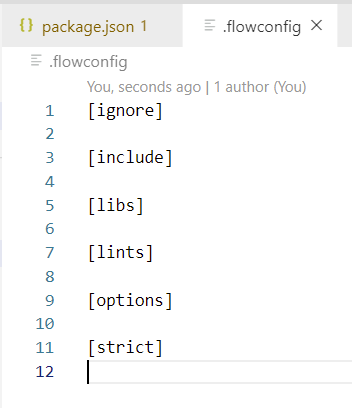

<!-- START doctoc generated TOC please keep comment here to allow auto update -->
<!-- DON'T EDIT THIS SECTION, INSTEAD RE-RUN doctoc TO UPDATE -->
**Table of Contents**  *generated with [DocToc](https://github.com/thlorenz/doctoc)*

  - [概要](#%E6%A6%82%E8%A6%81)
    - [Typescript简单认识](#typescript%E7%AE%80%E5%8D%95%E8%AE%A4%E8%AF%86)
    - [Javascript自有类型的问题](#javascript%E8%87%AA%E6%9C%89%E7%B1%BB%E5%9E%8B%E7%9A%84%E9%97%AE%E9%A2%98)
- [类型系统](#%E7%B1%BB%E5%9E%8B%E7%B3%BB%E7%BB%9F)
  - [1. 强类型与弱类型 ---- 类型安全](#1-%E5%BC%BA%E7%B1%BB%E5%9E%8B%E4%B8%8E%E5%BC%B1%E7%B1%BB%E5%9E%8B------%E7%B1%BB%E5%9E%8B%E5%AE%89%E5%85%A8)
  - [2. 静态类型与动态类型 ---- 类型检查](#2-%E9%9D%99%E6%80%81%E7%B1%BB%E5%9E%8B%E4%B8%8E%E5%8A%A8%E6%80%81%E7%B1%BB%E5%9E%8B------%E7%B1%BB%E5%9E%8B%E6%A3%80%E6%9F%A5)
  - [3. Javascript自有类型系统的问题](#3-javascript%E8%87%AA%E6%9C%89%E7%B1%BB%E5%9E%8B%E7%B3%BB%E7%BB%9F%E7%9A%84%E9%97%AE%E9%A2%98)
    - [1. 弱类型的不足 or 问题](#1-%E5%BC%B1%E7%B1%BB%E5%9E%8B%E7%9A%84%E4%B8%8D%E8%B6%B3-or-%E9%97%AE%E9%A2%98)
    - [2. 强类型的优势](#2-%E5%BC%BA%E7%B1%BB%E5%9E%8B%E7%9A%84%E4%BC%98%E5%8A%BF)
  - [4. Flow静态类型检查方案](#4-flow%E9%9D%99%E6%80%81%E7%B1%BB%E5%9E%8B%E6%A3%80%E6%9F%A5%E6%96%B9%E6%A1%88)
  - [5. Typescript语言规范与基本应用](#5-typescript%E8%AF%AD%E8%A8%80%E8%A7%84%E8%8C%83%E4%B8%8E%E5%9F%BA%E6%9C%AC%E5%BA%94%E7%94%A8)
    - [5.1 函数](#51-%E5%87%BD%E6%95%B0)
    - [5.2 Ts中的类](#52-ts%E4%B8%AD%E7%9A%84%E7%B1%BB)
      - [5.2.1 ES5实现类的方式](#521-es5%E5%AE%9E%E7%8E%B0%E7%B1%BB%E7%9A%84%E6%96%B9%E5%BC%8F)
      - [5.2.2 类中的静态方法](#522-%E7%B1%BB%E4%B8%AD%E7%9A%84%E9%9D%99%E6%80%81%E6%96%B9%E6%B3%95)
      - [5.2.3 ES5中的继承](#523-es5%E4%B8%AD%E7%9A%84%E7%BB%A7%E6%89%BF)

<!-- END doctoc generated TOC please keep comment here to allow auto update -->

### 概要

#### Typescript简单认识

Typescript主要解决了Javascript类型系统不足的问题。

可以大大提高代码的可靠程度

#### Javascript自有类型的问题


## 类型系统

类型系统，主要从类型安全和类型检查两个方面去阐述，类型安全，主要为强类型和弱类型，类型检查，主要指静态类型与动态类型的检查。

###  1. 强类型与弱类型 ---- 类型安全

类型安全，主要从强类型和弱类型两个方面。

强类型会严格限制实参的类型，代码给实参定义了一个string类型的参数，那么在调用的时候，就不能给传递一个number类型的参数；

弱类型不会严格限制实参的类型，即使给实参定义了一个number类型的参数，那么在调用的时候，也可以传递一个string类型的参数，即使这样，代码在实际运行过程中可能会出现问题，但代码在语法上没有任何问题。

强类型有比较强的类型约束，弱类型几乎没有什么类型约束。

<font color="#f20">总的来说，就是强类型不允许隐式的类型转换，而弱类型则允许任意类型的隐式的类型转换。</font>

> 课件中的nodejs版本：12.13.0

强类型和弱类型的区分，主要是指在编译阶段的判断，而不是在运行阶段的判断。

> 在node环境中可以直接运行js代码，以前是不知道这个知识点的。如：在终端执行node指令，就进入了node环境，在这个node环境中，就可以直接执行一些js代码了。

```javascript
path.dirname("/foo/bar/test.txt"); // /foo/bar  这是正常执行的
```

看上面的demo，代码是正常执行了的，那么我给dirname方法传递一个number类型的参数呢？

```javascript
path.dirname(111);
```

报异常了，如下：

```bash
Uncaught:
TypeError [ERR_INVALID_ARG_TYPE]: The "path" argument must be of type string. Received type number (111)
    at validateString (internal/validators.js:120:11)
    at Object.dirname (path.js:583:5)
    at repl:1:6
    at Script.runInThisContext (vm.js:120:18)
    at REPLServer.defaultEval (repl.js:435:29)
    at bound (domain.js:427:14)
    at REPLServer.runBound [as eval] (domain.js:440:12)
    at REPLServer.onLine (repl.js:762:10)
    at REPLServer.emit (events.js:326:22)
    at REPLServer.EventEmitter.emit (domain.js:483:12) {
  code: 'ERR_INVALID_ARG_TYPE'
}
```

异常信息给出了提示，说方法的参数需要且必须是一个string类型，但是实际收到了一个number类型的参数，这是不是就说明了Javascript也是强类型的语言呢？不是的。

因为对于强类型还是弱类型语言的判断，是指在代码的编译阶段就进行类型检查，而不是运行阶段。上面的demo，是在代码的运行阶段做的类型检查，所以这个demo不能够充分的说明Javascript是强类型的语言。

Javascript做出的类型判断的异常提示，都是在代码运行过程中，通过逻辑判断得出的结论，类型不符合，而不是js的代码解释器、编译器检查出了类型不对，可以看下node的案例：


python是强类型语言。

### 2. 静态类型与动态类型 ---- 类型检查

编程语言，从另一个角度来分，又可以氛围静态类型语言与动态类型语言。

**静态类型**

一个变量在声明时，它的类型就是明确的，且变量在声明后，类型不允许被修改

**动态类型**

变量在运行阶段才可以明确变量的类型，且变量类型岁可以变化。

也可以这么理解，在动态类型语言中，变量是没有类型的，而变量的值才是有类型的。

```javascript
var foo = 100;
foo = "Hello world!";
```

变量foo被赋值100后，才明确了类型为number类型，而到了下一行，foo又被赋值了一个string类型值。说明了变量foo本身是没有类型的，而它的存放的值是有类型的，且可以改变，最初为number类型，后来改成了string类型。

### 3. Javascript自有类型系统的问题

Javascript语言，弱类型 & 动态类型，说的皮一点，就是这门语言比较任性。

#### 1. 弱类型的不足 or 问题

1. 缺失了类型系统的可靠性 ----- 不靠谱

   那么为什么javascript不设计成强类型 & 静态类型呢？

   * 主要是javascript的发展背景，早期js应用场景简单
   * javascript没有编译环节

   随着js应用场景的复杂，那么js语言的灵活的特性就变成了短板。

2. 发现问题的时机不可控，函数、方法功能缺陷

   因为js没有编译环节，只有在代码运行时才能发现问题所在。这样，如果都按照理想的状态传递了正常的参数，是最理想的状态，那么加入有些环节出了问题，那么这些问题是提前发现不了，只有等到这部分代码在运行到的时候，才会做检测到变量的类型错误，且还需要是在代码中有类型判断的逻辑，否则也不会正常给出类型异常的提示，导致的结果就是就是出了问题，但是需要投入很大的精力去排查问题。

   ```javascript
   function add(a, b) {
       return a + b;
   }
   console.log(add(10, 3));
   ```

   上面的案例、传递的参数都是很理想的，那么看下面的：

   ```javascript
   // 两个数字求和
   function add(a, b) {
       return a + b;
   }
   
   var flag = true;
   if (flag) {
       setTimeout(() => {
           console.log(add("hello", false)); // hellofalse
       }, 1000);
   }
   ```

   add函数的本意是想计算两个数值的和，但是在实际使用中，由于我不了解这个函数的实现，给这个函数传递了一个string，一个boolean，虽然结果也给做了拼接，但是这不是我的初衷。

   **那么是不是可以通过规范、约定来规避问题呢？**

   规范和约定，都是一种理想化的状态，可以在一定程度上减少以上问题的出现，但是还是并不能解决代码实际中的问题，因为团队的人员是流动、人也是有惰性有遗忘的特性的，这些情况是避免不了的。

   还有团队规模大小也不同，对每个团队成员的执行力也不能有效保证。

   所以还是需要从技术的手段上来规避和解决这个问题。

   **君子约定有缺陷，强制约束有保障。**

#### 2. 强类型的优势

1. 错误可以更早的暴露

2. 代码更智能，编码更准确：编辑器可以给更友好、智能的提示

   一些导师，建议我们不在编码中使用智能提示：不要被大师们误解了，导师们只是建议我们在学习阶段不要使用智能提示，以便可以更好的学习知识点，但是在实际的开发中，还是要注意开发效率，去使用智能提示。

3. 重构更牢靠

   重构一般是对原代码进行破坏性的重建。

   ```javascript
   const util = {
       aaa: () => {
           console.log("util function");
       }
   };
   ```

   如我们几个月前实现了一段代码，现在发现这个方法aaa的命名不够友好，想改个名字。很熟悉的人应该可以改，但是也会很谨慎，因为我们不知道这个方法都被那里使用了，我们改了后，那些没有修改优化后的调用的地方，代码不会给我们提示，因为js是弱类型语言，没有编译环节，只有代码在运行阶段才会报异常信息。这就很痛苦了，有很好的优化方案，但是又不敢改。

   > 强类型语言，都有编译环节。

4. 可以在代码层面减少不必要的类型判断

   ```javascript
   function sum(a, b) {
       if (typeof a !== "number" || typeof b !== "number") {
           throw new TypeError("类型异常");
       }
   
       return a + b;
   }
   ```

   如要实现一个求和方法、函数，我期望对两个数字求和，那么就不要传入没有实际意义的string或者boolean等等，那我就需要在代码实现中加入合适的类型判断，否则就满足不了我的要求。


### 4. Flow静态类型检查方案

flow，类型检查器，是facebook在2014年推出的一个类型检查器，为js提供了更加完善的类型系统。

flow的原理：在代码中添加类型注解，来标明变量的类型，称为类型注解。

在js原生的代码中，是不允许使用类型注解的，那么在js中怎么使用flow呢？

<font color="#f20">flow的根本，就是类型注解，为变量添加类型的限制。</font>

**flow的使用**

1. 安装flow

```bash
npm install flow-bin --save-dev
```

2. 初始化package.json

   我习惯npm，直接使用npm init初始化即可。

   ```bash
   npm init
   ```

   执行命令后，直接下一步即可。

3. 在package.json的scripts添加flow指令

   ```json
     "scripts": {
       "test": "echo \"Error: no test specified\" && exit 1",
       "flow": "flow"
     },
   ```

4. 初始化flow的配置文件.flowconfig

   ```bash
   npm run flow init
   ```

   执行指令后，生成.flowconfig文件

   


### 5. Typescript语言规范与基本应用

#### 5.1 函数

1. 参数、函数都要设置类型

   参数、函数都要设置类型，如果函数没有返回值，则设置void类型；

2. 可选参数

   参数后加?标识符表示该参数为可选参数

   可选参数，需要放在参数列表的最后面

   ```typescript
   // 参数age后的?表示age参数为可选参数
   function getUserInfo(username:string,age?:number){
       if(age){
           return `${username} 今年${age}岁了`;
       }else{
           return `${username} 的年龄保密，打听别人的年龄很不礼貌哦！`;
       }
   }
   ```

3. 参数默认值

   ES5中不可设置参数默认值

   ES6、TS中可设置参数默认值

   设置了参数默认值，如果函数在调用时传入了新的值，那么新值将覆盖默认值

   ```typescript
   // 为参数age设置了默认值23
   function getUserMsg(username: string, age: number = 23) {
       return `${username}今年${age}岁了`;
   }
   console.log('getUserMsg("Nicholas"): ', getUserMsg("Nicholas")); // Nicholas今年23岁了
   ```

4. 剩余参数

   类似ES6中的三点运算符，也叫rest参数，接收一组数据参数放入到一个数组中（暂时先叫做数组吧，严格来讲不是数组，是类数组），然后对这一组数据进行相应的操作

   ```typescript
   // 表示接收一个number类型数组，存放到result中
   function multiSum(...result: number[]):number {
       let sum = 0;
       for (let i = 0; i < result.length; i++) {
           sum += result[i];
       }
       return sum;
   }
   console.log('multiSum(2,3): ', multiSum(2,3)); // 5
   ```

   如果函数定义时既有固定的参数，也有剩余参数，那么剩余参数在参数列表的最后面，函数调用时传入的参数，优先将前面传入的参数赋值给固定的参数，后面的参数会赋值给剩余参数

   ```typescript
   // 有固定参数num，在函数调用时，第一个参数6会赋值给参数num,其余的值赋值给result
   function multiSum(num: number, ...result: number[]): number {
       let sum = num;
       for (let i = 0; i < result.length; i++) {
           sum += result[i];
       }
       return sum;
   }
   console.log('multiSum(2,3): ', multiSum(6, 2, 3)); // 11
   ```

5. 函数重载

   Js中是没有重载的概念的，Ts中有重载的概念。

   函数重载，指的是多个同名的函数，或者定义多个同名函数，函数的参数类型、顺序、个数不同，就出现了函数重载的情况。

   > Js中，如果出现同名的函数，那么后面的函数会覆盖前面的函数

   <font color="#f20">现在对函数重载还有些模糊，先给个案例体会下吧，以后还要多加关注</font>

   ```typescript
   function getAuthorInfo(username: string): string;
   function getAuthorInfo(age: number): number;
   function getAuthorInfo(str: any): any {
       if(typeof str === "string"){
           console.log('str: ', "我的名字是：" + str);
       }else{
           console.log("作者今年" + str +"岁了");
       }
   }
   
   getAuthorInfo("Nicholas"); // 我的名字是：Nicholas
   getAuthorInfo(18); // 作者今年18岁了
   ```

   还有一种重载的方式：

   ```typescript
   function getAuthorInfo(username: string): string;
   function getAuthorInfo(username: string, age: number): string;
   function getAuthorInfo(username: any, age?: any): any {
       if (age) {
           console.log(`作者${username}今年${age}岁了`);
       } else {
           console.log(`作者是${username},年龄保密哦，不允许随意打听别人的年龄！`);
       }
   }
   
   getAuthorInfo("Nicholas"); // 作者是Nicholas,年龄保密哦，不允许随意打听别人的年龄！
   getAuthorInfo("Nicholas", 26); // 作者Nicholas今年26岁了
   ```

   函数的重载，同名函数的前几个函数，都只有函数的定义，而没有函数的实现，只有在最后一个函数做函数的实现，且这个有实现的函数中，参数类型和函数的返回值类型都是any。

#### 5.2 Ts中的类

##### 5.2.1 ES5实现类的方式

**只有简单的属性，没有方法**

ES5中没有专门的类的声明方式，但是可以通过function构造函数的方式间接实现。

```javascript
// 构造函数，只有属性
function Person(name, age) {
  this.name = name;
  this.age = age;
}

var p = new Person("Nicholas Zakas", 18);
console.log(p.name);
```

**构造函数和原型里添加属性和方法**

构造函数里面添加属性和方法，都要通过this关键字

```javascript
// 构造函数，只有属性
function Person(name, age) {
  this.name = name;
  this.age = age;
  // 构造函数中通过this添加方法
  this.play = function () {
    console.log(this.name + " is playing games!");
  };
}

var p = new Person("Nicholas Zakas", 18);
p.play();
```

ES5中除了可以在构造函数中定义属性和方法，也可以在原型链中扩充属性和方法。

```javascript
//构造函数的原型上，添加了一个属性和方法
Person.prototype.job = "Teacher";
Person.prototype.work = function () {
  return this.name + " is working!";
};
console.log(p.work());
```

##### 5.2.2 类中的静态方法

方法，有静态方法和实例方法两种分类。

静态方法：只能通过类调用的方法，是静态方法

实例方法：需要通过类的实例化对象才能调用的方法，称为实例方法。

```javascript
function Person(name, age) {
  this.name = name;
  this.age = age;
  // play方法需要类Person的实例对象才能调用，所以方法play称为实例方法
  this.play = function () {
    console.log(this.name + " is playing games!");
  };
}

Person.getBaseInfo = function () {
  return "只能通过类调用";
};

// 只能通过类Person去调用
console.log(Person.getBaseInfo());

// 需要通过类Person的实例对象才能调用实例方法
var p = new Person("Nichoalas Zakas", 26);
p.play();
// 实例方法play()不能通过类调用，会报错 Uncaught TypeError: Person.play is not a function
Person.play();
```

##### 5.2.3 ES5中的继承

ES5中的继承，一般会通过原型链+构造函数组合继承的方法实现继承

构造函数继承，也称为对象冒充继承

对象冒充继承，可以继承构造函数中的属性和方法，但是不能继承原型链中的属性和方法

```javascript
function Person(name, age) {
  console.log(this);
  this.name = name;
  this.age = age;
  this.play = function () {
    return this.name + " is playing games!";
  };
}

Person.prototype.work = function () {
  return "working！";
};

function Child() {
  // 子类Child继承Person类
  Person.call(this); // 对象冒充形式继承Person类
}

var c = new Child("Hanmeimei", 16);

console.log(c.play());
c.work(); // 对象冒充形式实现的继承，不能继承原型链中的方法，所以这里的执行了原型链中的方法，会报错，提示c.work is not a function
```

原型链实现继承：就是将子类的prototype指向父类的构造函数

```javascript
function Person(name, age) {
  this.name = name;
  this.age = age;
  this.play = function () {
    return this.name + " is playing games!";
  };
}

Person.prototype.work = function () {
  return "working！";
};

function Child() {}

Child.prototype = new Person();
var c = new Child("Hanmeimei", 16);
console.log(c.work());
```

原型链继承，既可以继承构造函数中的方法，也可以继承父类原型链中的方法。

**原型链实现继承的问题**

原型链继承，子类实例化的时候，没有办法给父类传参。

```javascript
function Person(name, age) {
  this.name = name;
  this.age = age;
  this.play = function () {
    return this.name + " is playing!";
  };
}

function Child(name, age) {}
Child.prototype = new Person();

var c = new Child("Nicholas Zakas", 18);
console.log(c.play()); // undefined is playing!
```

发现原型链继承，没有实现子类向父类的传参，即构造函数没有实现。

```javascript
function Person(name, age) {
  this.name = name;
  this.age = age;
  this.play = function () {
    return this.name + " is playing!";
  };
}

function Child(name, age) {
  Person.call(this, name, age); // 对象冒充的继承模式，子类可以向父类传参了
}
Child.prototype = new Person();

var c = new Child("Nicholas Zakas", 18);
console.log(c.play()); // undefined is playing!
```

我们还可以直接将子类的prototype直接指向父类的prototype，实现原型链的继承；

```javascript
function Person(name, age) {
  this.name = name;
  this.age = age;
  this.play = function () {
    return this.name + " is playing!";
  };
}
Person.prototype.work = function () {
  return this.name + " is working!";
};

function Child(name, age) {
  Person.call(this, name, age); // 对象冒充的继承模式，子类可以向父类传参了
}
// Child.prototype = new Person();
Child.prototype = Person.prototype; // 子类的prototype指向父类的prototype，实现原型继承

var c = new Child("Nicholas Zakas", 18);
console.log(c.play()); // undefined is playing!
console.log(c.work()); // 可以继承父类的原型方法
```

> ES5中class的继承，一般通过原型链和构造函数的组合方式实现继承。


