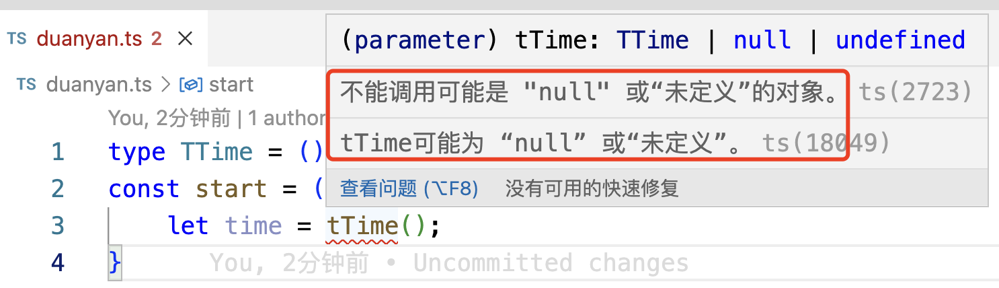

参考链接:https://juejin.cn/post/7201423410168266810
## 1. 

## 7. TS类型断言-类型的声明和转换

在使用TS的项目中，经常会有类型相关的问题，比如某种类型没有某个方法，或者在使用某个对象或特定类型的方法、属性时提示该对象没有该属性或方法，那么这个时候就可以使用类型断言。类型断言，其实就是提前对编辑器做了告知行为。类型断言，主要有两种实现方式：

### 7.1 断言形式

1. 尖括号形式

语法: <type>+value,尖括号中填写具体的类型

```ts

```

2. as形式---推荐的方式

语法:value as type,type后跟具体类型

```ts
let value:any = "Nicholas";
let valueLength = (value as string).length;
console.log('%c [ valueLength ]-18', 'font-size:13px; background:pink; color:#bf2c9f;', valueLength)
```

### 7.2 断言类型

1. 非空断言

非空断言使用!表示，用来判断某个变量一定不是null和undefined。如果不做非空判断则代码会直接报错.

如:

```ts
type TTime = () => number;
const start = (tTime:TTime | null | undefined) => {
    let time = tTime();
}
```

变量tTime是一个联合类型，可能是TTime类型，也可能是null和undefine类型，在编译阶段就给出了异常提示:



如果对变量tTime做一个非空断言，则异常信息会消失:

```ts
type TTime = () => number;
const start = (tTime:TTime | null | undefined) => {
    let time = tTime!();
}
```

就在变量后面直接跟一个!操作符即可，然后可以看到异常的提示没有了。

2. 肯定断言-肯定化保证赋值

3. 将任何类型断言为any

4. 调用函数时将参数和返回值断言成精确的值