<!-- START doctoc generated TOC please keep comment here to allow auto update -->
<!-- DON'T EDIT THIS SECTION, INSTEAD RE-RUN doctoc TO UPDATE -->
**Table of Contents**  *generated with [DocToc](https://github.com/thlorenz/doctoc)*

- [1. JS情况](#1-js%E6%83%85%E5%86%B5)
  - [1.1 Ts究竟是什么？](#11-ts%E7%A9%B6%E7%AB%9F%E6%98%AF%E4%BB%80%E4%B9%88)
  - [1.2 Ts相比较Js增加了什么？](#12-ts%E7%9B%B8%E6%AF%94%E8%BE%83js%E5%A2%9E%E5%8A%A0%E4%BA%86%E4%BB%80%E4%B9%88)
- [2. Ts开发环境搭建](#2-ts%E5%BC%80%E5%8F%91%E7%8E%AF%E5%A2%83%E6%90%AD%E5%BB%BA)
- [3. 基本数据类型](#3-%E5%9F%BA%E6%9C%AC%E6%95%B0%E6%8D%AE%E7%B1%BB%E5%9E%8B)
  - [3.1 字面量类型声明方式](#31-%E5%AD%97%E9%9D%A2%E9%87%8F%E7%B1%BB%E5%9E%8B%E5%A3%B0%E6%98%8E%E6%96%B9%E5%BC%8F)
  - [3.2 any类型](#32-any%E7%B1%BB%E5%9E%8B)
  - [3.3 unknown](#33-unknown)
  - [3.4 void](#34-void)
  - [3.5 never](#35-never)
  - [3.6 object](#36-object)
  - [3.7 array](#37-array)
  - [3.8 tuple](#38-tuple)
  - [3.9 enum](#39-enum)
  - [3.10 声明变量为多个类型：可以用或 | ，也可以使用且 &。](#310-%E5%A3%B0%E6%98%8E%E5%8F%98%E9%87%8F%E4%B8%BA%E5%A4%9A%E4%B8%AA%E7%B1%BB%E5%9E%8B%E5%8F%AF%E4%BB%A5%E7%94%A8%E6%88%96--%E4%B9%9F%E5%8F%AF%E4%BB%A5%E4%BD%BF%E7%94%A8%E4%B8%94-)
  - [3.11 类型别名](#311-%E7%B1%BB%E5%9E%8B%E5%88%AB%E5%90%8D)
- [4. 编译选项](#4-%E7%BC%96%E8%AF%91%E9%80%89%E9%A1%B9)
- [5. webpack整合TS](#5-webpack%E6%95%B4%E5%90%88ts)
  - [5.1 基本配置](#51-%E5%9F%BA%E6%9C%AC%E9%85%8D%E7%BD%AE)
  - [5.2 配置HTML中自动引入js、css文件](#52-%E9%85%8D%E7%BD%AEhtml%E4%B8%AD%E8%87%AA%E5%8A%A8%E5%BC%95%E5%85%A5jscss%E6%96%87%E4%BB%B6)
  - [5.3 配置webpack-dev-server](#53-%E9%85%8D%E7%BD%AEwebpack-dev-server)
  - [5.4 clean-webpack-plugin生成文件之前清空output（生成文件）目录](#54-clean-webpack-plugin%E7%94%9F%E6%88%90%E6%96%87%E4%BB%B6%E4%B9%8B%E5%89%8D%E6%B8%85%E7%A9%BAoutput%E7%94%9F%E6%88%90%E6%96%87%E4%BB%B6%E7%9B%AE%E5%BD%95)
  - [5.5 模块配置](#55-%E6%A8%A1%E5%9D%97%E9%85%8D%E7%BD%AE)
- [6. babel配置](#6-babel%E9%85%8D%E7%BD%AE)
  - [6.1 安装babel相关](#61-%E5%AE%89%E8%A3%85babel%E7%9B%B8%E5%85%B3)
  - [6.2  babel相关配置](#62--babel%E7%9B%B8%E5%85%B3%E9%85%8D%E7%BD%AE)
- [7. 面向对象](#7-%E9%9D%A2%E5%90%91%E5%AF%B9%E8%B1%A1)
  - [7.1 类](#71-%E7%B1%BB)
    - [7.1.1 属性](#711-%E5%B1%9E%E6%80%A7)
    - [7.1.2 方法](#712-%E6%96%B9%E6%B3%95)
    - [7.1.3 构造函数](#713-%E6%9E%84%E9%80%A0%E5%87%BD%E6%95%B0)
  - [7.1.4 继承](#714-%E7%BB%A7%E6%89%BF)
  - [7.1.5 抽象类](#715-%E6%8A%BD%E8%B1%A1%E7%B1%BB)
  - [7.1.6 接口](#716-%E6%8E%A5%E5%8F%A3)
  - [7.1.7 属性封装](#717-%E5%B1%9E%E6%80%A7%E5%B0%81%E8%A3%85)
  - [7.1.8 泛型](#718-%E6%B3%9B%E5%9E%8B)
- [7.2 项目实践-贪食蛇](#72-%E9%A1%B9%E7%9B%AE%E5%AE%9E%E8%B7%B5-%E8%B4%AA%E9%A3%9F%E8%9B%87)

<!-- END doctoc generated TOC please keep comment here to allow auto update -->

### 1. JS情况

JS易学易用，但是由于本身的特性，可能会有一些隐藏的隐患

js不适合大型项目：

1. 面向对象不理想
2. 没有块作用域
3. js里没有类型的概念：没有变量类型
4. ……

Js很好用，但是也有很多的问题，于是微软就做了件事，开发了Ts。

Typescript，是在js的基础上引入了类型的概念，做了一些功能的扩展，就成了js的超集了。

Js是弱类型语言，并不是说js中没有类型的概念。Js中，值是有类型的，如String、Number、Boolean等，说js中没有类型、动态类型，指的是js中的变量没有固定的类型，js中的同一个变量可以存储number类型、可存储string类型数据，也可以存储布尔类型值。所以说js中的变量是弱类型的。

Ts中引入了类型的概念，指的是Ts中定义了变量的类型，除了值有类型外，变量也有了类型。

> 微软最近几年，在技术领域做了一些比较不错的贡献：
>
> 1. 浏览器放弃了IE内核，拥抱了标准
> 2. 开发了Ts
> 3. 退出了vscode编辑器

#### 1.1 Ts究竟是什么？

1. 以Javascript为基础构建的开发语言
2. 一个js的超集
3. 可以在任何支持js的平台中执行
4. Typescript扩展了Javascript，并引入了类型的概念：注意，这里的类型指的是变量的类型
5. TS不能被Js解析器直接执行：因为现在的前端环境还是以js为主，deno好像是原生支持了Ts，以后浏览器有可能会可以直接运行ts
6. 浏览器、node等这些环境，最终运行的是还是js，所以Ts需要编译为Js

#### 1.2 Ts相比较Js增加了什么？

1. 变量有了类型：指增加了变量的类型，ts中，变量有了类型，不能给同一个变量赋不同类型的值
2. 新增了数据类型：如枚举、元祖、interface等
3. 支持ES6的新特性
4. 添加了一些ES不具备的新特性
5. 丰富的配置选项
6. 强大的开发工具

### 2. Ts开发环境搭建

Ts环境，依赖nodejs，需要全局安装typescript

1. 安装nodejs

   不介绍细节了，直接参考nodejs的官网吧：https://nodejs.org/zh-cn/

2. 全局安装typescript解析器

   ```bash
   npm install typescript -g
   ```

到这里，ts的基本环境，可以说就搭建技术了，接下来，可以看下怎么运行ts文件

> Typescript文件以.ts为文件扩展名

1. 创建一个ts项目目录
2. 进入项目目录，创建一个ts文件index.ts
3. tsc  index.ts 就可以编译为js文件了

### 3. 基本数据类型

* 类型声明

  * 类型声明是TS非常重要的一个特点

  * 通过类型声明可以指定TS中变量（参数、形参）的类型

  * 指定类型后，当为变量赋值时，TS编译器会自动检查值是否符合类型声明，符合则赋值，不符合则报错

  * 简而言之，类型声明给变量设置了类型，使得变量只能存储某种类型的值

  * 语法：

    ```typescript
    let 变量: 类型;
    let 变量: 类型 = 值;
    function fn(参数: 类型, 参数: 类型): 类型{
        // 函数体
    }
    ```

* 自动类型判断

  * TS拥有自动类型判断机制
  * 当对变量的声明和赋值是同时进行的，TS编译器会自动判断变量的类型
  * 所以如果你的变量的声明和赋值是同时进行的，可以省略掉类型声明

* 类型

  | 类型   | 例子                           | 描述                               |
  | ------ | ------------------------------ | ---------------------------------- |
  | number | 1，-33，3.9                    | 任意数字                           |
  | string | "Hello world","Nicholas Zakas" | 任意字符串                         |
  |        | true，false                    | 布尔值，只有2个值：true、false     |
  | 字面量 | 其本身                         | 限制变量的值就是该字面量的值       |
  |        | *                              | 任意类型                           |
  |        | *                              | 类型安全的any                      |
  |        | 空值(undefined)                | 没有值(或是undefined)              |
  | never  | 没有值                         | 不能是任何值                       |
  |        | {name: "Nicholas"}             | 任意的js对象                       |
  |        | [1,2,4]                        | 任意的js数组                       |
  |        | [4,5]                          | 元祖，TS新增的类型，固定长度的数组 |
  |        | enum{A,B}                      | 枚举，TS中新增的类型               |

> js中出现问题多的场景，更多的不是简单的变量，而是函数中的参数

<font color="#f20">ts中的数据类型，都写小写，如number、string、boolean等</font>

#### 3.1 字面量类型声明方式

可以直接通过基本的数据类型去赋值

```typescript
let a:number;
let b:object;
```

**也可以直接通过字面量进行类型声明**

```typescript
// 直接通过字面量为变量声明类型
let a: 10; // a值就只能是10了

a = 20; // 给a重新赋值，报异常了
```

这个时候，a就像一个常量，这种类似的用法，不多，几乎不用。那字面量进行类型声明，什么时候会用呢？

看案例：

```typescript
let sex:"male" | "female";
sex = "male";
sex = "female";
```

字面量类型声明，类型本身也就是值。

类似上面的案例，也可以称为联合类型

固定常量的字面量类型用的场景也不是很多，但是联合类型的另一种方式应用场景会多一些，比如为一个变量同时声明为number类型和string类型，这个变量既可以赋number类型值，也可以赋string类型值

```typescript
let flag: number | string;
flag = 12; // 赋值number类型没有问题
flag = "Nicholas Zakas"; // 赋值string类型没有问题
flag = false; // 赋值boolean类型有问题了  这里看不出来，截个图吧
```


#### 3.2 any类型

any表示任意类型，一个变量设置为any类型，则表示ts对该变量关闭了类型校验

ts中不建议使用any类型

ts中，声明一个变量，如果没有显示的指定类型，则该变量则自动被指定为any类型，即ts中默认的类型为any类型

```typescript
// 下面两种方式都不建议使用
let d: any;
let e;
```

#### 3.3 unknown

unknown类型，表示未知类型

一个unknonw类型的变量，可以被赋值成任何类型的值

```typescript
// unknown类型的变量可以被赋值任何类型的值
let n:unknown;
n = 12;
n = "Hello";
n = false;
```

那是不是unknown和any是一样的？

不一样。

any类型的变量可以赋值给任何类型的变量，而unknown类型的变量，只是本身可以赋值任何类型的值，但是不能将unknown类型的变量赋值给其他类型的变量

```typescript
// unknown类型的变量可以被赋值任何类型的值
let n:unknown;
n = 12;
n = "Hello";
n = false;

let ay:any;
ay = "Hello";

let s:string;
s = ay; // any类型的变量可以赋值给string类型的变量
s = n; // unknown类型的变量不能赋值给其他类型的变量
n = 26; // unknown类型的变量，值可以是其他类型的值，如别赋了一个number类型的值
```

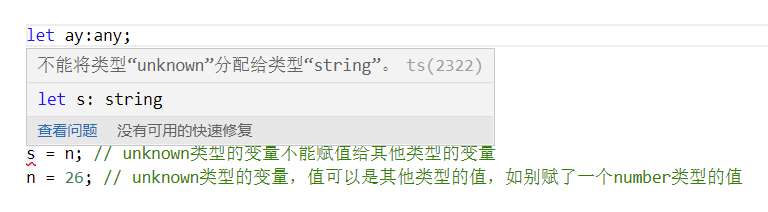

所以说，unknown是一个类型安全的any；unknown类型的变量，不能赋值给其他类型的变量。

**那么有些场景可能确实需要进行类型转换，那么有没有办法呢？有的。**

我们对unknown类型的变量值进行一个类型判断，然后再进行赋值，就可以了

```typescript
let un:unknown;
un = "Hello world!";

let s:string;
if(typeof un === "string"){
    s = un; // 先进行un变量的类型判断，当un的值是string类型时，再将un赋值给一个string类型的变量，就没问题了
}
```

还有一种方法：类型断言,可以通过类型断言的方式告诉ts解析器该变量的实际类型，也可以简单理解为重新指定、明确下unknown类型变量的当前实际类型。两种具体的语法：

语法1： 变量 as 类型

语法2：<类型>变量

尖括号的方式不能应用在jsx、tsx中。

```typescript
let un:unknown;
un = 18;

let str:string;
str = un as string; // 这样也是可以的，哪怕un当前虽然不是string类型，但是显示的把它指定成了string类型，就可以把它赋值给string类型的变量了

let num:number;
num = <number>un;
```

#### 3.4 void

void使用变量的情况不多，大部分用在修饰函数，表示没有返回值

ts中，函数没有返回值的时候，默认返回值类型为void；如果有返回值，ts编译器会根据返回值类型自动设置函数的返回值类型

使用void修饰的函数，可以直接return，也可以return null或者undefined,但不能返回一个具有其他类型的值

```typescript
function fn():void{
    // 这3种返回都是可以的
    // return;
    // return null;
    return undefined;
}
```

#### 3.5 never

never表示永远都不会返回，也是更多的使用在函数中

- never 是其他类型的子类型，代表不会出现的值
- 返回“从不”的函数不能具有可访问的终结点
- 在函数内部永远会抛出错误，导致函数无法正常结束
- console.log('end point')永远执行不到

```typescript
function f():never{
    throw new Error();
}
```

#### 3.6 object

object在ts中是一个不太实用的类型。

实际写代码是，我们更加关注的是对象中属性的类型，而不是关心当前的值是否是对象 。

声明类型对象的变量，可以使用{}，{}中指定对象中包含的属性

语法：{属性名：类型值，属性名：类型值}：在为变量赋值的时候，对象的属性名和属性值必须要和对象声明时的结构完全一直

在属性名的后面添加？，表示该属性可选

```typescript
// 声明一个结构为{name:string,age:number}的对象
let obj:{name:string,age:number};
obj = {
    name: "Nicholas Zakas",
    age: 18
};


let obj2:{name:string,age?:number};
obj2 = {
    name: "Nicholas Zakas" // 结束了，不加age属性了，也是正常
};

// 我想添加任意类型的属性
// propName自定义，可以是任何其他的变量名，表示对象中的属性名是一个string类型的，如age、job；后面的any表示属性的值是任意类型的，如age：18，job:"Programmer"
let obj3:{name:string,[propName:string]:any};
obj3 = {
    name: "Nicholas Zakas",
    age: 18,
    job: "Programmer"
};
```

还可以定义函数的类型结构：

```typescript
// 表示定义一个函数类型结构，函数有2个参数，都是number类型的，且函数的返回值是number类型
let ff:(n1:number,n2:number) => number;

// 这里实例化上面定义的结构的函数
// 实例化的这个函数中的参数的类型，可以写也可以不写，不是必须的，以及函数的返回值类型，都是可选的
ff = function(p1:number,p2:number){
    return p1 + p2;
}
console.log(ff(2,3)); // 5
```

#### 3.7 array

js中的数组默认没有类型的概念，也就是说同一个数组中可以存储任何类型的值

更理想的是同一个数组中，只存储同一个类型的值，性能会好很多

Ts中两种声明数组的方式：

```typescript
/**
 * 两种声明数组的方式
 * let 变量:类型[]
 * let 变量：Array<类型>
 */
// 表示声明一个string类型的数组
let arr:string[];

// 表示声明一个number类型的数组
let ar:Array<number>
```

#### 3.8 tuple

tuple，叫做元祖，表示固定长度的数组，即数组的长度要固定，元素个数多了不行，少了也不行

使用场景：当数组中元素个数是固定的时候，就使用元祖

元祖中元素，可以是不同的数据类型，也可以是相同的数据类型

元祖的元素个数，一般不会很多，如果数组元素多了，就直接使用数组了

```typescript
/**
 * 元祖：表示长度固定的数组
 * 当元素个数固定的时候，就可以使用元祖，比数组的性能会好一些
 * 元祖中元素，可以是不同的数据类型
 */
let tp:[string,number];
tp = ["hello",789];
```

#### 3.9 enum

枚举，js中没有，ts新增的一种数据类型

信息在数据库中存储的时候，应该尽量存储较小的数据，如性别信息，我们可以存储男、女、不详这3个字符串，但是也可以存0、1、2，相比起来，存数字比字符串应该会占用更小的存储空间。

语法：enum 变量{值，值}

也可以为枚举指定索引值

enum 变量{值 = 索引值，值=索引值}

```typescript
/**
 * enum  枚举
 * 语法：enum 变量{值，值}
 */

enum Gender{
    男,
    女
}
let person:{name:string,age:number,gender:Gender};
person = {
    name: "Nicholas",
    age: 18,
    gender: Gender.男
};

console.log(person.gender);
```

#### 3.10 声明变量为多个类型：可以用或 | ，也可以使用且 &。

```typescript
// 都是表示变量既可以是string类型，也可以是number类型
let p:string & number;
let p2:string | number;
```

但是在实际中，为一个变量同时声明为两个类型，是没有实际意义的，因为一个变量不可能即是string类型，又是number类型的。那怎么用且&关键字呢？

```typescript
let p3: {name: string} & {age: number};
p3={
    name: "Nicholas Zakas",
    age: 18
}
```

更像是声明对象。

#### 3.11 类型别名

```typescript
/**
 * 类型别名
 * type type类型名 = 值
 */
type K = 1 | 2 | 3 | 4;
let k:K;
let m:K;
k = 3;
m = 4;
```

### 4. 编译选项

* 自动编译文件

  * 编译文件时，使用-w指令后，Ts编译器会自动监听文件的变化，并在文件发生变化时对文件进行编译

    ```bash
    tsc index.ts -w
    ```

    使用webstorm编辑器的时候，使用-w参数，会有个时间间隔，并不是实时更新的，使用vscode也有时间间隔，但是比webstorm间隔小了很多

    -w 参数只能监听一个ts文件的变化

* 自动编译整个项目

  * 如果直接使用tsc指令，则可以自动将当前项目下的所有ts文件编译为js文件

  * 但是能直接使用tsc指令的前提是，先在当前项目的根目录下创建一个ts的配置文件:tsconfig.json

    * tsconfig.json是ts编译器的配置文件
    * 一般的json文件中不可以注释，但是tsconfig.json中可以注释

  * tsconfig.json是一个json文件，添加配置文件后，只需要tsc指令就可以完成对整个项目的编译

    * tsconfig.json文件为空的时候，tsc也可以编译项目下的所有ts文件，同理，tsc -w也可以监听项目下的所有ts文件的变化

  * 配置选项

    * include

      * 定义希望被编译文件所在的目录

      * 默认值：["** / *"]

        ```json
        {
            // 表示src和test目录下的所有ts文件都会被ts编译器编译
            "include": [
                "src/**/*",
                "test/**/*"
            ]
        }
        ```

        > json中做路径通配的时候，*表示所有文件，**表示所有目录
        >
        > ** / *表示所有目录下的所有文件

    * exclude

      * 定义需要排除在外的目录

      * 默认值：["node_modules","bower_components","jspm_packages"]

        ```typescript
        "exclude": ["src/dataType/**/*"] // src中dataType目录下的所有ts文件都不会被编译、监听变化
        ```

    * extends

      * 定义被继承的配置文件

        ```typescript
        "extends": "./config/baseConfig.json" // 该配置文件会继承config/baseConfig.json中的所有配置信息
        ```

    * files

      * 指定被编译文件的列表，只有需要编译的文件少时才会用到

        ```typescript
        "files": [
            "index.ts",
            "file.ts",
            "user.ts"
        ]
        ```

        files配置项和include的主要功能基本类似，只是include使用的是通配的方式，files使用的具体的文件名的方式

        所以files不适合大量文件的使用

    * compilerOptions

      * compilerOptions是tsconfig.json中最重要的一个配置项，它是ts编译器的选项，本身的配置比较复杂，包含了很多的子选项

      * compilerOptions有很多的子选项，学习compilerOptions主要就是学习它的子选项

      * 子选项配置

        * target

          * 用来指定ts被编译为es的目标版本，默认为ES3

          * target的属性值，就是ES的版本号，如es3，es5，es6，es2018等

          * 那如果不知道具体有哪些es的版本的时候，怎么去查呢？有文档可以查，这里给一个简单的方案：就是给target一个错误的值，去执行tsc指令，ts编译器会把正确的值列表给提示出来

            ```bash
            PS D:\Ts> tsc
            tsconfig.json:25:19 - error TS6046: Argument for '--target' option must be: 'es3', 'es5', 'es6', 'es2015', 'es2016', 'es2017', 'es2018', 'es2019', 
            'es2020', 'es2021', 'esnext'.
            
            25         "target": "爱的色放"
                                 ~~~~~~
            
            
            Found 1 error.
            ```
            
            如案例所示，ts编译器直接将所有的值列表都给列了出来，根据自己的需要选择一个就可以了

        * module

          * 指定选用的模块化规范，常用的有如：es6、commonjs、amd等

          * 那我怎么知道都有哪些规范可以去使用呢？和target一样，不知道的时候就随便给module赋值，ts编译器会在异常信息中告诉我们

            ```bash
            PS D:\Ts> tsc
            tsconfig.json:27:19 - error TS6046: Argument for '--module' option must be: 'none', 'commonjs', 'amd', 'system', 'umd', 'es6', 'es2015', 'es2020', 'es2022', 'esnext', 'node12', 'nodenext'.
            
            27         "module": "es2016"
                                 ~~~~~~~~
            
            
            Found 1 error.
            ```

            如案例中，我随便给module选项赋值es2016，结果不对，但是ts编译器告诉了我正确的值列表，然后根据需要去选一个就可以了

            至于每个值的区别，我们可以尝试的去运行下看下效果

        * lib

          * 用来指定项目会用到的库

          * 一般情况下，在做基于浏览器的项目时，这个配置项不需要改

          * 如果在写node项目时，可能会根据需要去改成相应的值

          * 具体体现
            * 比如浏览器项目中，我给这个配置项配置为空，那么就表示不适用任何库，那么我们在写代码的时候就不会给我们任何的代码提示

                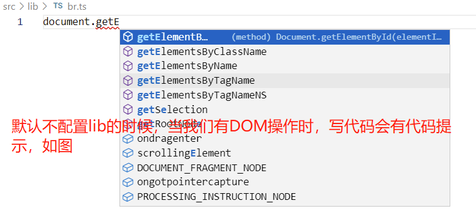
            
                但是如果给lib配置为空，再写代码时，就不会有任何的代码提示：
            
                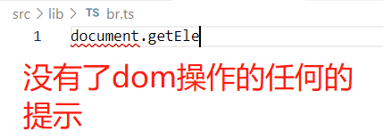
            
          * 配置项的值

            * 和target、module一样，如果不知道都有哪些值可选，就随便写个，ts编译器会告诉我们

              ```bash
              PS D:\WebStudy\Ts> tsc
              error TS2318: Cannot find global type 'Array'.
              
              error TS2318: Cannot find global type 'Boolean'.   
              
              error TS2318: Cannot find global type 'Function'.  
              
              error TS2318: Cannot find global type 'IArguments'.
              
              error TS2318: Cannot find global type 'Number'.    
              
              error TS2318: Cannot find global type 'Object'.
              
              
              error TS2318: Cannot find global type 'String'.
              
              tsconfig.json:29:17 - error TS6046: Argument for '--lib' option must be: 'es5', 'es6', 'es2015', 'es7', 'es2016', 'es2017', 'es2018', 'es2019', 'es2020', 'es2021', 
              'esnext', 'dom', 'dom.iterable', 'webworker', 'webworker.importscripts', 'webworker.iterable', 'scripthost', 'es2015.core', 'es2015.collection', 'es2015.generator', 'es2015.iterable', 'es2015.promise', 'es2015.proxy', 'es2015.reflect', 'es2015.symbol', 'es2015.symbol.wellknown', 'es2016.array.include', 'es2017.object', 'es2017.sharedmemory', 'es2017.string', 'es2017.intl', 'es2017.typedarrays', 'es2018.asyncgenerator', 'es2018.asynciterable', 'es2018.intl', 'es2018.promise', 'es2018.regexp', 'es2019.array', 'es2019.object', 'es2019.string', 'es2019.symbol', 'es2020.bigint', 'es2020.promise', 'es2020.sharedmemory', 'es2020.string', 'es2020.symbol.wellknown', 'es2020.intl', 'es2021.promise', 'es2021.string', 'es2021.weakref', 'es2021.intl', 'esnext.array', 'esnext.symbol', 'esnext.asynciterable', 'esnext.intl', 'esnext.bigint', 'esnext.string', 'esnext.promise', 'esnext.weakref'.
              
              29         "lib": ["abcd"]
                                 ~~~~~~
              
              
              Found 9 errors.
              ```

              这个配置选项多，谨慎修改

            * 默认值

              * 默认值为浏览器的运行环境
              * 一般情况下，不需要修改lib的配置

        * outDir

          * 指定编译后的文件的输出目录

        * outFile

          * 指定将输出文件合并为一个文件

          * 只能合并module配置项为amd或者system的模块化方案，其他的模块化方案不支持

            ```bash
            PS D:\Ts> tsc
            tsconfig.json:27:9 - error TS6082: Only 'amd' and 'system' modules are supported alongside --outFile.
            
            27         "module": "es2015",
                       ~~~~~~~~
            
            tsconfig.json:33:9 - error TS6082: Only 'amd' and 'system' modules are supported alongside --outFile.
            
            33         "outFile": "./dist/app.js"
                       ~~~~~~~~~
            
            
            Found 2 errors.
            ```

        * allowJs

          * 指定是否对js文件进行编译
            * 有的时候项目除了有ts文件，也会有js文件allowJs用来指定是否对项目中的js进行编译
          * 默认值为false

        * checkJs

          * 指定是否检查js语法，默认为false

        * removeComments

          * 指定编译后的文件是否移除注释

        * noEmit

          * 指定是否生成编译后的文件，true不生成，false生成,默认为false
          * 很少使用该选项，如果设置为true的话，可能就是为了检查下语法，并不希望生成最终文件

        * noEmitOnError

          * 当发生错误时不生成编译文件，true有错误时不生成编译文件，false都会生成编译文件  
          * 默认为false

        * alwaysStrict

          * 指定编译后文件是否使用严格模式
          * 默认false，不使用严格模式
          * 布尔值：true  false

        * noImplicitAny

          * 是否允许显示的使用any类型

          * 值为布尔值：true   false

            * true：不能有显示的使用any类型

            * false：可以显示的使用any类型

            * 默认为false

              ```json
              "noImplicitAny": true
              ```

              看效果

              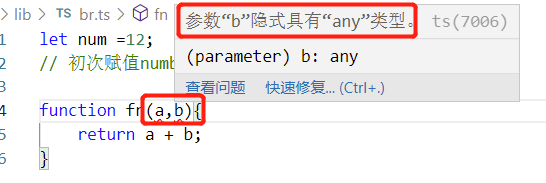

        * noImplicitThis

          * 不允许不明确类型的this

          * 值为布尔值：true、false，默认为false

            * true：不允许不明确类型的this

            * false：不做类型的检查，可以使用this

              ```json
              // 不允许不明确类型的this
              "noImplicitThis": true
              ```

              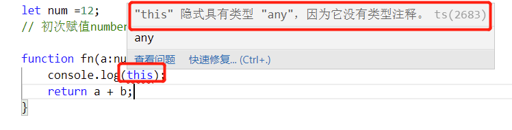

        * strictNullChecks

          * 严格检查空值

        * strict

          * 所有严格检查的总开关，如果设置为true，所有的严格检查都将打开，默认为false

### 5. webpack整合TS

#### 5.1 基本配置

初始化项目

```bash
npm init -y # 为了生成package.json来管理项目
```

安装依赖

```bash
npm install webpack webpack-cli typescript ts-loader --save-d
```

配置webpack.config.js

```javascript
const path = require("path");

module.exports = {
    entry: "./src/index.ts",
    output: {
        path: path.resolve(__dirname, "dist"),
        filename: "bundle.js"
    },

    // 指定webpack打包时用到的模块
    module: {
        // 指定加载规则
        rules: [
            {
                // test指定规则生效的文件
                test: /\.ts$/,
                use: "ts-loader",
                // 要排除的文件
                exclude: "/node_modules/"
            }
        ]
    }
};
```

配置tsconfig.json

```json
{
    "compilerOptions": {
        
    }
}
```

我没有配置，直接使用的默认配置项

检查结果：

```bash
npm run build #看是否生成了dist目录以及dist目录下是否有bundle.js文件
```

#### 5.2 配置HTML中自动引入js、css文件

​	使用html-webpack-plugin插件

```bash
npm install html-webpack-plugin --save-dev
```

配置html-webpack-plugin插件：从webpack.config.js中配置，webpack的配置文件

1. 导入插件

```js
// 导入html-webpack-plugin插件
const HtmlWebpackPlugin = require("html-webpack-plugin");
```

html-webpack-plugin可以自动生成一个html文件，并在该文件中自动引入模块化文件，即js和css文件

2. 配置插件:还是在webpack.config.js

   > 记住所有关于webpack的配置都是在webpack的配置文件中，默认都是在webpack.config.js中

```js
// 配置插件
plugins:[
    new HtmlWebpackPlugin()
]
```

这样就可以了

最后执行npm  run  build就可以了，执行后会在dist目录下生成一个bundle.js和一个html文件，且html中会自动引入js等模块化文件。

3. html文件的自定义配置

   执行npm run build生成的html文件，都是默认的信息，比如页面的title是Webpack App,那么我想改成其他的信息，怎么改呢，只要改一些html-webpack-plugin的一些配置就可以了

   ```js
   // 配置插件
   plugins:[
       new HtmlWebpackPlugin({
           title: "自定义页面title", // 定义生成页面的title
           filename: "main.html" // 定义生成的html页面的文件名
       })
   ]
   ```

   看效果：

   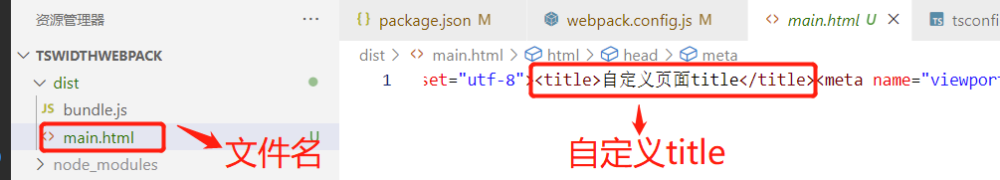

   更加详细的配置，可以参考：https://github.com/jantimon/html-webpack-plugin

   一些简单的HTML的配置，可以通过选项配置的方式，那么如果项目的HTML信息个性化的比较多，那仅仅通过自定义的配置可能满足不了需求，怎么办呢？

   可以在项目的目录下新建一个自定义的HTML文件，然后通过webpack配置，以这个html文件为模板就可以了。

   比如我在项目根目录中的public目录下新建了一个index.html，并以此文件作为模板文件：

   ```js
   // webpack.config.js对html-webpack-plugin的配置
   // 配置插件
   plugins:[
       new HtmlWebpackPlugin({
           // title: "自定义页面title", // 定义生成页面的title
           // filename: "main.html" // 定义生成的html页面的文件名
           template: "./public/index.html" // 指定模板文件
       })
   ]
   ```

   看效果：

   模板文件

   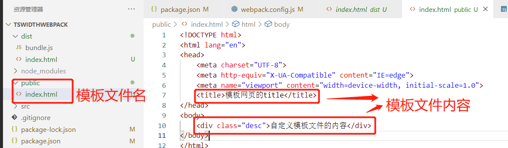

   生成的编译文件

   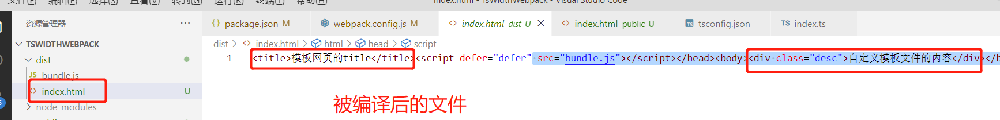

#### 5.3 配置webpack-dev-server

经过前面html-webpack-plugin的配置，我们可以自定义模板文件，指定生成文件的名称了。但是代码有了变化之后想要看效果的是好，都需要重新build一下，在开发过程中影响开发效率，也有点麻烦，怎么办呢。

webpack-dev-serve可以帮我们启动一个web服务，能够实时监听项目文件的变动，在文件有了变动之后，能够自动进行项目的编译。

1. 安装webpack-dev-serve

   ```bash
   npm run webpack-dev-serve --save-dev # 开发时依赖，生产环境是用不到的
   ```

2. 启动脚本配置

   ```json
   // package.json中scripts部分配置启动脚本
   "start": "webpack serve --open --mode=development" //表示通过webpack启动serve指令，且会自动打开默认浏览器，模式为development，其实就是开发环境
   // webpack5中需要明确的告诉webpack mode选项，告知webpack当前是生产环境还是开发环境，我习惯通过cli脚本中指定，如本案例
   ```

   > webpack5.x中需要配置mode选项，我项目中webpack版本是5.64.4，如果不配置mode，执行脚本的时候会报提示信息，浏览网页信息，会有错误信息提示。

#### 5.4 clean-webpack-plugin生成文件之前清空output（生成文件）目录

webpack5中已经没有介绍clean-webpack-plugin插件了，但是仍旧可以使用；webpack5中推荐在output配置项配置clean属性

清空原来的文件，主要是为了保证dist是最新的文件

**clean-webpack-plugin配置**

```js
// webpack.config.js中
// 注意导入是通过结构的方式导入，直接导入在使用的时候会提示CleanWebpackPlugin没有构造函数
const {CleanWebpackPlugin} = require("clean-webpack-plugin");

// 配置插件
// 配置清理插件，在build之前先清空output目录,直接实例化一下即可，不需要额外的配置项
new CleanWebpackPlugin(),
```

**webpack5中推荐的outpub配置clean属性配置方法**

```js
// webpack.config.js
output: {
    path: path.resolve(__dirname, "dist"),
    filename: "bundle.js",
    clean: true // 配置这一个选项即可
},
```

#### 5.5 模块配置

主要就是配置webpack支持将哪些类型的文件打包成模块，常见的类型文件有js、ts、css、less、scss、png、jpg等静态资源类型。

webpack中，通过resolve配置项来配置模块类型：

```js
resolve:{
    extensions:[".ts",".js",".css"]
}
```

### 6. babel配置

#### 6.1 安装babel相关

```bash
npm install @babel/core @babel/preset-env babel-loader core-js --save-dev
```

@babel/core，babel的核心内容

@babel/preset-env 预设环境

babel-loader 转义器

core-js js的运行环境，也可以说是js的模拟环境，这个插件里面的内容比较多，也可以配置按需加载

#### 6.2  babel相关配置

```js
// webpack.config.js
use: [
    // 指定加载器有两种形式，一种是字符串，一种是对象，都可以
    // 加载器的执行顺序，从后往前执行，配置在最后面的最先执行
    // 配置babel加载器
    {
        // 指定加载器
        loader: "babel-loader",
        // 设置babel
        options: {
            // 设置预定义环境
            presets:[
                [
                    // 指定环境插件
                    "@babel/preset-env",
                    // 配置信息
                    {
                        // 设置要兼容的目标浏览器
                        targets: {
                            "chrome": "88", //兼容chrome的88版本
                            "ie": "9"
                        },
                        // 指定core-js版本
                        "corejs": "3",
                        // 使用core-js的方式，usage表示按需加载
                        "useBuiltIns": "usage"
                    }
                ]
            ]
        }
    },
    "ts-loader"
],
```

core-js：js的运行环境。比如在使用一些特殊实现的时候，有的浏览器可能不支持，这个时候core可能对这些浏览器做了一些自己的实现，这个时候就会将使用的这些功能core来替不支持这个功能的浏览器去实现。比如promise，chrome实现了，但是IE就没有实现。这个时候core-js可能会有自己的实现。当然了，也可能没有实现这个功能。

> babel只能转移我们自己开发的代码，可以将高版本标准的代码转为低版本的代码，但是webpack自己生成的代码，是不经过babel转义的，只能通过webpack自己的配置去调整。

### 7. 面向对象

面向对象，就是通过对象进行操作。

抽象：对应了具体。

学习编程，思想类的东西，先不用着急去理解，先学会写代码，写的多了，慢慢就领会到思想的东西了。

#### 7.1 类

类是对象的模型，某类对象的共有的属性和功能。

定义类：通过class关键字定义类。

```typescript
class Person {
    
}
const p = new Person();
```

类中主要包含两个部分内容：

1. 数据：属性
2. 功能：方法

##### 7.1.1 属性

属性，分为实例属性和类属性（也称为静态属性）。

1. 实例属性：只能通过类的实例访问的属性

   直接定义声明的实例属性，可读、可写，即这个属性的值可以被读取也可以被修改

   也可以定义只读属性：通过readonly关键字定义只读属性，只读属性只能被读取调用值，不能被重新赋值，相当于const关键字声明的变量吧。

   ```typescript
   name:string = "Nicholas Zakas";
   // 通过readonly定义只读属性，不能被修改（重新赋值）
   readonly gender:string = "male";
   ```

   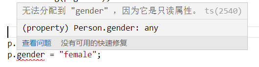

2. 类属性（静态属性）：通过static关键字声明的属性，只能通过类来访问的属性，称为类属性，或者静态属性。

   声明属性时，在属性前面使用static关键字。

   类属性只能通过类去访问，类的实例对象是访问不了的。

   ```typescript
   class Person {
       // 实例属性，需要通过类的实例化对象去访问
       name:string = "Nicholas Zakas";
   
       // 类属性，通过static关键词声明定义，只能通过类访问
       static age: number = 18;
   }
   const p = new Person();
   console.log(p.name); // Nicholas Zakas  实例属性调用
   console.log(Person.name); // Person，这个是类本身，打印类名称
   console.log(Person.age); // 18 类属性，只能通过类来调用
   ```

   也可以定义静态的只读属性，只是需要注意的是readonly需要在static关键字后面，不能调换顺序

   ```typescript
   // 定义静态的只读属性，static和readonly不能换顺序，只能按照static readonly的顺序依次标明
   static readonly age:number = 18;
   ```

##### 7.1.2 方法

方法和属性一样，也可以区分为实例方法和类方法。

1. 实例方法

   通过类的实例对象去访问

   ```typescript
   // 实例方法，打印基本信息
   printBaseInfo(){
       console.log(`我是${this.name},性别${this.gender}`);
   
   }
   
   // 通过类的实例对象去调用实例方法
   p.printBaseInfo();
   ```

2. 类方法（静态方法）：通过static关键字定义，只能通过类本身去调用

   ```typescript
   // 通过static定义类方法
   static isStudent(){
       console.log(`我今年${this.age}岁，还是一个学生！`);
   }
   
   // 类本身调用类方法
   Person.isStudent();
   ```

##### 7.1.3 构造函数

ts中，通过关键字constructor声明构造函数，声明构造函数不需要函数名

构造函数会在对象创建时被调用：即只要通过new操作符创建实例对象时就会调用构造函数

构造函数中，this就表示当前对象，当前对象就是当前新创建的对象，如通过const dog = new Dog();创建的实例对象dog，那么当前对象就是dog，this也指向dog

在类（class）中，无论有没有使用构造函数，属性和方法，都要根据需要正常声明、定义；如果使用了构造函数，那么构造函数就会调用属性去初始化值

类中，属性的声明，是在类中声明，不是在构造函数中声明，需要注意这个细节。

在方法中，也可以通过使用this调用当前实例对象：前提是实例方法。如果是静态方法，就不去讨论了，没有实际意义，静态方法中的this指向当前类。

```typescript
class Dog {
    // 类中声明该类会用到的属性
    name: string;
    age: number;

    /**
     * 构造函数
     * 通过constructor声明构造函数，不需要函数名
     * 构造函数会在实例对象创建时被调用：即通过new操作符实例化对象的时候，就都会调用构造函数来生成实例对象
     */
    constructor(name: string, age: number) {
        /**
         * 构造函数中，this表示当前的实例
         * 如通过const dog = new Dog()，那么this就指向当前的实例dog；
         * 构造函数中的当前对象，就是当前创建的那个对象，如const dog2 = new Dog();那么当前对象以及this都指向dog2
         */
        this.name = name;
        this.age = age;
    }

    play(){
        console.log(`我是${this.name},今年${this.age}岁了！`);
    }
}

// 通过new操作符调用构造函数，创建对象实例
const luma = new Dog("路马",4);
luma.play(); // 我是路马,今年4岁了！

const tiantian = new Dog("天天",6);
tiantian.play(); // 我是天天,今年6岁了！ 
```

#### 7.1.4 继承

ts中，可以通过关键字extends来继承、扩展另外一个类，被继承的类称为父类，继承的类被称为子类。

在一些编程语言中，父类也被称为超类。

使用继承后，子类将拥有父类所有的属性和方法

如果子类的实际需要，从父类继承的属性和方法不能满足需求怎么办呢？直接在子类中添加需要的属性和方法就可以了

如果子类中添加了和父类同名的方法，那么子类中的方法就会覆盖掉父类中的方法。这种子类覆盖父类中方法的形式，称为<font color="#f20">方法的重写</font>。

> 面向对象开发中，一般会遵循OCP原则，对扩展开放，对修改关闭，即开闭原则。一般情况下，我们继承使用了别人开发的类的时候，如果有不满足自己需求的情况下，不要轻易去修改这个基类，可以在自己的实现中去扩展它，而不是去随意的修改它。因为这个类可能被多个人、多个项目中使用。
>
> 当然了，不是不能修改，是要谨慎修改。

```typescript
/**
 * 基类，父类
 */
class Animal {
    name: string;
    age: number;

    /**
     * 构造函数
     * @param name string
     * @param age number
     */
    constructor(name: string, age: number) {
        this.name = name;
        this.age = age;
    }

    /**
     * 打招呼
     * @param 无
     */
    sayHello() {
        console.log("我是动物，Hello！");
    }
}

/**
 * Cat extends Animal
 * Animal被称为父类，Cat被称为子类
 * 使用继承后，子类将拥有父类的所有的属性和方法
 * 通过继承，可以将多个子类共同拥有的一些属性和方法都写到一个父类中
 *  - 这样就就可以让多个子类同时拥有了父类中的属性和方法了
 *  - 如果子类和父类有差异化，子类需要父类中不存在的一些属性和方法怎么办？直接在子类中添加就可以了
 * 父类中的有些方法，有时候不能满足实际场景的需求，怎么办呢？直接在子类中重新实现一下父类中已经存在的方法就可以了
 *  - 如果子类中添加了和父类中同名的方法，那么子类中的方法就会覆盖父类中的方法
 *  - 这种子类覆盖父类方法的形式，称为方法的重写
 */
class Cat extends Animal {
    /**
     * 重写sayHello方法
     */
    sayHello() {
        console.log("我们一起学猫叫，我们一起喵喵喵");
    }

    /**
     * 新增定义父类中不存在的方法
     * 捉老鼠
     */
    catchMice(){
        console.log("捉了一只大老鼠！");
    }
}
```

**super**

在有关类的代码中，super表示当前类的父类。

```typescript
/**
 * Cat extends Animal
 * Animal被称为父类，Cat被称为子类
 * 使用继承后，子类将拥有父类的所有的属性和方法
 * 通过继承，可以将多个子类共同拥有的一些属性和方法都写到一个父类中
 *  - 这样就就可以让多个子类同时拥有了父类中的属性和方法了
 *  - 如果子类和父类有差异化，子类需要父类中不存在的一些属性和方法怎么办？直接在子类中添加就可以了
 * 父类中的有些方法，有时候不能满足实际场景的需求，怎么办呢？直接在子类中重新实现一下父类中已经存在的方法就可以了
 *  - 如果子类中添加了和父类中同名的方法，那么子类中的方法就会覆盖父类中的方法
 *  - 这种子类覆盖父类方法的形式，称为方法的重写
 */
class Cat extends Animal {
    /**
     * 在子类中重新定义一个性别的属性
     */
    gender: string;

    /**
     * 子类中重新实现构造函数
     * @param name string 从父类中继承的属性
     * @param age number 从父类继承的属性
     * @param gender string 子类新增的属性
     * 构造函数的参数，父类中定义的参数，子类中的构造函数也需要重新传一遍，只是不需要单独的实现了，只需要调用super即可
     */
    constructor(name:string,age:number,gender: string){
        // 调用父类的构造函数，且传入父类中构造函数已经实现的参数
        super(name,age);
        // 仅仅给子类中新增的属性赋值
        this.gender = gender;
    }

    /**
     * 重写sayHello方法
     */
    sayHello() {
        console.log("我们一起学猫叫，我们一起喵喵喵");
    }

    /**
     * 新增定义父类中不存在的方法
     * 捉老鼠
     */
    catchMice(){
        console.log("捉了一只大老鼠！");
    }
}
```

总的来说，就是子类可以直接使用父类中的属性和方法，但是如果父类不能满足子类的需求时：

1. 如果是方法不能满足，则在子类中直接添加或重写父类的方法就可以了
2. 如果是属性不能满足，那么也是直接新增需要的属性即可，只是在构造函数中需要通过super关键字来调用父类的构造函数，且子类构造函数中需要传入全部的参数列表，只是不需要做全部重新赋值。

#### 7.1.5 抽象类

在面向对象编程中，一般情况下，父类是不希望被创建或者叫实例化对象的。

因为，父类都是范围比较广泛、非常不具体的类的，比如一个Animal的父类，通过它创建了对象，我们也不知道这个对象具体是什么。

父类的作用，我们仅仅是期望定义一些共用的属性或者方法的，那么我们怎么限制父类不能被实例化对象呢？只要把这个类定义成抽象累就可以了。

ts中，可以通过abstract定义抽象类，抽象类不能被实例化对象

```typescript
// 通过abstract定义的类表示抽象类，抽象类不能被实例化对象
abstract class Animal {
   
}
```

抽象t类和其他的普通类没有什么区别，只是不能用来创建对象，抽象类就是专门用来被继承的类。

抽象类中可以添加抽象方法

抽象方法，通过abstract定义，只定义方法结构，不做方法的实现，没有方法体

抽象方法，只能定义在抽象类中

子类必须对抽象方法进行重写

```typescript
/**
 * 定义抽象方法：只定义方法体，不做方法实现，可以有方法的返回值类型
 */
abstract introBySelf():void;
```

#### 7.1.6 接口

type：描述一个对象的类型

interface：用来定义一个类结构，叫对象结构也可以。

- 用来定义一个类中应该包含的属性和方法

- 同时接口也可以当做类型声明去使用

  ```typescript
  interface User {
      name: string;
      age: number;
  }
  
  interface User {
      gender: string;
      play():void;
  }
  
  const u: User = {
      name: "Nicholas Zakas",
      age: 18,
      gender: "male",
      play(){
          console.log("playing basketball");
      }
  };
  ```

**interface和type的区别：**

1. type不能重复声明，interface可以重复声明

   ```typescript
   // 声明了两个同名的type，ts是不允许的
   type Student = {
       name: string,
       age: number,
       gender: string
   }
   
   type Student = {
       
   }
   ```

   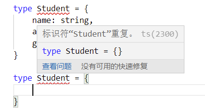

   ```typescript
   // interface是可以声明两个同名的interface的
   interface User {
       name: string,
       age: number
   }
   
   interface User{
       gender: string
   }
   ```

2. 

**接口和抽象类**

1. 接口中，只定义属性而不能有实际值；

2. 接口只定义对象的接口，而不考虑实际值

   1. 接口中的所有方法都只能是抽象方法（不需要通过absctract定义），只能定义方法名和方法返回值，但是不能有方法体；

      ```typescript
      interface User {
          name: string;
          age: number;
      }
      
      interface User {
          gender: string;
          // 接口中定义方法，但是不能有方法体
          play():void;
      }
      
      class User implements User {
          name: string;
          age: number;
          gender: string;
          constructor(name: string, age: number, gender: string) { 
              this.name = name;
              this.age = age;
              this.gender = gender;
          }
      
          play(){
              console.log("playing football");
          }
      }
      
      
      const p1 = new User("Hanmeimei",16,"female");
      p1.play();
      ```

3. 抽象类中，可以有抽象方法，也可以有实例方法，即可以有方法的实现，且抽象方法需要通过关键字abstract去定义；

   <font color="#f20">接口就是对类的限制</font>

   接口实际上是定义了类的标准，它和抽象类的区别，主要有2个：

   1. 抽象类中既可以有抽象方法，也可以有普通方法，接口中只能有抽象方法；
   2. 抽象类通过extends关键字实现；接口通过implements关键字实现；

   > 接口、抽象类概念只有在ts中有，js中是没有这个概念的，所以ts被编译成js后不要去找抽象来、接口的实现啥的。

#### 7.1.7 属性封装

ts中，可以在属性前面添加访问修饰符

1. public：public修饰的属性可以在任意位置访问（修改）默认值

2. private：private修饰的属性称为私有属性，私有属性只能在类内部进行访问、修改，子类中也不能访问

3. protected:受保护属性，只能在当前类或者当前类的子类中访问

   ```typescript
   class Teacher {
       /**
        * 属性前可以添加访问修饰符：public、private
        *  - public：在任意位置都可以访问和修改属性值
        *  - private：私有属性，私有属性只能在类的内部访问和修改
        */
       private _name: string;
       private _age: number;
   
       constructor(name: string, age: number) {
           this._name = name;
           this._age = age;
       }
   
       lecture(){
           console.log(`我正在讲课！`);
       }
   }
   
   const t = new Teacher("Nicholas Zakas",26);
   t._age = 18;
   ```

   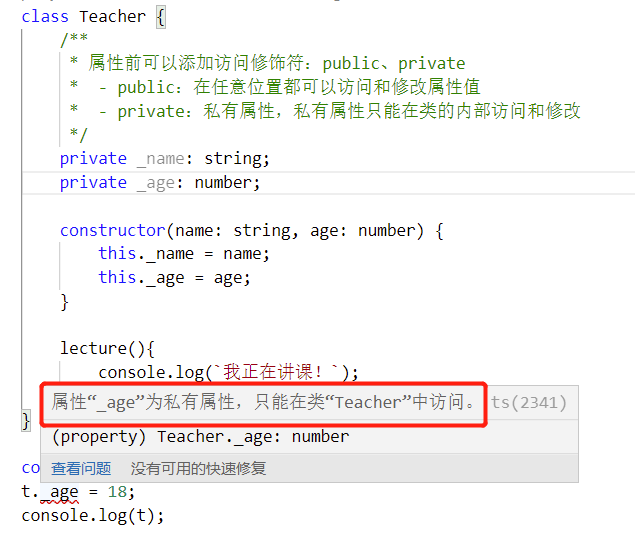

那确实需要在对象实例中修改或访问属性时，怎么办呢？

通过在类中暴露方法的方式，通过方法去访问和修改数据。即常说的getter和setter方法。

```typescript
class Teacher {
    /**
     * 属性前可以添加访问修饰符：public、private
     *  - public：在任意位置都可以访问和修改属性值
     *  - private：私有属性，私有属性只能在类的内部访问和修改
     */
    private _name: string;
    private _age: number;

    constructor(name: string, age: number) {
        this._name = name;
        this._age = age;
    }

    // 定义getter方法来获取属性值
    getName() {
        return this._name;
    }

    // 定义setter方法，来修改属性值
    setName(name: string) {
        this._name = name;
    }


    lecture() {
        console.log(`我正在讲课！`);
    }
}

const t = new Teacher("Nicholas Zakas", 26);
console.log(t.getName());
t.setName("猪八戒"); // 通过setter修改属性值
console.log(t);
```

现在通过setter虽然也可以修改属性值，但是对属性的控制权全部控制在了类中了，外部不能随意修改了。

当通过setter修改值时，可以在setter方法中做一系列的业务处理，不让它外部随意修改，或者有条件的去修改。数据安全上也有了更大的保障。如设置年龄不能小于0

```typescript
// 读取age
getAge() {
    return this._age;
}

// 设置age，但是需要age >= 0
setAge(age: number) {
    if (age >= 0) {
        this._age = age;
    }
}

const t = new Teacher("Nicholas Zakas", 26);
t.setAge(-10); 
console.log(`新年龄${t.getAge()}`); // 26,因为-10不符合条件，对age的修改失败
```

因为getter、setter分别可以读取和设置属性，所以在一些编程语言中，也把getter和setter称为存取器。

ts中，对于getter和setter存取器的使用，有一些简单的使用方式

```typescript
class Frutes {
    private _name: string;
    private _price: number;

    constructor(name: string, price: number) {
        this._name = name;
        this._price = price;
    }

    // ts中读取属性的另一种方式
    get name() {
        return this._name;
    }

    // ts中设置属性的另一种方式
    set name(name: string) {
        this._name = name;
    }
}

console.log("水果类开始");
const f = new Frutes("国光", 3.99);
// 通过get、set方式的存取器，在读取、设置属性的时候，就不需要通过方法的调用了，可以直接通过点语法读取属性
// 直接通过点语法读取属性: f.name,直接通过点语法，代码不是去找的属性name，而是方法get
console.log(`修改品牌前：${f.name}`); // 修改品牌前：国光
// 直接通过点语法设置属性:f.name
f.name = "富士";
console.log(`修改品牌后：${f.name}`); // 修改品牌后：富士
console.log("水果类结束");
```

直接使用get 属性(){}、set 属性(){}的方式，可以不改变我们原来读取属性的方式，但是底层的属性调用发生了改变，是调用的存取器方法，而不是表面上的直接存取属性值。

**类的创建、构造函数、属性定义的简写形式**

```typescript
class A {
    // 属性定义、属性初始化值，一步做完了
    // 构造函数中通过访问修饰符定义属性，函数体中可以省略显示的属性赋值
    constructor(public a:string,private b:number){}
}
```

这种方式等价于：

```typescript
class A{
    public a:string
    private b:number;

    constructor(a:string,b:number){
        this.a = a;
        this.b = b;
    }
}
```

#### 7.1.8 泛型

在定义函数或者类时，如果遇到类型不明确的时候就可以使用泛型

泛型：不确定的类型，不知道具体是什么类型，根据调用情况去决定具体类型

```typescript
/**
 * fn<T> 定义泛型，T可以自定义，可以是任意的
 * @param a 类型为泛型T
 * @returns 返回泛型类型T类型
 */
function fn<T>(a: T): T {
    return a;
}

// 调用
console.log(fn(10));
// 指定string类型的泛型
console.log(fn<string>("Hello，泛型"));
```

泛型可以指定多个。

```typescript
// 定义了2个泛型：T和K
function fn2<T, K>(a: T, b: K): number {
    return 0;
}

fn2(12,"hello");
```

泛型还可以通过extends关键字继承、实现接口

```typescript
interface AA {
    name: string;
    length: number;
}

// 无论是实现的接口还是继承的抽象类，统统使用extends关键字
function fn3<T extends AA>(a: T): number {
    return A.length;
}
fn3({ name: "Nicholas", length: 90 });
```

类也可以使用泛型

```typescript
class BB<T>{
    name: T;
    constructor(name: T) {
        this.name = name;
    }
}
```

泛型就是在类型不明确的时候，定义一个变量，起到个类型限制的作用。

> 抽象类、泛型、接口，js中没有这些概念。

### 7.2 项目实践-贪食蛇

1. 安装项目依赖：主要是处理样式的npm包，以less为例

   ```bash
   npm install less less-loader css-loader style-loader --save-dev
   ```

2. 处理样式的浏览器兼容

   使用postcss，为css样式添加前缀，安装依赖：
