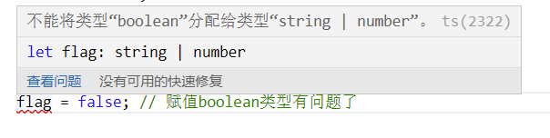

### 1. JS情况

JS易学易用，但是由于本身的特性，可能会有一些隐藏的隐患

js不适合大型项目：

1. 面向对象不理想
2. 没有块作用域
3. js里没有类型的概念：没有变量类型
4. ……

Js很好用，但是也有很多的问题，于是微软就做了件事，开发了Ts。

Typescript，是在js的基础上引入了类型的概念，做了一些功能的扩展，就成了js的超集了。

Js是弱类型语言，并不是说js中没有类型的概念。Js中，值是有类型的，如String、Number、Boolean等，说js中没有类型、动态类型，指的是js中的变量没有固定的类型，js中的同一个变量可以存储number类型、可存储string类型数据，也可以存储布尔类型值。所以说js中的变量是弱类型的。

Ts中引入了类型的概念，指的是Ts中定义了变量的类型，除了值有类型外，变量也有了类型。

> 微软最近几年，在技术领域做了一些比较不错的贡献：
>
> 1. 浏览器放弃了IE内核，拥抱了标准
> 2. 开发了Ts
> 3. 退出了vscode编辑器

#### 1.1 Ts究竟是什么？

1. 以Javascript为基础构建的开发语言
2. 一个js的超集
3. 可以在任何支持js的平台中执行
4. Typescript扩展了Javascript，并引入了类型的概念：注意，这里的类型指的是变量的类型
5. TS不能被Js解析器直接执行：因为现在的前端环境还是以js为主，deno好像是原生支持了Ts，以后浏览器有可能会可以直接运行ts
6. 浏览器、node等这些环境，最终运行的是还是js，所以Ts需要编译为Js

#### 1.2 Ts相比较Js增加了什么？

1. 变量有了类型：指增加了变量的类型，ts中，变量有了类型，不能给同一个变量赋不同类型的值
2. 新增了数据类型：如枚举、元祖、interface等
3. 支持ES6的新特性
4. 添加了一些ES不具备的新特性
5. 丰富的配置选项
6. 强大的开发工具

### 2. Ts开发环境搭建

Ts环境，依赖nodejs，需要全局安装typescript

1. 安装nodejs

   不介绍细节了，直接参考nodejs的官网吧：https://nodejs.org/zh-cn/

2. 全局安装typescript解析器

   ```bash
   npm install typescript -g
   ```

到这里，ts的基本环境，可以说就搭建技术了，接下来，可以看下怎么运行ts文件

> Typescript文件以.ts为文件扩展名

1. 创建一个ts项目目录
2. 进入项目目录，创建一个ts文件index.ts
3. tsc  index.ts 就可以编译为js文件了

### 3. 基本数据类型

* 类型声明

  * 类型声明是TS非常重要的一个特点

  * 通过类型声明可以指定TS中变量（参数、形参）的类型

  * 指定类型后，当为变量赋值时，TS编译器会自动检查值是否符合类型声明，符合则赋值，不符合则报错

  * 简而言之，类型声明给变量设置了类型，使得变量只能存储某种类型的值

  * 语法：

    ```typescript
    let 变量: 类型;
    let 变量: 类型 = 值;
    function fn(参数: 类型, 参数: 类型): 类型{
        // 函数体
    }
    ```

* 自动类型判断

  * TS拥有自动类型判断机制
  * 当对变量的声明和赋值是同时进行的，TS编译器会自动判断变量的类型
  * 所以如果你的变量的声明和赋值是同时进行的，可以省略掉类型声明

* 类型

  | 类型   | 例子                           | 描述                               |
  | ------ | ------------------------------ | ---------------------------------- |
  | number | 1，-33，3.9                    | 任意数字                           |
  | string | "Hello world","Nicholas Zakas" | 任意字符串                         |
  |        | true，false                    | 布尔值，只有2个值：true、false     |
  | 字面量 | 其本身                         | 限制变量的值就是该字面量的值       |
  |        | *                              | 任意类型                           |
  |        | *                              | 类型安全的any                      |
  |        | 空值(undefined)                | 没有值(或是undefined)              |
  | never  | 没有值                         | 不能是任何值                       |
  |        | {name: "Nicholas"}             | 任意的js对象                       |
  |        | [1,2,4]                        | 任意的js数组                       |
  |        | [4,5]                          | 元祖，TS新增的类型，固定长度的数组 |
  |        | enum{A,B}                      | 枚举，TS中新增的类型               |

> js中出现问题多的场景，更多的不是简单的变量，而是函数中的参数

<font color="#f20">ts中的数据类型，都写小写，如number、string、boolean等</font>

#### 3.1 字面量类型声明方式

可以直接通过基本的数据类型去赋值

```typescript
let a:number;
let b:object;
```

**也可以直接通过字面量进行类型声明**

```typescript
// 直接通过字面量为变量声明类型
let a: 10; // a值就只能是10了

a = 20; // 给a重新赋值，报异常了
```

这个时候，a就像一个常量，这种类似的用法，不多，几乎不用。那字面量进行类型声明，什么时候会用呢？

看案例：

```typescript
let sex:"male" | "female";
sex = "male";
sex = "female";
```

字面量类型声明，类型本身也就是值。

类似上面的案例，也可以称为联合类型

固定常量的字面量类型用的场景也不是很多，但是联合类型的另一种方式应用场景会多一些，比如为一个变量同时声明为number类型和string类型，这个变量既可以赋number类型值，也可以赋string类型值

```typescript
let flag: number | string;
flag = 12; // 赋值number类型没有问题
flag = "Nicholas Zakas"; // 赋值string类型没有问题
flag = false; // 赋值boolean类型有问题了  这里看不出来，截个图吧
```



#### 3.2 any类型

any表示任意类型，一个变量设置为any类型，则表示ts对该变量关闭了类型校验

ts中不建议使用any类型

ts中，声明一个变量，如果没有显示的指定类型，则该变量则自动被指定为any类型，即ts中默认的类型为any类型

```typescript
// 下面两种方式都不建议使用
let d: any;
let e;
```

#### 3.3 unknown

unknown类型，表示未知类型

一个unknonw类型的变量，可以被赋值成任何类型的值

```typescript
// unknown类型的变量可以被赋值任何类型的值
let n:unknown;
n = 12;
n = "Hello";
n = false;
```

那是不是unknown和any是一样的？

不一样。

any类型的变量可以赋值给任何类型的变量，而unknown类型的变量，只是本身可以赋值任何类型的值，但是不能将unknown类型的变量赋值给其他类型的变量

```typescript
// unknown类型的变量可以被赋值任何类型的值
let n:unknown;
n = 12;
n = "Hello";
n = false;

let ay:any;
ay = "Hello";

let s:string;
s = ay; // any类型的变量可以赋值给string类型的变量
s = n; // unknown类型的变量不能赋值给其他类型的变量
n = 26; // unknown类型的变量，值可以是其他类型的值，如别赋了一个number类型的值
```


所以说，unknown是一个类型安全的any；unknown类型的变量，不能赋值给其他类型的变量。

**那么有些场景可能确实需要进行类型转换，那么有没有办法呢？有的。**

我们对unknown类型的变量值进行一个类型判断，然后再进行赋值，就可以了

```typescript
let un:unknown;
un = "Hello world!";

let s:string;
if(typeof un === "string"){
    s = un; // 先进行un变量的类型判断，当un的值是string类型时，再将un赋值给一个string类型的变量，就没问题了
}
```

还有一种方法：类型断言,可以通过类型断言的方式告诉ts解析器该变量的实际类型，也可以简单理解为重新指定、明确下unknown类型变量的当前实际类型。两种具体的语法：

语法1： 变量 as 类型

语法2：<类型>变量

```typescript
let un:unknown;
un = 18;

let str:string;
str = un as string; // 这样也是可以的，哪怕un当前虽然不是string类型，但是显示的把它指定成了string类型，就可以把它赋值给string类型的变量了

let num:number;
num = <number>un;
```

#### 3.4 void

void使用变量的情况不多，大部分用在修饰函数，表示没有返回值

ts中，函数没有返回值的时候，默认返回值类型为void；如果有返回值，ts编译器会根据返回值类型自动设置函数的返回值类型

使用void修饰的函数，可以直接return，也可以return null或者undefined,但不能返回一个具有其他类型的值

```typescript
function fn():void{
    // 这3种返回都是可以的
    // return;
    // return null;
    return undefined;
}
```

#### 3.5 never

never表示永远都不会返回，也是更多的使用在函数中

- never 是其他类型的子类型，代表不会出现的值
- 返回“从不”的函数不能具有可访问的终结点
- 在函数内部永远会抛出错误，导致函数无法正常结束
- console.log('end point')永远执行不到

```typescript
function f():never{
    throw new Error();
}
```

