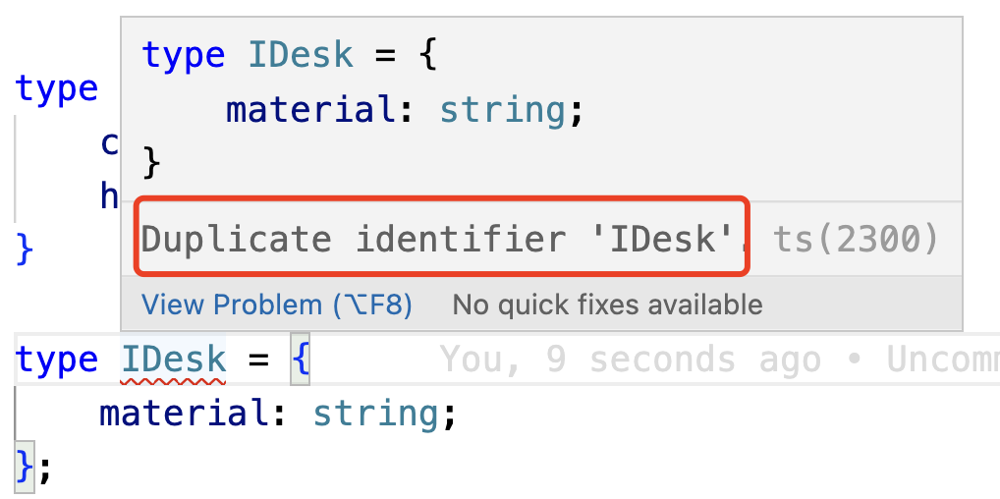
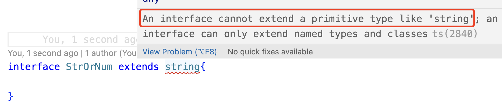

参考链接:https://juejin.cn/post/7207417288704868407?#comment
### 1. interface和type

文档上有一句话：在ts中，能用interface的地方就用interface，除非interface实现不了的功能或者typescript给了提示要使用type，否则就使用interface。

### 2. 主要区别

| type                       | interface                                                    |
| -------------------------- | ------------------------------------------------------------ |
| 定义之后就不能添加新的属性 | 始终可以定义新的属性<br>可以定义多个同名的interface<br>定义的多个同名的interface属性可以合并 |
|                            |                                                              |
|                            |                                                              |

定义多个同名interface

```ts
interface IPerson {
    name: string;
    age: number;
}

interface IPerson {
    gender: string;
    height: number;
}
```

但是type只能定义一个，不能声明、定义多个同名的type

```ts
type IDesk = {
    color: string;
    height: number;
}

type IDesk = {
    material: string;
};
```

案例中定义了多个同名的type，结果报错了，提示了语法错误：



#### 3.1 interface的限制

文章开头就说了，能使用interface的地方就使用interface，除非interface实现不了的功能。那么interface有哪些实现不了的功能呢？即interface的限制

**interface不能操作基本的数据类型**

我没知道ts可以定义联合类型，type可以直接声明一个联合类型，如：

```ts
type StringOrNumber = string | number;
const sn = 12;
const st = "hello";
```

type很简单的就声明了一个联合类型，但是interface不能通过extends继承的方式通过继承直接声明一个包含有原始、基础数据类型的类型

```ts
interface StrOrNum extends string{
    
}
```

这样就会报错，如：

