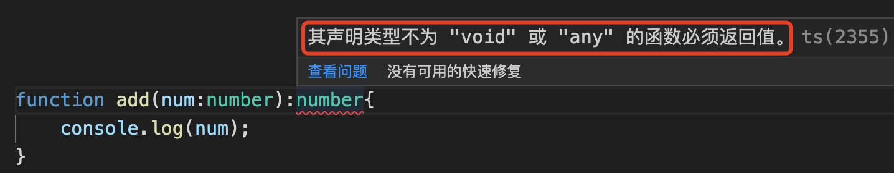

### 1. 学习ts的必要性

做前端开发的，一般情况下离不开vue或者react，而vue和react的默认版本即将要切换成ts了，所以学习ts对于前端开发者来说，是必须的事情，而不是说可不可以的事情了。不去学习，就会掉队了。

### 2. ts的基本的一些观点

**Ts区分大小写**

ts是js的超集，也就是说，js有的，ts都有；js没有的，ts也有。

ts强类型，不允许改变变量的数据类型，不可对变量任意赋值，只能是赋值变量的声明的类型的值。

**ts缺点？**

ts有着非常强大的优势，但也有一些不足的地方：

1. 不能被浏览器解释，最终还是要被编译为js去浏览器中执行；

2. 有一定的学习成本。

如果是从面向对象语言如java、c++等语言转型的，学习起来还好，都有着面向对象的思想、有接口概念、范型、class等概念；但是如果是从js转型去学习，编程思想需要一定程度的转变。

### 3. 数据类型

1. null、undefined

特殊一点的undefined和null是所有类型的子类型，也就是说，这两个类型的值undefined和null可以赋值给任何类型变量。

```ts
let mail:string = null;
let height:number = undefined;
console.log(mail); // null
console.log(height); // undefined
```

但是如果tsconfig.json中配置了strictNullChecks为true的时候，undefined就只能赋值给它们各自类型和void值，null只能赋值给它自己的null类型值，否则会报错。

```json
"strictNullChecks": true // 配置为true后，undefined就只能赋值给它自己的undefined和void类型值，null就只能赋值给它自己的null类型值
```

```ts
let re:void = undefined; // 正常
let res:void = null; // 报错，类型异常
```

2. any

一般情况下不建议使用any，使用any就失去了ts的类型优势了，但是在一些特殊场景中可以使用，比如使用了第三方库，可以设置为any类型。

3. 数组

数组表示一类相同类型的集合，如number类型、string类型等，数组项的类型写错了会报错，使用数组的操作方法操作了错误的数据类型也会报错。

```ts
let arr:number[] = [1,2,3];
arr.push("hello"); // 这里会报错，提示string类型的参数不能赋值给number类型的参数
```


4. tuple 元组类型

元组类型，是一种特殊的数组，表示一个数组的个数固定，但是数组项可以是不同的数据类型，就是说一个数组，可以有number类型的值，也可以有string类型值。

**数据类型的判断**

这里主要说数组和元组的数据类型判断。

我们知道js中可以通过typeof来判断一个变量的数据类型，但是仅仅停留在基本的数据类型，像数组这样的类型，通过typeof会被判定为object的，因为数组本就是一种特殊的object。当然了，我们知道，精准判断数组的数据类型，可以通过Array.isArray()，返回一个boolean值。

```ts
let arr:number[] = [1,2,3];
console.log(typeof arr); // object
console.log(Array.isArray(arr)); // true
```

ts中，元组(tuple)也被认定是一种数组，也可以通过Array.isArray()来判断是不是一个数组。

```ts
let tuple:[number,string] = [12,"hello"];
console.log(typeof tuple); // object
console.log(Array.isArray(tuple)); // true,tuple在语言层面，也被认为是数组
```

> tuple类型怎么判断？

5. 函数类型

**函数的定义**

ts中的函数定义，支持通过function关键字定义函数、函数表达式声明匿名函数。

俱名函数：通过function关键字定义

```ts
function add(a:number,b:number){
    return a + b;
}
```

**函数的表达式的匿名函数写法**

```ts
let inc = (a:number,b:number) => a + b;
```

所有的这些，技术点并不是难，但是需要我们的基本功要扎实。

**可选参数**

函数可以携带参数，可以携带多个参数，可以携带带有默认参数值的参数，也看可以携带可选参数。可选参数，一般放在参数的最后面。

可选参数，是在参数后面添加？表示这是个可选参数。

**js中，函数可以使用函数体外部分的变量，被称为函数捕获了这个变量。但是ts的函数体中，是不能使用函数体外的变量的。**

```js
var c = 12;
function ad(a, b) {
    return a + b + c;
}
console.log(ad(2, 3));

var z = 10;
const add2 = (x, y) => x + y + z;
console.log(add2(1, 3));
```
js中，无论是通过function声明的函数，还是函数表达式，都可以使用函数体外部分的变量。ts中的函数也有同样的特征，在函数体内，也可以调用函数外部的变量，只要这个变量存在即可。

```ts
let z:number = 5;
function add2(x:number,y:number){
    return x + y + z;
}
console.log(add2(2,4));
```
ts函数add2的函数体内使用了函数add2的外部变量z，只要变量z存在即可，如果不存在，就会报错了。

> 无论js还是ts中，函数体内都可以使用函数外部的变量，但是要保证这个变量是存在的。个人建议是尽量少用函数外部的变量，尽量自己的生命线掌控在自己可控的范围内。

**函数类型**

函数类型，包括函数参数类型和返回值类型。

ts函数中，参数可以显示声明数据类型，也可以缺省参数的数据类型，如果缺省了参数的数据类型，则默认为any；

函数和变量一样，也是可以定义类型的，只不过函数的返回值类型可以省略，不是强制的。

函数的类型，一般叫做返回值类型，而不是直接说函数的类型。在函数的返回值类型缺省的时候，会根据函数的实际返回值类型进行类型推导，返回一个最终结果的数据类型。或者也可以简单的理解为没有限定返回值类型的函数，可以返回任意的类型，只要函数的执行过程中没有出错即可。

```ts
let z:number = 5;
function add2(x:number,y:number){ // 定义的函数没有定义返回值类型，那么这个函数就可以返回任意类型的值
    return (x + y + z).toString(); // 可以返回一个string类型，也可以返回一个number类型
}
console.log(add2(2,4)); // 11
console.log(typeof add2(2,4)); // string
```

> 既然我们已经接受了ts，接受了它的类型系统，那么我个人观点是尽量给我们的函数定义好固定的返回值类型。

**自定义函数类型**

上面的我们定义的都是指定的函数参数类型和函数的返回值类型，下面我们定义自定义的函数类型，并根据自定义的函数类型来声明符合自定义函数类型的函数。

先声明一个变量，并指定一个函数类型：

```ts
// 定义了一个变量，并给这个新定义的变量指定自定义的函数类型，自定义的函数类型定义了参数数量和参数的数据类型，以及函数的返回值类型
let increment:(x:number,y:number) => number;
```

接下来就为这个变量赋值一个函数，对这个函数有一个要求，要符合这个变量的类型要求，即这个变量是自定义的函数类型，函数参数及返回值类型

```ts
increment = (x:number,y:number):number => x + y;
```

到这里，其实就已经声明了一个表达式函数，实际编码中可以将声明和赋值链接起来：

```ts
let increment:(x:number,y:number) => number = (x:number,y:number) => x + y;
```

解析来就是调用函数了：

```ts
increment(5,6);
```

这种类型声明函数的方式，刚开始接触ts可能会感觉怪怪的，感觉代码量增加了好多，代码长了好多。其实本质上，就是一个表达式函数，然后加上了类型限制。

```js
let increment = (x,y) => x + y;
```

**接口定义函数类型**

ts中通过接口来定义函数类型更加清晰。

```ts
// 声明一个函数类型的接口，函数参数2个，都为number类型，且函数返回值为number类型
interface Increment {
    (x:number,y:number):number
}
// 实现接口，声明函数的实现
let icr:Increment = (x:number,y:number) => x + y;
// 函数调用
console.log(icr(3,4)); // 7
```

**类型别名的方式定义函数类型**

```ts
// 定义一个函数类型的别名
type Increment = (x:number,y:number) => number;
// 定义实现
let icr:Increment = (x:number,y:number) => x * y;
// 调用
console.log(icr(2,5));
```

### 4.范型

> ts中的函数，只要声明的函数不是void或者any类型，就必要要有返回值。

```ts
function add(num:number):number{
    console.log(num);
}
```

如案例中的函数，是会报错的。



> 范型语法，对于前端开发者来说有点奇怪，但是只要记住就行了。在ts中，一看到<>,就知道这是范型。

我们知道type和interface都可以定义函数类型，那么我们也可以使用范型来重新实现一下。

```ts
type Print = <T>(arg:T) => T;
const print6:Print = (arg) => {
    return arg;
}
```

interface实现：

```ts
// 使用接口定义一个函数范型
interface IPrint<T>{
    (arg:T):T|string;
}

// 声明一个实现IPrint接口的函数实现
const myPrint2:IPrint<string> = (arg:string) => arg;
console.log(myPrint2("Hello Nicholas Zakas"));
```

**默认参数**

函数参数看可以设置默认值，范型也可以设置默认类型。

```ts
// 用接口定义带有默认类型值的范型
interface IPrint<T=string>{
    (arg:T):T;
}
// 声明函数的实现，
const ip:IPrint<number> = (x:number) => x;
console.log(ip(12));
```

**处理多个参数**

```ts
// 固定参数类型的数据交换
let ttt:[string,number]=["hello",12];
function swap(tt:[string,number]):[number,string]{
    return [tt[1],tt[0]];
}
console.log(swap(ttt));

// 使用范型，更加灵活的数据位置交换
function swap2<T,U>(tuple:[T,U]):[U,T]{
    return [tuple[1], tuple[0]]
}
console.log(swap2([23,false]));
```

