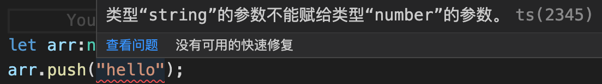

### 1. 学习ts的必要性

做前端开发的，一般情况下离不开vue或者react，而vue和react的默认版本即将要切换成ts了，所以学习ts对于前端开发者来说，是必须的事情，而不是说可不可以的事情了。不去学习，就会掉队了。

### 2. ts的基本的一些观点

ts是js的超集，也就是说，js有的，ts都有；js没有的，ts也有。

ts强类型，不允许改变变量的数据类型，不可对变量任意赋值，只能是赋值变量的声明的类型的值。

**ts缺点？**

ts有着非常强大的优势，但也有一些不足的地方：

1. 不能被浏览器解释，最终还是要被编译为js去浏览器中执行；

2. 有一定的学习成本。

如果是从面向对象语言如java、c++等语言转型的，学习起来还好，都有着面向对象的思想、有接口概念、范型、class等概念；但是如果是从js转型去学习，编程思想需要一定程度的转变。

### 3. 数据类型

1. null、undefined

特殊一点的undefined和null是所有类型的子类型，也就是说，这两个类型的值undefined和null可以赋值给任何类型变量。

```ts
let mail:string = null;
let height:number = undefined;
console.log(mail); // null
console.log(height); // undefined
```

但是如果tsconfig.json中配置了strictNullChecks为true的时候，undefined就只能赋值给它们各自类型和void值，null只能赋值给它自己的null类型值，否则会报错。

```json
"strictNullChecks": true // 配置为true后，undefined就只能赋值给它自己的undefined和void类型值，null就只能赋值给它自己的null类型值
```

```ts
let re:void = undefined; // 正常
let res:void = null; // 报错，类型异常
```

2. any

一般情况下不建议使用any，使用any就失去了ts的类型优势了，但是在一些特殊场景中可以使用，比如使用了第三方库，可以设置为any类型。

3. 数组

数组表示一类相同类型的集合，如number类型、string类型等，数组项的类型写错了会报错，使用数组的操作方法操作了错误的数据类型也会报错。

```ts
let arr:number[] = [1,2,3];
arr.push("hello"); // 这里会报错，提示string类型的参数不能赋值给number类型的参数
```



4. tuple 元组类型

元组类型，是一种特殊的数组，表示一个数组的个数固定，但是数组项可以是不同的数据类型，就是说一个数组，可以有number类型的值，也可以有string类型值。

**数据类型的判断**

这里主要说数组和元组的数据类型判断。

我们知道js中可以通过typeof来判断一个变量的数据类型，但是仅仅停留在基本的数据类型，像数组这样的类型，通过typeof会被判定为object的，因为数组本就是一种特殊的object。当然了，我们知道，精准判断数组的数据类型，可以通过Array.isArray()，返回一个boolean值。

```ts
let arr:number[] = [1,2,3];
console.log(typeof arr); // object
console.log(Array.isArray(arr)); // true
```

ts中，元组(tuple)也被认定是一种数组，也可以通过Array.isArray()来判断是不是一个数组。

```ts
let tuple:[number,string] = [12,"hello"];
console.log(typeof tuple); // object
console.log(Array.isArray(tuple)); // true,tuple在语言层面，也被认为是数组
```

> tuple类型怎么判断？

5. 函数类型

**函数的定义**

ts中的函数定义，支持通过function关键字定义函数、函数表达式声明匿名函数。

俱名函数：通过function关键字定义

```ts
function add(a:number,b:number){
    return a + b;
}
```

函数的返回值类型，可以忽略，也可以限制。忽略的话，默认是void类型，返回值是undefined。

**函数的表达式的匿名函数写法**

```ts
let inc = (a:number,b:number) => a + b;
```

所有的这些，技术点并不是难，但是需要我们的基本功要扎实。

**可选参数**

函数可以携带参数，可以携带多个参数，可以携带带有默认参数值的参数，也看可以携带可选参数。可选参数，一般放在参数的最后面。

可选参数，是在参数后面添加？表示这是个可选参数。

**js中，函数可以使用函数体外部分的变量，被称为函数捕获了这个变量。但是ts的函数体中，是不能使用函数体外的变量的。**

```js
var c = 12;
function ad(a, b) {
    return a + b + c;
}
console.log(ad(2, 3));

var z = 10;
const add2 = (x, y) => x + y + z;
console.log(add2(1, 3));
```
js中，无论是通过function声明的函数，还是函数表达式，都可以使用函数体外部分的变量。使用函数体外变量的时候，这个变量一定要存在，否则就会报错、报异常。