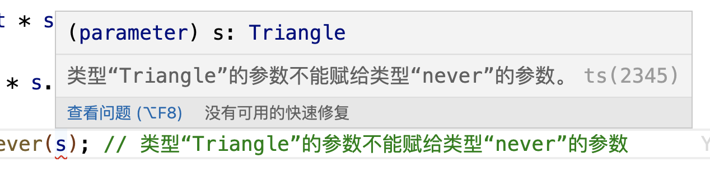

<!-- START doctoc generated TOC please keep comment here to allow auto update -->
<!-- DON'T EDIT THIS SECTION, INSTEAD RE-RUN doctoc TO UPDATE -->
**Table of Contents**  *generated with [DocToc](https://github.com/thlorenz/doctoc)*

- [1. 交叉类型](#1-%E4%BA%A4%E5%8F%89%E7%B1%BB%E5%9E%8B)
  - [1.1 不是所有的类型都要通过&合并新的类型](#11-%E4%B8%8D%E6%98%AF%E6%89%80%E6%9C%89%E7%9A%84%E7%B1%BB%E5%9E%8B%E9%83%BD%E8%A6%81%E9%80%9A%E8%BF%87%E5%90%88%E5%B9%B6%E6%96%B0%E7%9A%84%E7%B1%BB%E5%9E%8B)
  - [1.2 合并的新类型中有重名属性时的处理逻辑](#12-%E5%90%88%E5%B9%B6%E7%9A%84%E6%96%B0%E7%B1%BB%E5%9E%8B%E4%B8%AD%E6%9C%89%E9%87%8D%E5%90%8D%E5%B1%9E%E6%80%A7%E6%97%B6%E7%9A%84%E5%A4%84%E7%90%86%E9%80%BB%E8%BE%91)
  - [1.3 从另一个角度理解交叉类型](#13-%E4%BB%8E%E5%8F%A6%E4%B8%80%E4%B8%AA%E8%A7%92%E5%BA%A6%E7%90%86%E8%A7%A3%E4%BA%A4%E5%8F%89%E7%B1%BB%E5%9E%8B)
- [2. 联合类型](#2-%E8%81%94%E5%90%88%E7%B1%BB%E5%9E%8B)
  - [2.1 联合类型的使用](#21-%E8%81%94%E5%90%88%E7%B1%BB%E5%9E%8B%E7%9A%84%E4%BD%BF%E7%94%A8)
  - [2.2 类型缩减](#22-%E7%B1%BB%E5%9E%8B%E7%BC%A9%E5%87%8F)
  - [2.3 可辨识联合类型](#23-%E5%8F%AF%E8%BE%A8%E8%AF%86%E8%81%94%E5%90%88%E7%B1%BB%E5%9E%8B)
- [3. 交叉类型和联合类型的关系](#3-%E4%BA%A4%E5%8F%89%E7%B1%BB%E5%9E%8B%E5%92%8C%E8%81%94%E5%90%88%E7%B1%BB%E5%9E%8B%E7%9A%84%E5%85%B3%E7%B3%BB)

<!-- END doctoc generated TOC please keep comment here to allow auto update -->

### 1. 交叉类型

交叉类型，就是通过&符号将多个类型联合到一起，合并成一个新的类型，然后使用type来声明新生成的类型，也可以不通过type声明一个新的类型，通过字面量的方式使用即可。

```ts
interface classA {
    name: string;
    age: number;
}

interface classB {
    name: string;
    mobile: number;
}

// 通过type声明一个新的类型变量
type NewClass = classA & classB;

// 通过使用新声明的类型声明一个变量
let info: NewClass = {
    name: "Nicholas Zakas",
    age: 16,
    mobile: 13209099876
}

// 也可以不通过type声明新的类型，而是直接通过字面量的方式声明变量
let info2: classA & classB = {
    name: "Nicholas Zakas",
    age: 16,
    mobile: 13209099876
}
```

有两个类型classA和classB，然后这两个类型通过&合并了，最后通过type关键字将合并的类型生成为一个新的类型，该新的类型包括了原来两个类型的所有属性。重合的类型只算一次。

#### 1.1 不是所有的类型都要通过&合并新的类型

不是说所有类型都能通过&合并成新的类型，因为这样合并后没有现实意义。比如两个类型A和B都有属性name，其中A中的name属性为string类型，B中的name为number类型，但是如果A & B合并了，那么这个新合成的新的类型就成了never类型了，就已经失去了类型合并的意义了。

```ts
interface A {
    name: string;
}

interface B {
    name: number;
}

type T = A & B;

let t:T = {
    name: 12 // 这里会报异常，A和B合并后形成的是never类型，不能将类型“number”分配给类型“never”
};
```

#### 1.2 合并的新类型中有重名属性时的处理逻辑

合并的接口类型中如果有重名属性，可以分为两种情况去处理：

1. 同名属性的类型相同，合并后还是原来类型

```ts
interface M {
    name: string;
    age: number;
}

interface N {
    name: string;
    gender: number;
}

type MN = M & N;
let nm: MN = {
    name: "Nicholas Zakas",
    age: 16,
    gender: 1
};
```

原类型M和N，有同名的属性name，也有不同名的其他属性，在M和N合并后，同名的name还是原来的string类型，其他不同名的属性保持原来的类型不变。

2. 同名属性的类型不同，合并后为never，合并操作没有现实意义

如果原来类型中有同名的属性，但是类型不同，这个时候合并后的新类型就是never。

```ts
interface X {
    q: number;
    w: string;
}

interface Y {
    q: boolean;
    r: string;
}

type Z = X & Y; // Z是never
```

原类型X和Y中都有一个q属性，在X中q属性是nunber类型，Y中q是boolean类型，所以两个类型合并后就是never了。因为一个值，不可能同时即时nunber类型，又是boolean类型，那么结果就只能是never，永远不可能。

#### 1.3 从另一个角度理解交叉类型

如果在实践中仅仅是把原始类型、字面量类型、函数类型等原子类型合并成交叉类型，是没有实际意义的，因为不会有变量会同时满足既是number，又是string类型，所以这个时候新的类型实际上就是never类型。

**交叉类型的使用场景**

1. 合并接口类型

将多个接口类型合并为一个类型是交叉类型使用较多的场景，这样就相当于实现了接口继承，也就是所谓的合并接口类型。

```ts
type Person = {
    name: string;
    age: number
} & {
    height: number;
    weight: number;
} & {
    mobile: number;
    mail: string;
}
```

**如果被交叉合并的子接口中有定义了同名的属性，会怎么处理呢？**

- 如果同名属性是同一种数据类型，则直接按照同名属性的数据类型约束

```ts
type Student = {
    name: string;
    age: number;
} & {
    age: number
}
```

如两个类型中都定义了age属性，但是age属性都是number类型，那么age属性就是number类型。

```ts
let s: Student = {
    name: "Nicholas Zakas",
    age: 12
};
```

类型Student合并的两个类型都有age属性，且都是number类型，那么合并后的age就是number类型。

- 如果合并的接口中定义了不同类型的同名属性，那么合并后的类型中该属性为never类型，则不能通过该类型声明、约束变量

```ts
type Student = {
    name: string;
    age: number;
} & {
    age: string;
}
```

合并的接口定义了不同类型但同名的age属性，那么age的类型就是number & string,一个变量永远不会满足既是number类型的同时又是string类型，所以合并后的类型Student就没有了实际价值了，因为不不会在一个值能够满足age的类型约束要求。

- 如果同名属性的类型兼容，比如一个是number，另一个是number类型的子类型、数字字面量类型，那么合并后的类型是两者中的子类型.

```ts
type Student = {
    name: string;
    age: number;
} & {
    age: 16; // 该类型为number类型的子类型
}

let s: Student = {
    name: "Nicholas Zakas",
    age: 16 // age属性值只能是16，age属性的类型分别为number和数字字面量类型16，而字面量类型16为number的子类型，所以合并后的类型就是子类型16
};
```

2. 合并联合类型

合并联合类型，那么这个最终的交叉类型，需要同时满足不同联合类型的约束。

```ts
type A = "blue" | 'red' | 996;
type B = 996 | '007';

type C = A | B;
let c: C = 996;
```

如demo，联合类型A和B，交叉形成交叉类型C，那么交叉类型C的值需要同时满足联合类型A和B，那么满足这个条件的就只有996，所以变量c的合法的值就只有996这一个值。
### 2. 联合类型

#### 2.1 联合类型的使用

如果希望属性是多种类型中的一种，也可以满足所有的类型，那么这个时候就可以使用联合类型。联合类型通过|符号合并多个类型而成的新类型。联合类型取多个类型的并集，最终类型只需要满足多个类型中的某个类型即可，也可以同时满足。

```ts
let vb: string[] | string = "hello";
let vbs: string[] | string = ["world"];
let vbc: string | number = 12;
let vbd: string | number = "Hello world";
```

联合类型可以合并基本的数据类型，也可以合并接口类型：

```ts
interface SS {
    name: string;
    age: number;
}

interface ST {
    mobile: string;
    code: string;
}

let sst: SS | ST = {
    name: "Nicholas Zakas",
    age: 12,
    code: '10010'
}
```

联合类型值就是几种类型之一，使用｜分隔。

实践中，可以使用type类型别名来抽象联合类型。

```ts
type StrOrNum = string | number;
let ss:StrOrNum = "hello world";
```

#### 2.2 类型缩减

联合类型中，如果定义的联合类型包含了某个类型和某个类型的子类型这种情况，如定义的联合类型包含数字类型和数字字面量类型、字符串类型和字符串字面量类型、布尔类型和布尔类型字面量会怎么处理呢？

由于数字字面量是数字类型的子类型、字符串字面量类型是字符串类型的子类型、布尔类型字面量也是布尔类型的子类型，那么这个时候会发生类型缩减，分别缩减为数字类型、字符串类型和布尔类型。

```ts
type UnionNum = 12 | number; // 最终类型为number
type UnionStr = "Hello" | string; // 最终为string
type UnionBoolean = false | boolean; // 最终为boolean
```

在这种简单的联合类型场景下，Typescript进行了类型缩减，将字面量类型缩减掉了，只保留了原始类型。

但是这种缩减方式也造成了一个问题:编译器只能告诉我们定义的变量是哪个原始类型:

```ts
type Str = "hello" | "world" | "Nicholas Zakas" | string;
let strs:Str = "May";
```


**类型缩减控制**

上面的联合类型经过ts的类型缩减后，缩减为只剩下了基本类型，同时ts也提供了控制类型缩减的能力,方式为在父类型后面添加& {}即可。

```ts
type Str = "hello" | "world" | "Nicholas Zakas" | string & {};
```

这样定义的Str类型的变量在赋值的时候会自动提示出来:


#### 2.3 可辨识联合类型

可以把单例类型、联合类型、类型保护和类型别名这几种类型进行合并，来创建一个叫做可辨识联合类型，这个可辨识联合类型也可以被叫做标签联合或者代数数据类型。

单例类型，可以简单的理解为符合单例模式的数据类型，比如枚举成员、字面量类型。

可辨识联合类型有两个必要要素:

1. 具有普通的单例类型属性；

2. 一个类型别名，包含了那些类型的联合；

**可辨识的联合属性是为了保证每个case都可以被处理**

```ts
interface Square {
    kind: "square"; // 可辨识的属性
    size: number;
}

interface Rectangle {
    kind: "rectangle"; // 可辨识的属性
    height: number;
    width: number;
}

interface Circle {
    kind: "circle"; // 可辨识的属性
    radius: number;
}

type Shape = Square | Rectangle | Circle;
function getArea(s: Shape) {
    switch (s.kind) {
        case 'square':
            return s.size * s.size;
        case 'rectangle':
            return s.height * s.width;
        case 'circle':
            return Math.PI * s.radius * s.radius;
    }
}

let sh: Shape = {
    kind: 'square',
    size: 8
};
console.log("面积:", getArea(sh));
```

案例中的Shape就是一个可辨识的联合类型，它是一个3个接口的联合类型，这3个接口都有一个kind属性可起到辨识作用，同时也声明了类型别名Shape。所以Shape就是一个可辨识的联合类型。

案例中，函数getArea()包含了联合类型中的每个接口的可辨识属性，对每种接口提供的类型头提供了处理，那如果处理函数中没有处理完联合类型所有的场景,处理函数返回了undefined。如：

```ts
interface Square {
    kind: "square"; // 可辨识的属性
    size: number;
}

interface Rectangle {
    kind: "rectangle"; // 可辨识的属性
    height: number;
    width: number;
}

interface Circle {
    kind: "circle"; // 可辨识的属性
    radius: number;
}

interface Triangle {
    kind: "triangle",
    bottom: number;
    height: number;
}

type Shape = Square | Rectangle | Circle | Triangle;
function getArea(s: Shape) {
    switch (s.kind) {
        case 'square':
            return s.size * s.size;
        case 'rectangle':
            return s.height * s.width;
        case 'circle':
            return Math.PI * s.radius * s.radius;
    }
}

let triangle: Shape = {
    kind: 'triangle',
    bottom: 8,
    height: 6
};
console.log("面积:", getArea(triangle)); // undefined
```

联合类型中有Triangle类型，但是函数getArea()并没有对这种结构类型进行处理，结果函数返回了undefined。

处理函数没有处理完所有的场景，代码在编译阶段也没有给出任何的提示，这样不符合我们的预期，我们期望在这样的场景下在编译阶段能够给出一些提示,我们可以尝试使用strictNullChecks和使用never类型。

1. 使用strictNullChecks

还是看这个案例:

```ts
interface Square {
    kind: "square"; // 可辨识的属性
    size: number;
}

interface Rectangle {
    kind: "rectangle"; // 可辨识的属性
    height: number;
    width: number;
}

interface Circle {
    kind: "circle"; // 可辨识的属性
    radius: number;
}

interface Triangle {
    kind: "triangle",
    bottom: number;
    height: number;
}

type Shape = Square | Rectangle | Circle | Triangle;
function getArea(s: Shape) {
    switch (s.kind) {
        case 'square':
            return s.size * s.size;
        case 'rectangle':
            return s.height * s.width;
        case 'circle':
            return Math.PI * s.radius * s.radius;
    }
}

let triangle: Shape = {
    kind: 'triangle',
    bottom: 8,
    height: 6
};
console.log("面积:", getArea(triangle));
```

函数getArea()没有处理所有的联合类型的场景，没有处理Triangle这种类型的场景，那么函数就直接返回了undefined，我们可以结合ts编译选项"strictNullChecks": true来配置来实现编译阶段的提示。

这种方式简单，但是这个属性是在ts2.0版本中加入的，对以前的代码不会生效，所以在使用的时候需要留意下版本问题。

2. 使用never

当函数返回一个错误或者不可能有返回值的时候，返回值类型为never。这个时候可以结合switch添加一个default分支，当前面的case都不满足条件的时候，就执行默认的default分支。

```ts
interface Square {
    kind: "square"; // 可辨识的属性
    size: number;
}

interface Rectangle {
    kind: "rectangle"; // 可辨识的属性
    height: number;
    width: number;
}

interface Circle {
    kind: "circle"; // 可辨识的属性
    radius: number;
}

interface Triangle {
    kind: "triangle",
    bottom: number;
    height: number;
}

type Shape = Square | Rectangle | Circle | Triangle;

function assertNever(value:never):never{
    throw new Error(value);
}
function getArea(s: Shape) {
    switch (s.kind) {
        case 'square':
            return s.size * s.size;
        case 'rectangle':
            return s.height * s.width;
        case 'circle':
            return Math.PI * s.radius * s.radius;
        default:
            return assertNever(s); // 类型“Triangle”的参数不能赋给类型“never”的参数
    }
}

let triangle: Shape = {
    kind: 'triangle',
    bottom: 8,
    height: 6
};
console.log("面积:", getArea(triangle));
```

使用这种方式，需要额外添加一个assertNever函数，但是这种方式有一些优势，就是不仅能够在编译阶段提示遗漏的条件，也会在运行阶段报错。



### 3. 交叉类型和联合类型的关系

交叉类型和联合类型类似，都是通过对原来的多个类型进行一些操作，形成一个新的类型。

区别：

1. 交叉类型，通过&合并原类型，新类型的最终类型是原类型的且的关系，即原类型中每个类型都要实现；

```ts
interface M {
    name: string;
    age: number;
}

interface N {
    name: string;
    gender: number;
}

type MN = M & N;
let nm: MN = {
    name: "Nicholas Zakas",
    age: 16,
    gender: 1
};
```

新类型MN必须要全部实现原类型的所有属性，如name、age和gender。

2. 联合类型，通过｜合并原类型，新类型的最终结果是原类型的或的关系，即新的类型可以只实现原类型中的部分属性，也可以全部实现；

```ts
let n:string | number; // n的值可以是string类型，也可以是number类型
```

**多个接口类型的联合**

```ts
interface X {
    q: number;
    w: string;
    r: string;
    z: string;
}

let n:string | number;

interface Y {
    q: number;
    r: string;
}

type XY = X | Y;
let xy: XY = {
    q: 2,
    r: "Hello",
    w: '12',
    z: 'world'
};
```

变量xy可以实现X和Y的部分类型，也可以实现X和Y的全部属性，即xy这个对象的属性，可以只有X和Y、X或Y的部分属性，而不必全部都包含进来。

> ts中通过function关键字声明的函数，如果定义的返回值类型如果不是void或者any，那么这个函数就必须要有返回值。

```ts
function contactName(oldName:string):string{
    let newName:string = oldName;
    return newName;
}
```

案例函数声明为string类型，那么就必须要有一个返回值，返回了newName。

<font color='#f20'>ts中，如果函数需要继承或实现某个接口，那么可以尝试优先使用函数表达式的方式声明函数，可以规避一些ts类型校验的一些问题。</font>