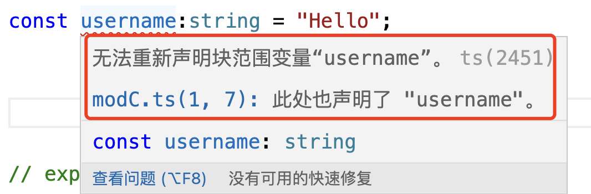

参考链接：https://juejin.cn/post/7229193250904752188
### Typescript的模块和命名空间

#### 模块

javascript在2015年引入了模块的概念，从此js开始了标准的模块化开发阶段，ts沿用了这个概念。

ts中的模块，和js中的模块，从语法到概念、应用，和js基本是一致的。

#### 导出

在一个文件中，任何的声明都可以通过export关键字导出。导出，其实就是对外暴露该内容，让外部可以引用该模块的内容。

ts中声明模块并导出

```ts
// modA.ts
export const num = 100;
export const str = "Hello World!";

export function add(a: number, b: number) {
    return a + b;
}

export class People {
    
}

export interface IUser {
    name: string;
    age: number;
}
```

通过import导入通过expor导出的模块，并引用

```ts
// modB.ts
import { num, str, add, IUser } from "./modA";
console.log("🚀 ~ file: modB.ts:2 ~ str:", str)
console.log('%c [ num ]-2', 'font-size:13px; background:pink; color:#bf2c9f;', num)

console.log("🚀 ~ file: modB.ts:6 ~ add(2,4):", add(2, 4))

const User: IUser = {
    name: "Nicholas Zakas",
    age: 12
};
console.log("🚀 ~ file: modB.ts:11 ~ User:", User)
```

### 命名空间

早期的ts中是没有命名空间的概念的，和js一样，只有模块的概念。

但是ts中的模块区分为内部模块和外部模块

从ts1.5开始，内部模块被改名为命名空间，所以我们使用ts时常说的命名空间，其实就是指ts的内部模块

那么在实际应用中怎么区分内部模块(命名空间)和外部模块呢？应该还是从其封装的内容上来区分：

1. 命名空间(内部模块):主要用于组织代码，避免命名冲突

2. 外部模块(模块):侧重代码的封装复用，一个模块内可能包含了多个命名空间

在日常的项目开发中，如果一个ts文件没有书写模块化的语法，那么这个文件中所有定义的变量默认都是挂载到全局上的，那么两个文件内就不能出现两个同名的变量，否则编译器就会报错，给出异常提示.

> 但是如果一个ts文件中只要有一个模块使用了export关键字导出过模块那么上面的异常就会消失。

```ts
// modC.ts
const username:string = "Youyyyy";

// modD.ts
const username:string = "Hello";
```

如果modC.ts和modD.ts中都没有使用过export导出过模块，那么这两个文件中因为都定义了username变量，所以编译器就会报错



但是只要modC.ts或者modD.ts中有一个文件中有使用过export导出过模块，这个重复声明的异常就会消失：

```ts
const username:string = "Hello";
export const flag:boolean = false;
```

异常提示消失

#### 命名空间语法

```markdown
namespace 命名{

}
```

#### 引入命名空间