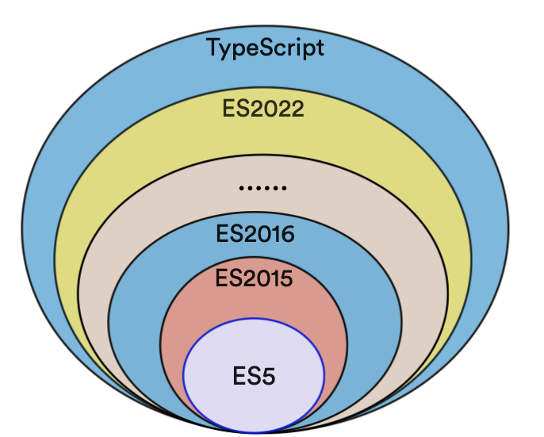
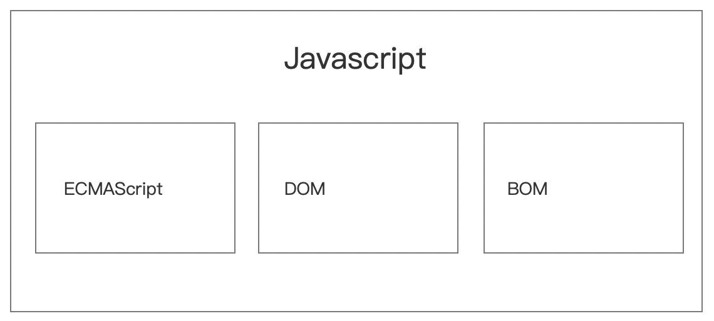

参考链接：https://juejin.cn/post/7112329718816473125
### Typescript基础

ts是微软开发的一种开源的编程语言，它是js的超急，本质上扩展了js的能力，添加了可选的静态类型和基于类的面向对象编程。

Typescript提供最新的和不断发展的Javascript特性，包括那些来自ES2015年的ECMAScript和未来的提案中的特性，比如异步功能和Decorators(装饰器)，以帮助建立健壮的组件。

**Typescript和Javascript(ECMAScript)之间的关系**

可参考下图：



**ECMAScript和Javascript之间的关系**

说的简单一点，我们可以简单的将ECMAScript理解为一个标准，而实现这个标准有很多种语言，常见的有Javascript、ActionScript等。

在浏览器环境下，也可以简单的这么理解一下:

Javascript = ECMAScript + DOM + BOM

图形化的表示可以如下:



**Typescript和Javascript之间有什么区别呢？**

ts和js有相同的地方，也有区别，区别是技术细节上的区别，现在浏览器还没有办法直接运行ts，如果希望ts代码最终是在浏览器环境下执行，那么ts代码还是要被编译成js才可以的，所以ts和js虽然有区别，但是最终是殊途同归的 ---- 这个词好像有点不太合适。

| Typescript                                                   | Javascript                                           |
| ------------------------------------------------------------ | ---------------------------------------------------- |
| 是js的超集                                                   | 一种脚本语言                                         |
| 用于解决大型项目代码复杂性和健壮性的问题                     | 用于创建动态网页                                     |
| 可以在编译期间发现并纠正错误                                 | 做为一种解释型语言，只能在运行时才能够发现存在的错误 |
| 强类型，支持静态类型和动态类型                               | 弱类型，没有静态类型                                 |
| 当前还不能直接在浏览器中直接运行，需要被编译为js后才能在浏览器环境中运行 | 可以直接在浏览器环境中运行                           |
| 支持模块、泛型和接口                                         | 不支持泛型和接口                                     |

关于静态类型和动态类型可以参考:[静态类型和动态类型](../%E5%89%8D%E7%AB%AF%E5%9F%BA%E7%A1%80/%E9%9D%99%E6%80%81%E7%B1%BB%E5%9E%8B%E5%92%8C%E5%8A%A8%E6%80%81%E7%B1%BB%E5%9E%8B.md)

**TS使用**

ts是编译型语言，在使用ts之前，需要先安装、配置ts的运行环境

安装ts

```bash
npm install typescript -g
```

编译ts文件

因为当前浏览器不能直接直接运行ts文件，所以我们开发的ts代码需要先被编译为js

```bash
tsc main.ts
```

> tsc是typescript的编译指令，全局安装了typescript后就可以直接使用该指令

**Typescript的工作流程**

开发ts代码->编译为js->模块化工具如webpack模块化处理->上线部署

**Typescript的主要特点**

1. 强大的类型系统

类型系统允许Javascript开发者在开发javascript应用时使用高效的开发工具和常用操作比如静态代码检查和代码重构

2. 先进的Javascript

Typescript提供最新的javascript和不断发展的javascript特性

3. 终结于Javascript

当前浏览器不能直接运行typescript，开发的typescript源码可以被编译为干净、简洁的js代码运行到浏览器中

### 泛型在ts中的应用

**泛型是什么？**

书面解释，泛型就是指类型参数化，即将原来某种具体的类型进行参数化。

直白一点，就是代码中原来使用的某种具体的数据类型如string、number，现在不直接指定为string或number类型了，而是用一个参数去表示，就像函数的参数一样。

> 软件工程中，我们不仅要创建一致的、定义良好的API，同时也要考虑到代码的可重用性。不见不仅要能够支持当前的数据类型，也要能够支持到未来的数据类型，这就在创建大型系统时提供了十分灵活的功能。

在传统的编程语言如C++、java这些面向对象语言中，都可以使用泛型来创建可重用的组件，一个组件可以支持多种数据类型的数据。这样，用户可以使用自己的数据类型来使用组件，极大的提升了组件的可复用性。

> 设计泛型的关键目的是在成员之间提供有意义的约束，这些成员可以是类的成员实例、类的方法、函数参数和函数返回值。

看个案例：

```javascript
const user = {
    name: "Nicholas Zakas",
    status: "在线"
};
```

```typescript
type User = {
    name: string;
    status: "在线" | "离线"; 
};
```

从这两个小demo中可发现一个小特点，就是js更加关注的是具体的值，如name的属性值是Nicholas Zakas，status属性的值是"在线"，而ts更加关注的是类型，如demo中定义了一个类型别名，这个类型有2个属性，分别为name和status，分别为这2个属性的数据类型都为string；

### 泛型在react中的应用