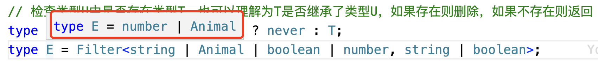
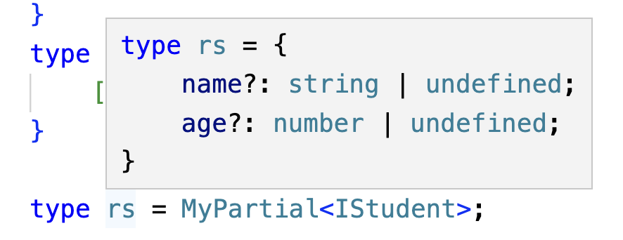
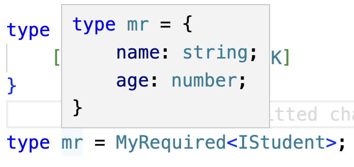

<!-- START doctoc generated TOC please keep comment here to allow auto update -->
<!-- DON'T EDIT THIS SECTION, INSTEAD RE-RUN doctoc TO UPDATE -->
**Table of Contents**  *generated with [DocToc](https://github.com/thlorenz/doctoc)*

- [1. 泛型处理函数参数](#1-%E6%B3%9B%E5%9E%8B%E5%A4%84%E7%90%86%E5%87%BD%E6%95%B0%E5%8F%82%E6%95%B0)
- [2. 泛型接口](#2-%E6%B3%9B%E5%9E%8B%E6%8E%A5%E5%8F%A3)
- [3. 泛型类](#3-%E6%B3%9B%E5%9E%8B%E7%B1%BB)
- [4. 泛型约束](#4-%E6%B3%9B%E5%9E%8B%E7%BA%A6%E6%9D%9F)
  - [4.1 泛型中使用extends](#41-%E6%B3%9B%E5%9E%8B%E4%B8%AD%E4%BD%BF%E7%94%A8extends)
  - [4.2 泛型中使用keyof](#42-%E6%B3%9B%E5%9E%8B%E4%B8%AD%E4%BD%BF%E7%94%A8keyof)
  - [4.3 泛型中使用extends和keyof](#43-%E6%B3%9B%E5%9E%8B%E4%B8%AD%E4%BD%BF%E7%94%A8extends%E5%92%8Ckeyof)
- [5. 映射类型](#5-%E6%98%A0%E5%B0%84%E7%B1%BB%E5%9E%8B)
- [6. 内置工具和类型体操](#6-%E5%86%85%E7%BD%AE%E5%B7%A5%E5%85%B7%E5%92%8C%E7%B1%BB%E5%9E%8B%E4%BD%93%E6%93%8D)
  - [6.1 条件类型](#61-%E6%9D%A1%E4%BB%B6%E7%B1%BB%E5%9E%8B)
  - [6.2 条件类型中推断(infer)和ReturnType](#62-%E6%9D%A1%E4%BB%B6%E7%B1%BB%E5%9E%8B%E4%B8%AD%E6%8E%A8%E6%96%ADinfer%E5%92%8Creturntype)
  - [6.3 分发条件类型(Distributive Conditional Types)](#63-%E5%88%86%E5%8F%91%E6%9D%A1%E4%BB%B6%E7%B1%BB%E5%9E%8Bdistributive-conditional-types)
  - [6.4 Partial](#64-partial)
  - [6.5 Required](#65-required)
  - [6.6 Readonly](#66-readonly)
  - [6.7 Record<Keys,Type>](#67-recordkeystype)
  - [6.8 Pick<Type,Keys>](#68-picktypekeys)
  - [6.9 Omit<Type,Keys>](#69-omittypekeys)

<!-- END doctoc generated TOC please keep comment here to allow auto update -->

参考链接:https://juejin.cn/post/7212622837063385125?
https://juejin.cn/post/7064351631072526350
https://juejin.cn/post/7209612932367532087#heading-3
https://juejin.cn/post/7033717369663029278

泛型有什么用？

### 1. 泛型处理函数参数

定义函数的时候不决定参数的类型，而是让调用者使用尖括号<>的方式传入对应的类型。

比如我们要实现一个函数，输入一个参数并返回它，要求保证参数和函数返回值类型一致。

```ts
function fn<Type>(args: Type): Type {
    return args;
}

console.log(fn<'hello'>("hello"));
```

泛型的语法是<>里面写类型参数，一般可使用T来表示。

> 类型参数经常会使用T、E、K、V、O，这些都是自定义的，可以任意修改，只是这几个使用的比较多，默认代码表了一些意义。

T: Type，类型

K: key

V: value

E: element，元素

O: Object,对象

<font color="#f20">这几个占位符只是使用的多一些而已，可以自定义，自己在编码的时候可以自定义。</font>

```ts
function print<T>(args: T): T {
    return args;
}
```
demo定义了一个函数，T是一个占位的类型变量，args是T类型，函数的返回值类型也是T类型。那么T究竟是一个什么类型呢？在函数定义阶段，我们并不知道T究竟是什么类型，而是在调用的时候，由调用者确定T到底是什么类型.

```ts
function print<T>(args: T): T {
    return args;
}
print<string>("hello"); // 函数调用方决定了函数定义时的T是string。
print<12>(12); // 调用时决定了T是一个数字字面量类型12
```

**泛型传入多个类型参数**

函数定义的时候，也可以传递多个类型参数 --- 我习惯把占位的<>里面的参数称为类型参数。

```ts
function fn2<T,E>(t:T,e:E):void{
    console.log(t,e);
}
fn2<string,number>("hello", 12); // hello, 12
```

### 2. 泛型接口

泛型接口是一种具有泛型类型参数的接口，它可以在接口的定义中使用这些参数，从而使得接口的属性和方法能够适用于多种类型。

1. 接口定义的时候使用泛型

```ts
interface IPerson<T> {
    name: T;
    friends: T[];
    sayHi: (msg: T) => void;
}

const p: IPerson<string> = {
    name: "Nicholas Zakas",
    friends: ["Dave Herman"],
    sayHi: (msg) => {
        console.log(msg);
    }
};
```

demo中定义了一个接口IPerson，并为接口指定了一个类型参数T,在接口内声明的属性都使用到了这个类型参数。这个类型参数究竟是什么类型，在接口定义的时候不确定，在接口被调用的时候由调用者指定。案例中调用时指定了类型参数为string。

2. 指定类型的默认值

在定义泛型接口时，也可以像定义函数一样，参数也可以有默认值，那么定义泛型接口时参数类型也可以有默认值

```ts
interface IPerson<T = string> {
    name: T;
    friends: T[];
    sayHi: (msg: T) => void;
}

const p: IPerson<number> = {
    name: 12,
    friends: [1, 2, 3],
    sayHi: (msg) => {
        console.log(msg);
    }
};

const p2: IPerson = {
    name: "Nicholas Zakas",
    friends: ["Dave Herman"],
    sayHi: (msg) => {
        console.log();
    }
};
```
案例在定义泛型接口的时候，指定了一个默认的类型，但是在实际使用到这个接口进行类型约束的时候，如果没有显示指定类型，则使用默认的类型参数string，如p2；如果使用泛型接口时显示指定了类型参数，则使用指定的类型参数，如p。

### 3. 泛型类

泛型类，是一种具有泛型类型约束的类，泛型类可以在类定义的时候使用这些类型参数，从而使得类的属性和方法能够适用于多种类型。

```ts
class Point<T>{
    x: T;
    y: T;
    constructor(x: T, y: T) {
        this.x = x;
        this.y = y;
    }
}

const p0 = new Point(3, 4);
const p1 = new Point<number>(2, 3);
const p4:Point<number> = new Point(2,5);
```

### 4. 泛型约束

#### 4.1 泛型中使用extends 

extends和泛型结合，可解决固定参数类型传递的需求

```ts
interface Person {
    name: string;
}

// 这里类型参数T继承了Person类型，那么T就继承了Person的所有属性，且函数参数person是T类型，那么函数参数person的类型只要有name属性就可以了，其他属性也可以自定义
function getName<T extends Person>(person: T) {
    return person.name;
}

// 调用中，函数getName()的参数实现了继承自Person的属性name，且也实现了自定义属性age
// name是必须的，age是可选的
getName({
    name: "Dave Herman",
    age: 12
});
```

在实际业务代码中，我们经常需要使用一个属性，但是编译器老提示我们没有这个属性，但是实际上呢是有的，比如我们获取某个数据的length属性的时候，如果参数是数组、字符串或者具有length属性的对象的时候。这个时候我们可以通过泛型继承的方式来规避表编译器对我们代码的异常信息提示.

```ts
interface ILength {
    length: number;
}

function getLength<T extends ILength>(args: T) {
    return args.length;
}

getLength<string>("hello");
getLength({
    name: "Dave Herman",
    age: 12,
    length: 3
});

getLength(['hello', 123]);

interface IUser {
    name: string;
    age: number;
}
getLength<IUser[]>([
    {
        name: "Nicholas Zakas",
        age: 18
    },
    {
        name: "Dave Herman",
        age: 21
    }
]);
```

#### 4.2 泛型中使用keyof

关于ts中的keyof的详细介绍，可以参考[ts中的keyof](./ts%E4%B8%AD%E7%9A%84keyof.md)

简单的信息，可以概括下。

js中有Object.keys()和keyof都是用来获取key的，但是也有不同。

Object.keys()：js中可用，ts中也可用，主要是用来获取对象的属性，且获取的属性列表会组成一个数组.

```ts
const worker = {
    name: "Nicholas Zakas",
    age: 12,
    salary: '98987'
};

console.log("Object.keys():",Object.keys(worker)); // [ 'name', 'age', 'salary' ]
```

keyof：只能在ts中使用，js中没有该能力。且keyof只能操作类型，即由interface和type声明的类型，而不能操作对象去获取对象的属性。keyof操作自定义类型的结果是由自定义类型的key值列表做成的一个字面量联合类型。

```ts
type Workers = {
    name: string;
    salary: number;
};
type workerTye = keyof Workers;
const w:workerTye = 'salary';
```

demo中keyof操作了自定义类型Workers，形成了一个由name和salary组成的字面量联合类型，即name | salary.所以由声明的workerTye类型的w的值就只能是name和salary中的一个。

#### 4.3 泛型中使用extends和keyof

这里的概念有点绕，暂且先放个demo，慢慢消化吧:

```ts
// 目的是获取某个对象上的属性，但是获取对象属性需要确保属性存在，那么需要建立起对象和属性之间的约束关系
function getPersonKey<T, K extends keyof T>(person: T, key: K) {
    return person[key];
}
getPersonKey({
    name: "Nicholas Zakas",
    age: 12,
    gender: 'male'
}, 'age'); // 12
```
### 5. 映射类型

映射类型是ts中的一种高级类型，它可以用来从现有的类型中生成一个新的类型

TS大部分的内置工具和类型体操都是基于映射类型实现

映射类型的语法形式:{[K in keyof T]:U}

K是T的所有属性名的联合类型

U是一个类型变换函数，它用来将T中的每个属性类型变成另外一个类型

```ts
interface IPerson {
    name: string;
    age: number;
}

type MyselfType1<T> = { [K in keyof T]: T[K] }

type MapType<T> = {
    [P in keyof T]: (arg: T[P]) => boolean;
}

type R1 = MyselfType1<IPerson>;
type R2 = MapType<IPerson>;

const p1: R1 = {
    name: "Dave Herman",
    age: 12
};
```

类型映射，就是通过一定的方法，将一种类型名称转换为其他的类型名称。

在使用类型映射时，有两个修饰符：

1. readonly: 设置属性只读

2. ?: 设置属性可选

-?: 去掉客选

+?: 都可选

-readonly:去掉只读

```ts
interface IPerson {
    name: string;
    age?: number; // 设置age属性可选
}

type MyselfType1<T> = { [K in keyof T]: T[K] }

type R1 = MyselfType1<IPerson>;

// 实例化时可以不初始化age属性
const p1: R1 = {
    name: "Dave Herman",
};
```

```ts
interface IPerson {
    name: string;
    age?: number; // 设置age属性可选
}

type MyselfType1<T> = { [K in keyof T]-?: T[K] } // -?:表示要去掉原来类型中的可选属性

type R1 = MyselfType1<IPerson>;

// 实例化时原来的可选属性age不能再设置可选了
const p1: R1 = {
    name: "Dave Herman",
    age: 16
};
```

```ts
interface IPerson {
    name: string;
    age?: number; // 设置age属性可选
}

type MyselfType1<T> = { [K in keyof T]+?: T[K] } // +?:表示原类型中的所有属性都可选

type R1 = MyselfType1<IPerson>;

// 实例化时原来的属性都可选
const p1: R1 = { // 因为设置了所有属性都可选，在实例化时没有声明属性也是可行的
};
```

### 6. 内置工具和类型体操

ts的类型系统增加了很多功能以适配js的灵活性，以满足ts是一门支持类型编程的类型系统

通常我们为代码加上类型约束，不太需要过多类型编程的能力，但是在开发一些通用框架、类库的时候考虑到各种适配就需要加上类型编程

#### 6.1 条件类型

条件类型根据某个特定的条件，从两个类型中选择一个作为最终的类型

写法：类似于三元运算符: someType extends OtherType ? TruethType : FalsyType

```ts

interface Dog extends Animal {

}

// string类型
type Example = Dog extends Animal ? "string" : "number";

// 检查类型U中是否存在类型T，也可以理解为T是否继承了类型U，如果存在则删除，如果不存在则返回
type Filter<T, U> = T extends U ? never : T;
type E = Filter<string | Animal | boolean | number, string | boolean>;
```

E最终为number和Animal的联合类型:



#### 6.2 条件类型中推断(infer)和ReturnType

条件类型提供了infer关键词，可以从正在比较的类型中推断类型，然后在true分支里引用该推断结果

#### 6.3 分发条件类型(Distributive Conditional Types)

#### 6.4 Partial

把所有属性均变为可选的类型

```ts
interface IStudent {
    name: string;
    age?: number;
}
type MyPartial<T> = {
    [K in keyof T]?: T[K]
}

type rs = MyPartial<IStudent>;
```
最后的类型rs的两个属性name和age都是可选属性


#### 6.5 Required

将所有的属性都变为必填属性

```ts
interface IStudent {
    name: string;
    age?: number;
}

type MyRequired<T> = {
    [K in keyof T]-?: T[K]
}

type mr = MyRequired<IStudent>;
```
原本类型IStudent中的name为必填属性，age为可选属性，现经过映射类型转换之后，类型IStudent的别名mr类型中的属性name和age都为必填属性



#### 6.6 Readonly

#### 6.7 Record<Keys,Type>

#### 6.8 Pick<Type,Keys>

#### 6.9 Omit<Type,Keys>