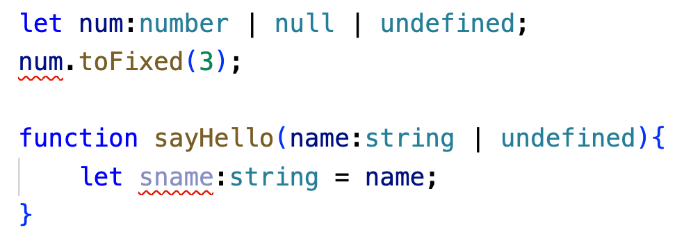
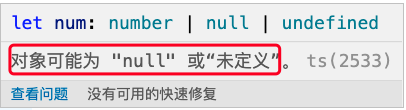
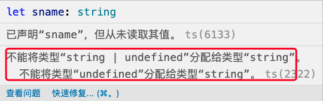
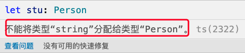

<!-- START doctoc generated TOC please keep comment here to allow auto update -->
<!-- DON'T EDIT THIS SECTION, INSTEAD RE-RUN doctoc TO UPDATE -->
**Table of Contents**  *generated with [DocToc](https://github.com/thlorenz/doctoc)*

- [1. ts类型断言](#1-ts%E7%B1%BB%E5%9E%8B%E6%96%AD%E8%A8%80)
- [2. 非空断言](#2-%E9%9D%9E%E7%A9%BA%E6%96%AD%E8%A8%80)
- [3. 双重断言](#3-%E5%8F%8C%E9%87%8D%E6%96%AD%E8%A8%80)
- [4. 小结](#4-%E5%B0%8F%E7%BB%93)

<!-- END doctoc generated TOC please keep comment here to allow auto update -->

### 1. ts类型断言

类型断言，就是我知道这个变量的类型是什么，我来告诉你这个变量的类型，而不用编译器自己去推断，类型断言对运行时没有影响，只是在编译阶段起作用。也就是说如果没有进行类型断言，编辑器中可能会显示一个红色的提示，但是对代码的运行结果可能没有影响。

**类型断言有两种形式**

1. 尖括号的方式

```ts
let nvalue:string = "这是一个字符串";
let strLength:number = (<string>nvalue).length;
```

2. as操作符

```ts
let nvalue:string = "这是一个字符串";
let strLength2:number = (nvalue as string).length;
```

这是ts中使用的两种类型断言的方式，一般的情况下，两种断言方式是等价的。但是在react中，只能使用as语法，因为尖括号和react语法有冲突。所以，为了记忆方便，我们也可以只记忆as语法。

无论是两种哪种断言方式，都有一个需要注意的地方，就是进行类型断言的变量，需要使用小括号括起来，让编译器知道这是一个整体，而不能分散开，否则就成了最后的那个类型去使用变量的方法了。

```ts
// 两种断言方式，进行类型断言的变量nvalue都是用小括号括了起来(<string>nvalue)、(nvalue as string)，表示它们是一个整体
let strLength:number = (<string>nvalue).length;
let strLength2:number = (nvalue as string).length;
```

### 2. 非空断言

来看2个例子：



```ts
let num:number | null | undefined;
num.toFixed(3);

function sayHello(name:string | undefined){
    let sname:string = name;
}
```

案例中，编辑器中都提示异常信息了，还都是赋值时类型异常的信息：





提示的信息，都是和null、undefien这些类别相关的，其实我们也可以简单处理一下，就是做个if判断：

```ts
let num:number | null | undefined;
if(num){
    num.toFixed(3);
}

function sayHello(name:string | undefined){
    let sname:string;
    if(name){
        sname = name;
    }
}
```

做个if的条件判断后，报错信息没有了，问题解决了。

但是ts给我们提供了一个操作符，可以不通过if条件判断，直接使用语言提供的操作!符即可.

使用方法：在需要做类型断言、做非空判断的那个变量后直接使用。

```ts
let num:number | null | undefined;
num!.toFixed(3); // 需要把num的空类型给排除掉

function sayHello(name:string | undefined){
    let sname:string = name!; // 需要将name变量的空类型排除掉
}
```

### 3. 双重断言

> 双重断言，实际编码中不建议使用，知道有这么个断言方式就可以了。

```ts
interface Person{
    name: string;
    age: number;
    email: string;
}

ler stu:Person = "Nicholas" as Person; // 这里会有类型的异常信息提示：不能将string类型的值赋值给Person类型变量
```



这个时候，我们也可以使用断言，将值断言为预期的类型Person。按照常规的断言方式：

```ts
let stu:Person = "Nicholas" as Person;
```

我们使用了as断言后，还是报错了，因为不需要编译器，我们自己也知道，不能将string类型强制断言给Person类型。那么怎么能去除掉这个异常的信息提示呢？这个时候可以使用双重断言的方式。

```ts
let stu:Person = "Nicholas" as any as Person;
```

先把值断言成一个any类型(断言成unkown类型也可以)，然后再次断言为一个Person类型，这样就可以了，没有异常的信息提示了。

但这仅仅是编辑器没有了类型的异常信息提示了，但是在逻辑上，是走不通的，我们不能强行将一个string类型的值赋值给一个Person类型变量。

双重断言，在实际项目中不建议使用，知道有双重类型断言这么回事就可以了。
### 4. 小结

无论是使用哪种方式的断言，都是在编译阶段消除了一些类型异常信息提示而已，并不会影响到运行阶段，所以还是得要求我们的代码逻辑严谨。