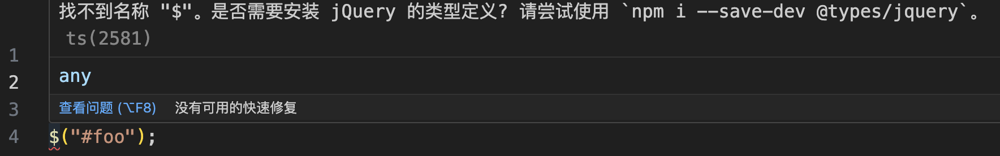
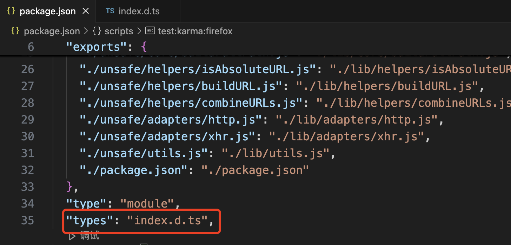

<!-- START doctoc generated TOC please keep comment here to allow auto update -->
<!-- DON'T EDIT THIS SECTION, INSTEAD RE-RUN doctoc TO UPDATE -->
**Table of Contents**  *generated with [DocToc](https://github.com/thlorenz/doctoc)*

- [1. 数据类型相关](#1-%E6%95%B0%E6%8D%AE%E7%B1%BB%E5%9E%8B%E7%9B%B8%E5%85%B3)
  - [1.1 基础数据类型](#11-%E5%9F%BA%E7%A1%80%E6%95%B0%E6%8D%AE%E7%B1%BB%E5%9E%8B)
  - [1.2 对象类型](#12-%E5%AF%B9%E8%B1%A1%E7%B1%BB%E5%9E%8B)
  - [1.3 数组类型](#13-%E6%95%B0%E7%BB%84%E7%B1%BB%E5%9E%8B)
- [class](#class)
- [declare](#declare)

<!-- END doctoc generated TOC please keep comment here to allow auto update -->

参考链接:https://juejin.cn/post/6981728323051192357

### 1. 数据类型相关

学习任何一门编程语言，一般都会先从学习数据类型开始，ts也不例外。

Ts的出现，是为了弥补js类型的缺失。

Vue2使用flow进行类型检查，新版本的vue3使用Ts进行了重构

Ts代码现在还不能直接运行在浏览器中(没有类型约束的代码可以运行在浏览器端，这种ts代码仅仅是js文件改了个文件扩展名，本质上还是js，加上了类型约束的ts才有了ts的灵魂，有了灵魂的ts现在还没有办法直接运行在浏览器中)

ts的数据类型包括所有的js类型如:null、undefined、string、number、boolean、bigint、Symbol、object(object属于引用类型，引用类型又包含了数组、对象、函数、日期)

ts中也包含了一些js中没有的类型，如void、never、any、enum、unknown以及可以自定义类型的type、interface

#### 1.1 基础数据类型

常用的类型有: boolean、number、string、array、enum、any、void

不常用的类型: tuple、null、undefined、never

ts的优势就是类型约束，在ts中变量的声明都要使用类型约束，否则就和js一样了

> 当然了，现在浏览器还不能直接运行ts，ts最终也是被编译成js后在浏览器中执行的。但是如果没有类型约束那么就失去了ts的优势了。

```ts
const num:number = 12;
function getUserInfo(name:string,age:number):void{
    // 逻辑处理
}
```

变量的声明可以使用类型约束，函数的声明，也可以使用类型约束。函数如果没有使用类型约束，则默认为void。

#### 1.2 对象类型

对象类型，这里不介绍什么是对象、怎么声明对象，主要总结下ts中怎么声明自定义对象类型数据。

ts中，声明对象使用类型约束，一般不会使用、也没有现成的对象类型可用，如果有的话，那应该也是其他团队成员定义过了。一般请看下，都是需要我们自己定义对象类型的。ts可以通过interface和type声明、定义自定义的类型。

**interface和type的异同点**

1. 相同点

interface和type都可以声明自定义的类型

```ts
interface IUser {
    name: string;
    age: number;
    salary?: number;
}

type User = {
    name: string;
    age: number;
    salary?: number;
};
```

2. 区别

interface是声明一个新的类型，但是如果使用interface声明了同名的类型会自动合并。如：

```ts
interface IUser {
    name: string;
    age: number;
    salary?: number;
}

interface IUser {
    gender: string;
}

const uesr:IUser = {
    name: 'Nicholas Zakas',
    age: 12,
    gender: '男'
}
```

声明了两个IUser接口，

> 熟悉java的朋友一定要注意，ts中的接口和java中的接口意义不同，java中的接口定义了一系列方法，是一系列方法特征的集合，但是并没有去实现。ts中的接口，可以理解为定义了一个新的数据类型。如ts中的内置的数据类型number、string、boolean等数据类型一样，interface定义了新的数据类型。

从上面1可以看出，type是对一个已经存在的类型重新起了个名字而已。如本来就有一个类型:

```ts
{
    name: string;
    age: number;
    salary?: number;
};
```

只是这个类型呢，没有名字，使用的时候如果直接使用这个类型不方便，那么type就给这个已经存在的类型重新起了个名字叫User，那么再使用这个类型的时候就可以直接使用User，有了变量使用就会方便了很多。

这就是type的作用。

#### 1.3 数组类型

可以说数组类型是客户端开发中使用的最为广泛的数据类型。

数组类型，有两种类型声明方式：

1. 在基础数据类型后面添加[]表示该类型的数组

```ts
const numArry: number[] = [1, 2, 3];
```

2. 使用数组泛型的方式声明数组

```ts
const numList: Array<number> = [4, 5, 6];
```

案例都是使用语言内置的数据类型创建的数组，在日常的开发中也可以使用自定义的类型定义数组。

```ts
interface INewUser {
    name: string;
    age: number;
}

const userList: INewUser[] = [
    {
        name: "Nicholas Zakas",
        age: 16
    },
    {
        name: "HcySunYang",
        age: 22
    }
];
```

通过自定义的数据类型INewUser，以及在类型后面添加[]的方式创建了一个数组。

自定义的数据类型，也可以通过数组泛型的方式定义数组:

```ts
interface INewUser {
    name: string;
    age: number;
}

const userList: Array<INewUser> = [
    {
        name: "Nicholas Zakas",
        age: 16
    },
    {
        name: "HcySunYang",
        age: 22
    }
];
```

可以发现，使用自定义类型创建数组，和使用内置类型创建数组的方式完全一致，可以使用数组泛型，也可以使用在类型后面添加[]d的方式。

**数组也可以是联合类型的数组**

我们知道ts中可以声明联合类型的变量，即一个变量可以是多个类型，类型与类型之间通过|分隔:

```ts
let info: number | string = "success";
info = 16;
```

声明了一个联合类型变量info，可以是number类型也可以是string类型。那么数组也可以像声明变量一样声明为联合类型的数组，只是联合类型需要使用()括起来

```ts
const tips: (string | number)[] = [16, "success"];
```

也可以定义自定义联合类型的数组，但是实际应用中可能使用的并不多：

```ts
interface DUser {
    name: string;
    age: number;
}

interface IStudent {
    class: string;
    grade: string;
}

const p: (DUser | IStudent)[] = [
    {
        name: "Nicholas Zakas",
        age: 12
    },
    {
        class: 'one',
        grade: '2'
    }
];
```

案例中定义了两种类型DUser和IStudent，声明了这2个类型的联合类型的数组p。

[关于interface和type的关系，可以参考](./interface%E5%92%8Ctype%E7%9A%84%E5%85%B3%E7%B3%BB.md)

#### 1.4 变量声明

ts和js相同，支持3种变量声明方式:var、let、const

注意数据类型写小写，不要写大写，大写是js的内置对象。
### class

### declare

declare关键字是专门为ts而设计、专门为ts而服务的。

我们都知道浏览器不能直接运行ts文件，需要先将ts文件编译为js后才可以执行，并且在编译阶段会进行类型检查。但是在ts中并不支持js可识别的所有类型，例如我们项目中使用的第三方库jQuery，我们可以通过id选择器获取id为foo的元素。

```js
$("#foo");
// or
jQuery("#foo");
```
可是如果在ts中，如果使用这样的语法，那么会提示异常。



这个时候，可以通过declare关键字来声明一个标识符，告诉typescript编译器，这个标识符已经存在了，可以在ts中使用了。然后就不会有异常提示了。

**定义**

在ts中，declare告诉ts编译器存在一个对象(可以在代码中使用的一个对象)，它向ts编译器声明该对象，简而言之，就是说它允许开发人员在项目中使用这个在其他地方声明的对象。

> 编译器不会将declare语句编译为javascript

看demo：

```ts
// declare声明了一个名为myGlobal的全局变量，并指定其类型为any
// 该声明不会生成真正的js代码，而只是告诉ts编译器该变量的存在，以便在ts文件中使用该变量时不会进行异常提示
declare var myGlobal:any;

// 为声明的myGlobal变量赋值
myGlobal = 32;
console.log('%c [ myGlobal ]-256', 'font-size:13px; background:pink; color:#bf2c9f;', myGlobal); // 32
```

看另一个demo：

```ts
// 直接通过var关键字声明了一个全局的变量myGlobal，这一行代码会生成js代码
var myGlobal:any;

// 为myGlobal变量赋值
myGlobal = 32;
console.log('%c [ myGlobal ]-269', 'font-size:13px; background:pink; color:#bf2c9f;', myGlobal); // 32
```

**declarea关键字的使用**

- declare var 声明一个全局变量

- declare function 声明全局方法

- declare class 声明全局类

- declare enum 声明全局枚举类型

- declare namespace 声明(含有子属性)全局对象

- declare global 扩展全局变量

- declare module 扩展模块

**声明文件**

一般情况下，在使用第三方库或模块时，有两种方式引入声明文件：

1. 全局声明：如果第三方库或者模块是全局访问的，我们可以在整个项目的任何地方直接使用它们，而不需要显示的去导入。这个是，只需要我们在ts项目中正确的引入了相应的声明文件。大多数的情况下，ts会自动查找并加载全局声明文件。如果没有自动加载全局声明文件，我们可以自己使用///的方式在具体的源文件中引入声明文件。

2. 模块导入：如果第三方库或者模块是通过模块化的方式提供的，那么需要使用import语句将这些模块导入到我们的代码中，同时也需要确保将相应的声明文件被正确引入。在这种情况下，我们可以使用import或者require来引入库，且不需要显示的引入声明文件，因为typescript编译器会根据模块的导入语句自动查找和查找相应的声明文件。

很多第三方库提供了声明文件，可以在库项目的package.json文件中查看。types字段表示类型声明文件是哪个。



可以使用@types统一管理第三方库的声明文件。@types的声明方式很简单，直接使用npm等包管理工具安装对应的声明模块即可，以loadsh为例：

```bash
npm install @types/loadsh --save-dev
```

