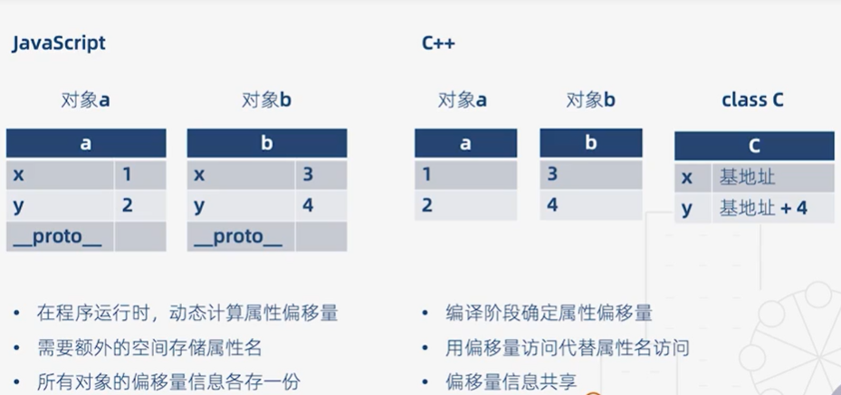
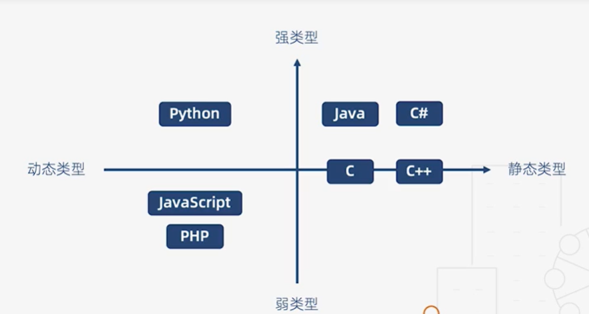
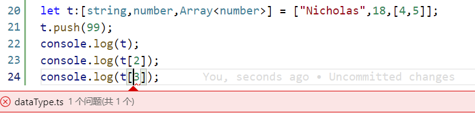
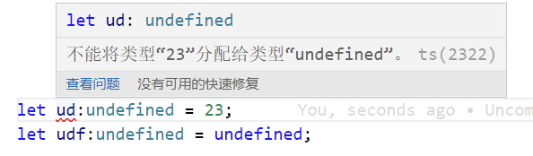
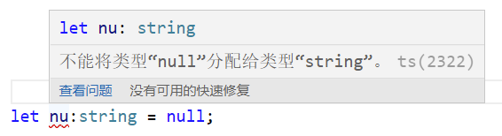
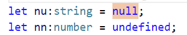
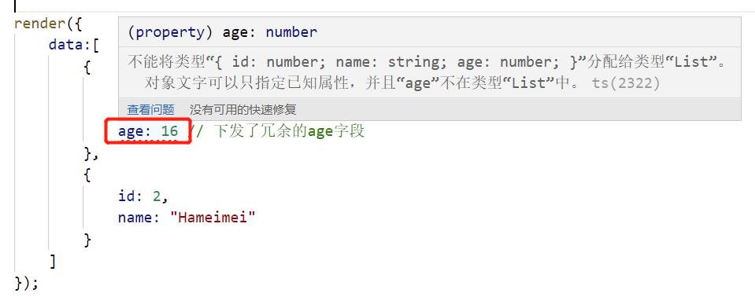

<!-- START doctoc generated TOC please keep comment here to allow auto update -->
<!-- DON'T EDIT THIS SECTION, INSTEAD RE-RUN doctoc TO UPDATE -->
**Table of Contents**  *generated with [DocToc](https://github.com/thlorenz/doctoc)*

- [1.再学ts](#1%E5%86%8D%E5%AD%A6ts)
  - [1.1 简单认识Typescript](#11-%E7%AE%80%E5%8D%95%E8%AE%A4%E8%AF%86typescript)
  - [1.2 为什么要使用Typescript](#12-%E4%B8%BA%E4%BB%80%E4%B9%88%E8%A6%81%E4%BD%BF%E7%94%A8typescript)
  - [1.3 应该怎么去学习typescript？](#13-%E5%BA%94%E8%AF%A5%E6%80%8E%E4%B9%88%E5%8E%BB%E5%AD%A6%E4%B9%A0typescript)
- [2. Typescript基础](#2-typescript%E5%9F%BA%E7%A1%80)
  - [2.1 强类型与弱类型](#21-%E5%BC%BA%E7%B1%BB%E5%9E%8B%E4%B8%8E%E5%BC%B1%E7%B1%BB%E5%9E%8B)
  - [2.2 静态类型语言和动态类型语言](#22-%E9%9D%99%E6%80%81%E7%B1%BB%E5%9E%8B%E8%AF%AD%E8%A8%80%E5%92%8C%E5%8A%A8%E6%80%81%E7%B1%BB%E5%9E%8B%E8%AF%AD%E8%A8%80)
  - [2.3 ts基础](#23-ts%E5%9F%BA%E7%A1%80)
  - [2.4 ts的数据类型](#24-ts%E7%9A%84%E6%95%B0%E6%8D%AE%E7%B1%BB%E5%9E%8B)
  - [2.5 类型注解](#25-%E7%B1%BB%E5%9E%8B%E6%B3%A8%E8%A7%A3)
  - [2.6 接口](#26-%E6%8E%A5%E5%8F%A3)
  - [2.7 函数](#27-%E5%87%BD%E6%95%B0)
  - [2.8 函数重载](#28-%E5%87%BD%E6%95%B0%E9%87%8D%E8%BD%BD)

<!-- END doctoc generated TOC please keep comment here to allow auto update -->

### 1.再学ts

#### 1.1 简单认识Typescript

js是一门动态的弱类型语言，没有类型的约束。

Ts可以完全的被编译为javascript，学习ts的时候，需要注意3个要点：

1. 类型检查

ts会在编译时进行类型检查，这就意味着可以在编译阶段排除掉语法错误。

2. 语言扩展

ts会包括来自ES6以及未来提案中的特性如异步操作和装饰器，也会从其他语言借鉴某些特性，如接口和抽象类。

3. 工具属性

ts可以编译成标准的javascript，可以在任何浏览器、操作系统上运行，无需任何运行时的额外开销。从这个角度上来讲，ts更像是一个工具，而不是一门编程语言。

#### 1.2 为什么要使用Typescript

1. vscode编辑器的强大自动补全、导航和重构功能，使得接口定义可以代替文档；

2. 同时可以提高开发效率；降低维护成本；

3. 可以帮助团队重塑“类型思维”，接口的提供方将被迫去思考API的边界，他们将从代码的编写者蜕变成代码的设计者。

如果javascript是一匹野马，那么typescript就是束缚这匹野马的缰绳；

#### 1.3 应该怎么去学习typescript？

循序渐进，基础（语法基础） -> 工程（做项目） -> 实战（还是做项目）

### 2. Typescript基础

#### 2.1 强类型与弱类型

什么是强类型语言呢？其实在很早之前，有一些计算机方面的科学家给出了一些解释：

> 在强类型语言中，当一个对象从调用函数传递到被调用函数时，其类型必须与被调用函数中声明的类型兼容。

```javascript
function a(){
    b(x);
}

function b(y){
    // ……
}
```

如案例中，函数a中调用了函数b，那么被调用的函数b中的参数x的类型，要和b函数定义时的参数y的类型保持一致，且程序应该运行良好。

后来关于强类型的定义又做了一些完善和具体：

> 强类型语言，不允许改变变量的数据类型，除非进行强制的类型转换。

以java为例，参考一下：

```java
import java.io.*;
class test  
{
	public static void main (String[] args) throws java.lang.Exception
	{
		int x = 1;
		boolean y = true;
		x = y;
		System.out.println(x);
	}
}
```

代码在运行时会报错，提示boolean型不能被转换为整型。

```java
import java.io.*;
class test  
{
	public static void main (String[] args) throws java.lang.Exception
	{
		int x = 1;
		boolean y = true;
// 		x = y;
        char z = 'a';
        x = z; // 这里没有报错，正常的输出了97，因为java进行了强制的类型转换
		System.out.println(x);
	}
}
```

> 弱类型语言：变量可以被赋值给、赋予不同的数据类型。

如js就是弱类型的编程语言，同一个变量可以被赋值不同类型的值。

强类型语言，有严格的限制，不同的数据类型之间不能进行赋值，除非进行了强制的数据类型的转换。

强类型语言，有一个好处，就是避免了很多不必要的错误。

#### 2.2 静态类型语言和动态类型语言

静态类型语言：在编译阶段确定所有变量的类型；

动态类型语言：在执行阶段确定所有变量的类型。

看案例：

```javascript
class C{
    constructor(x,y){
        this.x = x;
        this.y = y;
    }
}

function add(a,b){
    return a.x + a.y + b.x + b.y;
}
```

当js编译器看到这段代码的时候，它是不会知道类C和函数add中的参数的数据类型的，只有在实例化了类C和调用了add函数的时候，给类C的构造函数和add函数传递进来参数了，编译器才会知道函数的参数的具体的数据类型。

在来看一段C++的具有同样功能的代码：

```c
class C{
    public:
        int x;
        int y;
}

int add(C a,C b){
    return a.x + a.y + b.x + b.y;
}
```

C++的编译器在编译时，就已经知道了add函数参数的数据类型了，肯定是整型。

下面看一下在内存存储上的区别：



| 静态类型语言       | 动态类型语言                    |
| ------------------ | ------------------------------- |
| 对类型要求极度严格 | 对类型要求非常宽松              |
| 可以立即发现错误   | Bug可能隐藏很长时间，不易被发现 |
| 运行时性能良好     | 运行时性能差                    |
| 自文档化           | 可读性差                        |

动态类型语言的支持者认为：

1. 性能是可以改善的，如V8引擎，而语言的灵活性更重要；
2. 隐藏的错误，可以通过一些技术手段去发现如单元测试；
3. 文档可以通过工具生成；

动态类型语言和静态类型语言的争论一直在争论中，但是没有一个明确的结论。每种语言都有自己的可取之处，同时也可能会存在一些不足。

**其他的一些争议，或者叫讨论吧**

一些学者，把强类型语言定义为：不允许程序发生错误后继续执行

那么按照这个标准，C/C++是就应该是弱类型语言了，它没有对数组的越界进行检查？那么这两门语言到底是强类型还是弱类型语言呢？

下面来补一张常识图：



#### 2.3 ts基础

刚开始学习ts的时候，不要安装太多工程化的东西，只需要有简单的编辑器和node环境支持即可。

**环境搭建**

全局安装typescript，以便可以全局使用tsc指令

```bash
npm install typescript -g
```

初始化一个ts项目

```bash
mkdir welcome
cd welcome
npm init -y # 直接忽略各种选择项吧
```

之后就可以通过执行tsc指令来查看ts的可以进行的各种配置了

可以通过tsc --init创建包含一些默认配置项的ts的配置文件：tsconfig.json

```bash
PS D:\welcome> tsc --init

Created a new tsconfig.json with:
                                                                                                                     TS
  target: es2016
  module: commonjs
  strict: true
  esModuleInterop: true
  skipLibCheck: true
  forceConsistentCasingInFileNames: true


You can learn more at https://aka.ms/tsconfig.json
```

**配置构建工具**

配置构建工具，会使用webpack

```bash
npm install webpack webpack-cli webpack-dev-server --save-dev
npm install ts-loader typescript --save-dev
```

#### 2.4 ts的数据类型

| ES6的数据类型 | TS的数据类型 |          |
| ------------- | ------------ | -------- |
| Boolean       | Boolean      | void     |
| Number        | Number       | any      |
| String        | String       | never    |
| Array         | Array        | 元祖     |
| Function      | Function     | 枚举     |
| Object        | Object       | 高级类型 |
| Symbol        | Symbol       |          |
| undefined     | undefined    |          |
| null          | null         |          |

ES6有6中基本的数据类型，Boolean、Number、String、null、undefined、Symbol

引用类型：Array、Object、Function

TS的数据类型，在ES6的基础上新增了void、any、never、元祖、枚举以及其他一些高级类型

#### 2.5 类型注解

作用：相当于强类型语言中的类型声明

语法：(变量/函数):type

对变量和函数发生约束作用。

```ts
// 原始类型
let bool:boolean = true;
let num:number = 12;
let str:string = "Hello String";

// 数组
let arr:number[] = [1,2,3];
let arr2:Array<number> = [4,5,6]; // 泛型

// 元祖
let tuple:[number,string] = [12,"Nicholas Zakas"];

// 函数
let add = (x:number,y:number):number => {
    return x + y;
}

// 对象
let obj:object = {
    x:1,
    y:2
};

// symbol
let s1:symbol = Symbol();
let s2 = Symbol();

// 多种数据类型，可以为变量dt声明了多种数据类型，可以为string类型值也可以为number类型值
let dt:string | number = 2;
dt = "hello";
```

ts中，也可以为一个变量同时声明多种类型，只需要在类型注解中用|分割多个数据类型即可，如

```ts
let dt:string | number = 10; // 变量dt可以为string类型或者number类型
```

元祖，是ts中区别于js的一种数据类型，元祖是一种特殊的数组，它限定了数组项的个数和类型。

```ts
let tuple:[number,string] = [12,"Nicholas Zakas"];
let t:[string,number,Array<number>] = ["Nicholas",18,[4,5]];
let t2:[string,number,string[]]=["Hanmeimei",16,["apple","banana"]];
let t3:[string,number,number[]] = ["LiLei",12,[3,4]];
```

这几种都是合法的元祖，需要注意的是元祖的数据类型限定中，如果是数组类型的限定，和定义数组相同，可以使用基本的数据类型加[]的方式声明，也可以通过范式的方式声明。

**元祖越界**

元祖是一种特殊的数组，它可以使用数组的方法，如遍历、插入、弹出元素等操作。

```ts
let t:[string,number,Array<number>] = ["Nicholas",18,[4,5]];
t.forEach((item) => {
    console.log(item);
});
```

元祖使用了数组的forEach方法遍历元素。

下面使用push向元祖插入元素

```ts
let t:[string,number,Array<number>] = ["Nicholas",18,[4,5]];
t.push(99);
console.log(t); // [ 'Nicholas', 18, [ 4, 5 ], 99 ]
```

从执行结果上看，成功的向元祖插入了元素。

但是这个时候需要注意，新插入的元素是访问不到的，这就是元祖的越界问题。

实际的开发中，不要越界插入元祖元素。



> 可以通过数组的push等方法向元祖添加越界元素，但是越界元素不能被访问，ts编译是编译不过去的。

ts中函数声明的时候，函数可以省略类型的注解，这是利用了ts的类型推断功能。

个人的习惯中，还是不省略，养成一个良好的习惯，就是只要使用了ts写代码，就处处添加类型注解。

```ts
// 函数
let add = (x:number,y:number):number => x + y;

let increment = (x:number,y:number) => x + y;

function decrement(x:number,y:number):number{
    return x - y;
}
```

无论是箭头函数还是通过function声明的普通函数，函数的返回值类型可以省略。

```ts
// 声明了一个函数类型的变量，返回值为string，没有做实现
let compute:(x:number,y:number) => string;
// 做变量的函数的实现,做函数类型的实现的时候，形参可以不加类型注解，如a、b都没有加类型注解
compute = (a,b) => {
    return (a + b).toString();
}
console.log(compute(2,3)); // 5
```

**对象类型的限定**

ts中对象类型的注解，有点特殊，需要记一下

```ts
// 对象
let obj:object = {
    x:1,
    y:2
};
```

这样的对象类型的变量声明，在语法上按说是没有什么问题的，但是没有实际意义。

我们不能通过obj访问对象属性x或者y，因为变量obj是object类型的，但是object身上并没有x或者y这2个成员变量。所以正确的声明对象类型的变量的方式需要明确具体的成员变量及类型：

```ts
// ts中声明对象类型变量，需要明确对象的成员属性，并明确数据类型
let obj:{x:number,y:number} = {
    x: 12,
    y: 10
};
console.log(obj.x); // 12
```

**symbol**

symbol表示唯一值。

```ts
// symbol
let s1:symbol = Symbol();
let s2 = Symbol();
console.log("s1:", s1);
console.log(s1 === s2); // false
```

任何的Symbol类型的变量都是不相等的。

**undefined**

如果一个变量被声明了一个undefined类型，那么这个变量就只能被赋值undefined类型的唯一值undefined

```ts
let ud:undefined = 23; // 这里的赋值是有问题的，不能将23赋值给一个undefined类型变量
let udf:undefined = undefined;
```



**null**

null和undefined相同，如果一个变量被声明为了null类型，那么这个变量就只能被赋值null类型的唯一值null，而不能将其他的类型值赋值给null类型的变量。

> 既然其他的类型值都不能赋值给undefined、null这两个类型的变量，那么null和undefined可以赋值给其他的数据类型变量吗？



简单从代码上看是不行的，但是ts文档告诉我们了，undefined和null是其他类型的子类型，那么也就是说undefined和null是可以赋值给其他类型的变量的，这个时候需要在tsconfig.json配置文件进行一下简单配置：

```json
"strictNullChecks": false,  // 将strictNullChecks设置成false即可，默认是true
```



**void类型**

在js中，void是一个操作符，它可以让任何表达式返回undefined。

void 0可以返回一个undefined。

js中的undefined不是一个保留字，我们可以自定义一个undefined代替全局的undefined

```js
console.log(void 0); // undefined
```

**any**

尽量不要是用any类型，否则就和js没有什么区别了，失去了ts的意义了。

**never**

永远不会有返回值的类型，或者死循环的语句，会返回一个never类型

```ts
let error = () => {
    throw new Error("error");
}

let endless = () => {
    while(1){} // 永远不会有返回值
}
```

**枚举类型**

来看一段代码：

```js
function initByRole(role){
    if(role === 1 || role === 2){
        // do sth
    }else if(role === 3 || role === 4) {
        // do sth
    }else if(role === 5){
        // do sth
    }else {
        // do sth
    }
}
```

这是一段角色判断的代码，这段代码，有一些问题：

1. 可读性差，除非对着文档，否则谁也不会知道各种role的码值具体是表示什么意思
2. 可维护性差：硬编码，牵一发动全身

枚举，就是一组具有名字的常量的集合。

枚举，是js中没有的数据类型。

枚举，分为数字枚举和字符串枚举。

数字枚举

```ts
// 数字枚举
enum Role{
    Reporter = 200,
    developer = 206,
    Maintainer = 300,
    Owner,
    Guest
}
```

数字枚举，值从0开始，也可以自定义值，后面的常量会在指定的值基础上自增加1

数字枚举，利用了反向映射的道理，但是字符串枚举没有反向映射。

**常量枚举**

常量枚举，不会显示在编译后的代码中。就是说常量枚举，在代码被编译成js后，什么都不会留下。

那么常量枚举有什么意义呢？就是为了给其他需要用的地方提供值。

```ts
// 字符串、常量枚举
const enum Message{
    Success = "恭喜您,您中大奖了!",
    Fail = "很遗憾,本次没哟中奖"
}
console.log(Message.Success);
```

从代码中我知道有什么样的提示信息，但是编译为js后不会留下任何信息，可读性高，好维护。

**异构枚举**

字符串枚举和数字枚举，构成了异构枚举，不建议使用。

> 将程序中不易维护的硬编码，都可以使用枚举

####  2.6 接口

接口，可以用来约束对象、函数以及类的结构和类型，这是一种代码协作的契约，开发者必须要遵守且不能改变。

**定义对象类型接口**

定义对象类型接口，并渲染到页面的案例

```ts
interface List {
    // 定义一个只读属性id
    readonly id:number;
    name:string;
}

interface Result{
    data:List[]
}
// 渲染函数
function render(result:Result){
    result.data.forEach((item) => {
        console.log(item.id,item.name);
    });
}

// 假如从api获取到的数据
const result = {
    data: [
        {
            id:1,
            name: "Nicholas Zakas",
            gender: "male"
        },
        {
            id: 2,
            name: "Hameimei"
        }
    ]
};

render(result);
```

这种情况下，api下发的数据字段和我们interface中定义的字段完全相同，非常理想化。当然了，这段代码是可以正常执行没有任何问题的。

但是实际上，很多时候api下发的字段总是会有一些冗余字段，比如案例中给我们多下发了gender和age字段，那ts代码编译，就有问题了：

1. 如果api下发的数据赋值给了一个变量，那么代码在执行的过程中不会有什么问题，可以通过ts的编译，只是冗余的字段不会被做处理

   ```ts
   // 假如从api获取到的数据
   const result = {
       data: [
           {
               id:1,
               name: "Nicholas Zakas",
               gender: "male" // 下发的冗余字段gender
           },
           {
               id: 2,
               name: "Hameimei"
           }
       ]
   };
   ```

2. 如果api下发的数据是通过字面量的形式直接传递给使用函数的，那会报错，通不过ts的编译

   ```ts
   render({
       data:[
           {
               id:1,
               name: "Nicholas Zakas ddd",
               age: 16 // 下发了冗余的age字段,会报异常
           },
           {
               id: 2,
               name: "Hameimei"
           }
       ]
   });
   ```

   

那么出现这种情况怎么处理呢？一般情况下常用的有3种方式解决：

- 使用类型断言，告诉编译器这就是某个指定的类型

  ```ts
  render({
      data:[
          {
              id:1,
              name: "Nicholas Zakas ddd",
              age: 16 // 下发了冗余的age字段
          },
          {
              id: 2,
              name: "Hameimei"
          }
      ]
  } as Result);
  ```

- 将api下发的数据赋值给一个变量，然后通过使用变量的方式实现对数据的调用 ---- 就是前面正常的那个情况

```ts
const result = {
    data: [
        {
            id:1,
            name: "Nicholas Zakas",
            gender: "male"
        },
        {
            id: 2,
            name: "Hameimei"
        }
    ]
};
render(result);
```

- 使用泛型

```ts
render(<Result>{ // 泛型
    data: [
        {
            id:1,
            name: "Nicholas Zakas",
            gender: "female"
        },
        {
            id: 2,
            name: "Hameimei"
        }
    ]
})
```

但一般不建议使用这种方式，因为在react中有歧义

**对象类型接口**

就是用接口定义对象，包括Object和数组

**函数类型接口**

函数类型接口，就是用接口定义函数。

前面在学习ts数据类型的时候，我们知道可以通过下面的方式来定义一个函数类型：

```ts
let Sum:(x:number,y:number) => number;
```

表示声明了一个变量，该变量是一个函数类型，这个函数类型接收2个number类型参数，并且返回一个number类型的函数。这个函数类型的名称可以使用Sum来表示，说的直白一点：声明Sum为一个接收2个数字类型参数并返回一个number类型的函数。

使用接口可以实现同样的功能，即通过接口类声明一个函数类型：

```ts
interface Adds{
    (x:number,y:number):number
}
```
  
通过接口声明的函数类型需要接收2个number类型参数，且返回number的类型值，使用Adds表示这个类型。

来看下这个函数类型的实现案例：

```ts
let ads:Adds = (a,b) => a + b;
```

在使用接口可以实现这个功能，使用别名的方式，也可以实现：

```ts
// 函数类型定义,通过别名方式
type Add = (x:number,y:number) => number;
// 函数的实现
let ad:Add = (a,b) => a - b;
// 执行出了正确的结果
console.log("add：",ad(5,2)); // 3
```

**混合类型接口**

```ts
// 定义混合类型接口
interface Lib {
    // void返回值
    ():void;
    // string类型版本号
    version: string;
    // 定义一个方法
    doSth():void;
}
// 实现这个混合类型接口
let lib:Lib = (() => {}) as Lib;
lib.version = "1.0.0";
lib.doSth = () => {};
```

实际应用：

```ts
// 可以尝试封装这个单例模式的获取库版本号的方法
function getLib(){
    let lib:Lib = (() => {}) as Lib;
    lib.version = '1.2.0';
    lib.doSth = () => {
        console.log('来干活了');
    };
    return lib;
}

let l1 = getLib(); // 实例化一个对象
console.log(l1.version); // 1.2.0
l1.doSth(); // 来干活了
```
#### 2.7 函数

js中的函数参数，可以任意，没有强制要求

ts中的函数参数，需要按照定义给定固定数量和固定类型的参数，也可以根据需要定义可选参数，这个时候也可以不用传递这些可选的参数。

```ts
// 可选参数y
function add2(x:number,y?:number){
    // 如果y存在，则返回x + y，否则返回x
    return y? x + y : x;
}

console.log(add2(3,4)); // 7
console.log(add2(9)); // 9
```

**如果有可选参数的话，那么可选参数的位置必须在必选参数的后面**。

为参数设置默认值，方式和js中的方式相同。

```ts
function add3(x:number, y = 2, z:number,q = 3){
    return x + y + z + q;
}
console.log(add3(1,2,3,4)); // 10
```

在设置参数默认值的时候，需要注意，必选参数前的默认值是不能省略的，需要传递undefined来获取参数的默认值；必选参数后面的默认值，可以省略

```ts
function add3(x:number, y = 2, z:number,q = 3){
    return x + y + z + q;
}
console.log(add3(3,undefined,2,9)); // 16,通过传递undefined获取到了y的默认值
```

如果函数参数个数不固定的时候，可以使用剩余参数：

```ts
function add4(x:number,...rest:number[]){
    return x + rest.reduce((pre,cur) => pre + cur);
}
console.log(add4(2,3,4)); // 9
```

#### 2.8 接口定义函数画

语法：

```ts
interface 函数类型名{
    (参数名1:参数类型, 参数名2:参数类型):函数返回值类型
}
```

用接口定义函数，不需要定义函数名，只需要定义函数的结构，对函数的参数及返回值类型进行约束.如：

```ts
interface Add {
    (x: number, y: number): number
}
```

如这个接口定义了一个函数的接口类型Add，这个类型的函数需要有2个参数x和y，且参数类型都是number类型，函数也需要是number类型。

> 我一个简单的理解，ts定义函数类型常用的可能是3种方法：接口定义函数类型、变量定义函数类型、类型别名定义函数类型，其语法分别为：

**接口定义函数类型**

```ts
interface 函数名{
    (参数名称: 参数类型, 参数名称: 参数类型): 返回值类型
}
```

接口定义函数类型，不需要定义函数名称，只需要定义函数的参数名称、参数的数据类型和函数的返回值即可。

```ts
interface Add {
    (x:number, y: number):number
}
```

**变量定义函数类型**

```ts
let 变量名称:(参数名称:参数类型,参数名称:参数类型) => 返回值类型;
```

**类型别名定义函数类型**

```ts
type 类型名称 = (参数名称:参数类型,参数名称:参数类型) => 返回值类型;
```

#### 2.9 混合类型接口

混合类型接口，既可以有方法，也可以像对象类型接口一样定义属性。如

```ts
// 定一个一个混合类型接口
interface Lib {
    (): void;
    version: string;
    play(): void;
}

// 下的代码定义好了一个混合类型，但是有个弊端,这是一个单例，lib对象的属性和方法只能调用一次，调用次数多了没有意义
let lib: Lib = (() => { }) as Lib;
lib.version = "1.1.0";
lib.play = () => {
    console.log("Let's go playing football!");
}

console.log(lib.version);// 1.1.0

// 我们可以对上述案例进行优化，封装到一个方法中，然后返回实例
function getLib(version: string) {
    let lib: Lib = (() => { }) as Lib;
    lib.version = version;
    lib.play = () => {
        console.log("Let's go playing football!");
    }
    return lib;
}

let lib1 = getLib("1.2.0");
console.log(lib1.version);

let lib2 = getLib("1.4.0");
console.log(lib2.version);
```

#### 2.10 

### 3. 泛型

### 4. 类