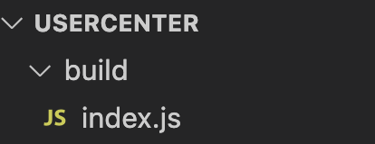

### 快速创建一个ts项目

1. 创建项目目录

```bash
mkdir UserCenter
```

2. 进入到项目目录

```bash
cd UserCenter
```

3. 当前项目下安装ts

```bash
npm install typescript -D
```

4. 初始化ts配置

```bash
npx tsc --init
```

5. 修改配置文件：配置文件输出目录、experimentalDecorators设置为true(这个配置是为了使用装饰器)

```json
{
  "compilerOptions": {
    "target": "es2016",
    "experimentalDecorators": true,
    "module": "commonjs",
    "outDir": "./build",
    "esModuleInterop": true,
    "forceConsistentCasingInFileNames": true,
    "strict": true,
    "skipLibCheck": true
  }
}
```

这些是一些必要的配置

6. 新建src目录，将源码都组织在src目录下

7. 新建ts文件如index.ts

```ts
function greeter(name: string){
    console.log(`Hello, ${name}`);
}

greeter("Nicholas Zakas");
```

8. 编译

```bash
npx tsc
```

执行该指令后，编译后的文件就被编译到了根目录下的build目录中了



9. 执行目标文件

```bash
node ./build/index.js
```

到了这一步，基本的项目就都已经完成了，不同的文件格式有不同的执行方式，如果是单个的js文件，可以直接通过node指令来执行，如果是需要web服务器的项目，那么就按照常规的项目搭建流程搭建项目就可以了。